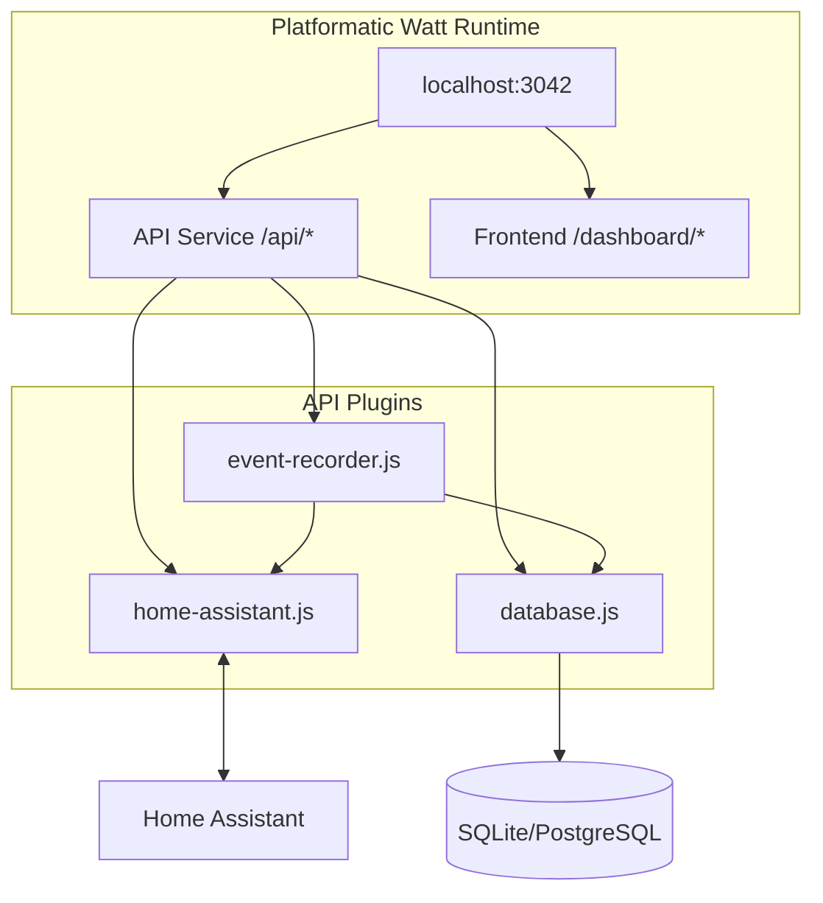
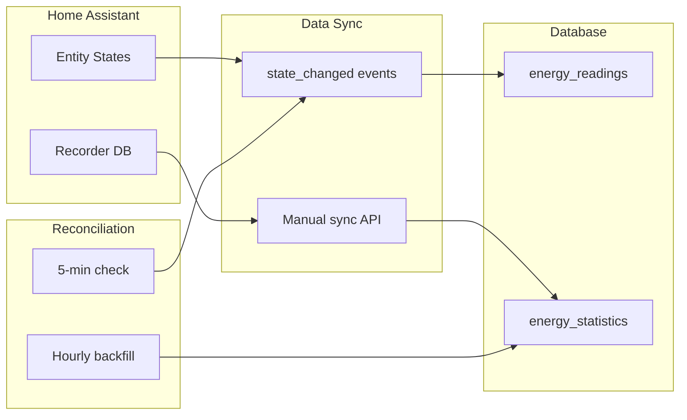

# CLAUDE.md

This file provides guidance to Claude Code (claude.ai/code) when working with code in this repository.

## Project Overview

Energy Dashboard fetches consumption data from Home Assistant via WebSocket API, caches it in SQLite, and displays it via React charts. Uses **Platformatic Watt** as the runtime to orchestrate API and frontend services.

## Documentation Standards

- **All diagrams MUST use Mermaid** - architecture, flows, dependencies, sequences, etc.
- Reference the full spec at `specs/energy-dashboard-spec.md` for detailed implementation

## Commands

```bash
# Development (runs all services with hot reload)
npm run dev

# Production
npm run build
npm run start

# Install dependencies (run from project root)
npm install
cd web/api && npm install && cd ../..
cd web/frontend && npm install && cd ../..
```

## Architecture



**Services:**
- **API** (`web/api/`): Fastify service with `@platformatic/service`
  - `plugins/home-assistant.js` - WebSocket client + event subscriptions
  - `plugins/database.js` - Knex.js multi-DB support
  - `plugins/event-recorder.js` - Real-time sync + reconciliation
  - `routes/` - Auto-loaded routes (entities, statistics, realtime, settings)

- **Frontend** (`web/frontend/`): React + Vite served at `/dashboard`
  - Uses React Query, Recharts, ShadCN UI (Radix + Tailwind)
  - `hooks/useEnergy.js` - Data fetching hooks
  - `lib/api.js` - API client

## Data Flow



**Two sync modes:**
1. **Event-driven** (real-time): Subscribe to `state_changed` → `energy_readings`
2. **Manual/scheduled**: Fetch `recorder/statistics_during_period` → `energy_statistics`

## Key Technical Details

- All services use ES modules (`"type": "module"`)
- SQLite tables: `energy_statistics`, `energy_readings`, `entities`, `subscription_state`, `sync_log`
- Frontend served at `/dashboard`, API at `/api/*`
- HA WebSocket: `ws://{HA_URL}/api/websocket` with token auth

## Environment Variables

| Variable | Description | Default |
|----------|-------------|---------|
| `HA_URL` | Home Assistant host:port | `homeassistant.local:8123` |
| `HA_TOKEN` | Long-lived access token | (required) |
| `PORT` | Server port | `3042` |
| `DATABASE_TYPE` | sqlite, postgresql, mysql | `sqlite` |
| `DATABASE_PATH` | SQLite database path | `./data/energy.db` |

## API Endpoints

| Endpoint | Method | Description |
|----------|--------|-------------|
| `/api/entities` | GET | List energy entities |
| `/api/statistics/:id` | GET | Get hourly statistics |
| `/api/statistics/sync` | POST | Manual sync from HA |
| `/api/readings/:id` | GET | Real-time readings |
| `/api/subscription/status` | GET | Event subscription status |
| `/api/subscription/backfill` | POST | Force backfill |

## Extending

**Add new aggregations**: Edit `web/api/plugins/database.js`
**Add new routes**: Create files in `web/api/routes/` - auto-loaded via platformatic.json
**Add new plugins**: Create in `web/api/plugins/` and register in `platformatic.json`

## Linear Integration

- **Project**: `ha-energy-analytics`
- **Assignee**: Eric
- **Profile**: `personal`
