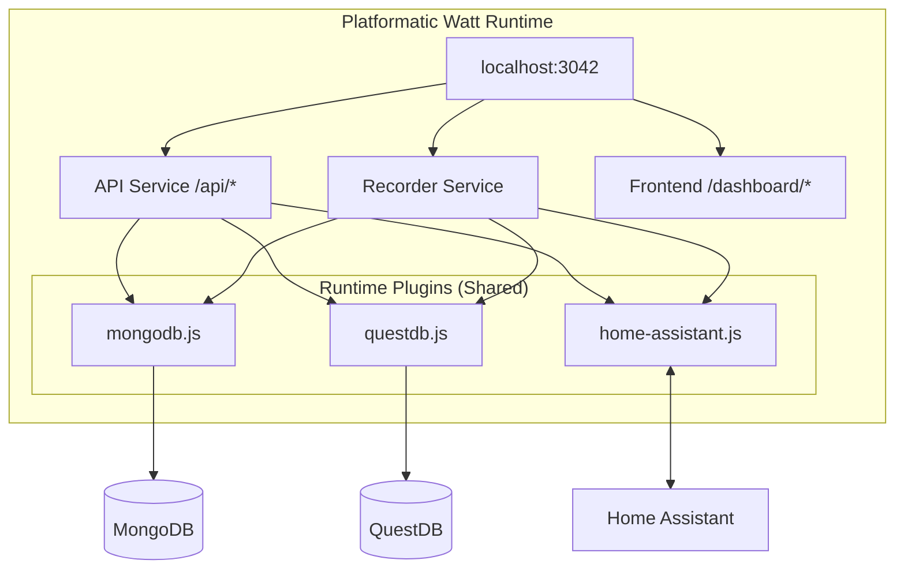
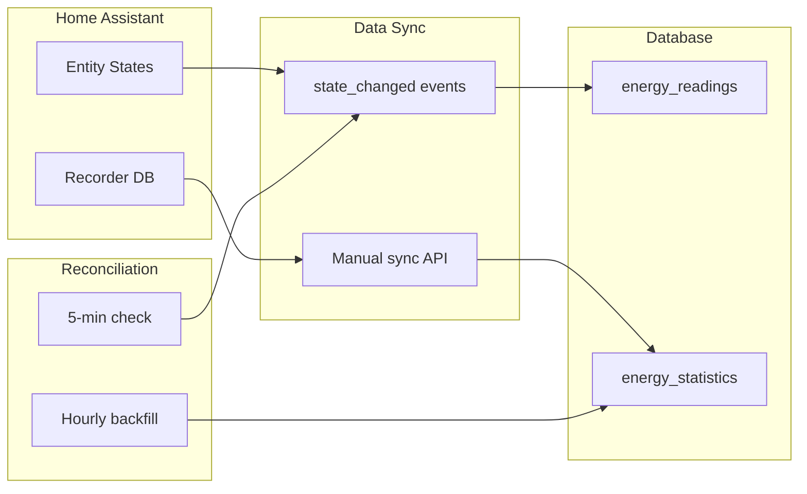

# CLAUDE.md

This file provides guidance to Claude Code (claude.ai/code) when working with code in this repository.

## Project Overview

Energy Dashboard fetches consumption data from Home Assistant via WebSocket API, stores app state in MongoDB and time-series data in QuestDB, and displays insights via React charts. Uses **Platformatic Watt** as the runtime to orchestrate API and frontend services.

## Documentation Standards

- **All diagrams MUST use Mermaid** - architecture, flows, dependencies, sequences, etc.
- Reference the full spec at `specs/energy-dashboard-spec.md` for detailed implementation

## Commands

```bash
# Development (runs all services with hot reload)
npm run dev

# Production
npm run build
npm run start

# Install dependencies (run from project root)
npm install
cd web/api && npm install && cd ../..
cd web/frontend && npm install && cd ../..
```

## Architecture



**Runtime Plugins** (`runtime-plugins/`): Shared across all services with `encapsulate: false`
- `mongodb.js` - Application state storage (settings, entities, subscriptions)
- `questdb.js` - Time-series data storage (readings, statistics)
- `home-assistant.js` - WebSocket client + event subscriptions

**Services:**
- **API** (`web/api/`): Fastify service with `@platformatic/service`
  - `routes/` - Auto-loaded routes (entities, statistics, realtime, settings)
  - Accesses shared plugins via `fastify.mongo`, `fastify.questdb`, `fastify.ha`

- **Recorder** (`web/recorder/`): Independent event recording service
  - `plugins/event-recorder.js` - Real-time sync + reconciliation
  - Subscribes to Home Assistant state_changed events
  - Handles heartbeat checks and hourly backfill

- **Frontend** (`web/frontend/`): React + Vite served at `/dashboard`
  - Uses React Query, Recharts, ShadCN UI (Radix + Tailwind)
  - `hooks/useEnergy.js` - Data fetching hooks
  - `lib/api.js` - API client

## Data Flow



**Two sync modes:**
1. **Event-driven** (real-time): Subscribe to `state_changed` → `energy_readings`
2. **Manual/scheduled**: Fetch `recorder/statistics_during_period` → `energy_statistics`

## Key Technical Details

- All services use ES modules (`"type": "module"`)
- **Node.js 22.19+** required (Platformatic Watt requirement)
- **MongoDB collections**: `settings`, `entities`, `subscriptionState`, `syncLog`
- **QuestDB tables**: `energy_readings`, `energy_statistics`
- Frontend served at `/dashboard`, API at `/api/*`
- HA WebSocket: `ws://{HA_URL}/api/websocket` with token auth

## Environment Variables

| Variable | Description | Default |
|----------|-------------|---------|
| `HA_URL` | Home Assistant host:port | `homeassistant.local:8123` |
| `HA_TOKEN` | Long-lived access token | (required) |
| `PORT` | Server port | `3042` |
| `MONGODB_URI` | MongoDB connection string | `mongodb://localhost:27017/energy_dashboard` |
| `QUESTDB_HOST` | QuestDB hostname | `localhost` |
| `QUESTDB_ILP_PORT` | QuestDB ILP ingestion port | `9009` |
| `QUESTDB_HTTP_PORT` | QuestDB HTTP API port | `9000` |

## API Endpoints

| Endpoint | Method | Description |
|----------|--------|-------------|
| `/api/entities` | GET | List energy entities |
| `/api/statistics/:id` | GET | Get hourly statistics |
| `/api/statistics/sync` | POST | Manual sync from HA |
| `/api/readings/:id` | GET | Real-time readings |
| `/api/subscription/status` | GET | Event subscription status |
| `/api/subscription/backfill` | POST | Force backfill |

## Directory Structure

```
energy-tracker/
├── watt.json                    # Runtime config with shared plugins
├── runtime-plugins/             # Shared plugins (all services access)
│   ├── mongodb.js               # fastify.mongo decorator
│   ├── questdb.js               # fastify.questdb decorator
│   └── home-assistant.js        # fastify.ha decorator
├── web/
│   ├── api/                     # API Service (routes only)
│   │   ├── platformatic.json
│   │   └── routes/
│   ├── recorder/                # Recorder Service (event handling)
│   │   ├── platformatic.json
│   │   └── plugins/
│   │       └── event-recorder.js
│   └── frontend/                # React frontend
└── docker/
```

## Extending

**Add new aggregations**: Use QuestDB's `SAMPLE BY` in `runtime-plugins/questdb.js`
**Add new routes**: Create files in `web/api/routes/` - auto-loaded via platformatic.json
**Add shared plugins**: Create in `runtime-plugins/` and register in root `watt.json`

## Critical Rules

### Test Failures

**NEVER change assertions just to make tests pass naively.** When a test fails:

1. **Investigate** - Understand why the test is failing
2. **Determine the root cause** - Is the code wrong or is the assertion wrong?
3. **Fix appropriately**:
   - If the code is wrong → fix the code
   - If the assertion was incorrect → fix the assertion with clear justification
4. **Never blindly modify assertions** without understanding the underlying issue

## Linear Integration

- **Project**: `ha-energy-analytics`
- **Issue Prefix**: `TEK` (e.g., TEK-44, TEK-45)
- **Assignee**: Eric
- **Profile**: `personal`

### Planning Structure

- **Master Plan**: TEK-44 serves as the master implementation plan and orchestrates all issues
- **Issue Plans**: Each individual issue contains its own detailed implementation plan
- **No separate plan files**: Update the Linear issues directly when plans need modification
