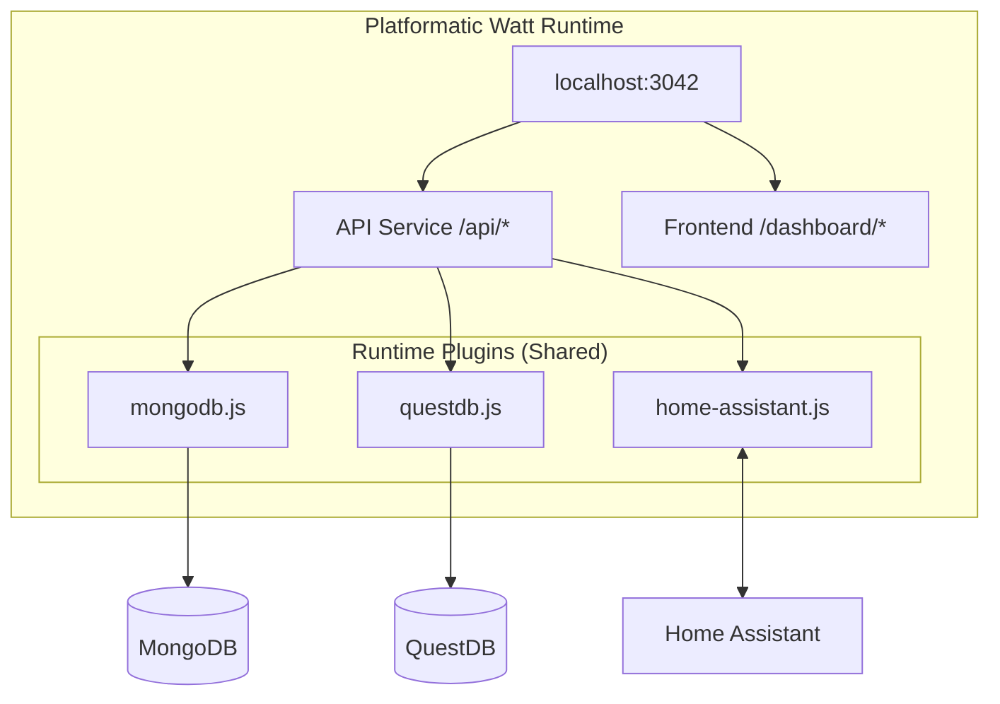

# CLAUDE.md

This file provides guidance to Claude Code (claude.ai/code) when working with code in this repository.

## Project Overview

Energy Dashboard fetches consumption data from Home Assistant via WebSocket API, stores app state in MongoDB and time-series data in QuestDB, and displays insights via React charts. Uses **Platformatic Watt** as the runtime to orchestrate API and frontend services.

## Documentation Standards

- **All diagrams MUST use Mermaid** - architecture, flows, dependencies, sequences, etc.
- Reference the full spec at `specs/energy-dashboard-spec.md` for detailed implementation

## Commands

```bash
# Development (runs all services with hot reload)
npm run dev

# Production
npm run build
npm run start

# Install dependencies (run from project root)
npm install
cd web/api && npm install && cd ../..
cd web/frontend && npm install && cd ../..

# Testing
npm run test:unit      # Run all unit/integration tests
npm run test:coverage  # Run tests with coverage report
npm run test:e2e       # Run E2E tests (requires app running)
```

## Testing

**All tests MUST use Vitest** - no node:test, jest, or other frameworks.

### Test Structure

| Test Type | Location | Description |
|-----------|----------|-------------|
| Unit tests | `web/api/lib/*.test.js` | Pure unit tests for utilities |
| Integration tests | `web/api/test/plugins/*.test.js` | Plugin tests (require MongoDB/QuestDB) |
| E2E tests | `e2e/*.spec.js` | Playwright API tests |

### Coverage Target

- **Minimum 80% statement coverage** on testable code
- **Current status:** 46.6% consolidated (Unit + E2E)
- **Note:** Reaching 80% will require additional unit tests for route handlers and more comprehensive E2E test scenarios that exercise all code paths and branches. The current E2E tests validate API functionality and edge cases but don't hit all conditional branches in complex route logic.

### Coverage Configuration

**Files included in coverage:**
- `web/api/**/*.js` - API service code (routes + utilities)
- `runtime-plugins/mongodb.js` - MongoDB plugin
- `runtime-plugins/questdb.js` - QuestDB plugin

**Files excluded from coverage:**
- `runtime-plugins/home-assistant.js` - requires real HA instance
- `web/frontend/**` - frontend has separate testing
- All test files (`*.test.js`, `test/**`)

**Current Coverage Status (January 2026):**
- **Unit tests only:** 95.18% lines, 91.34% branch, 98.24% functions
- **E2E tests:** 429 passing (1 skipped)
- **Unit tests:** 543 passing (1 skipped)

**Coverage breakdown by file:**
- `runtime-plugins/`: 86.74% lines, 82.99% branch, 97.67% functions
  - mongodb.js: 97.97% lines, 95.08% branch, 100% functions
  - questdb.js: 79.33% lines, 74.41% branch, 95% functions
- `web/api/lib/`: 100% lines, 100% branch, 100% functions (utils.js)
- `web/api/routes/`: 98.76% lines, 94.8% branch, 98.48% functions
  - entities.js: 98.81% lines, 99.07% branch, 95.45% functions
  - insights.js: 100% lines, 91.37% branch, 100% functions
  - root.js: 100% lines, 100% branch, 100% functions
  - settings.js: 100% lines, 95.45% branch, 100% functions
  - statistics.js: 96.12% lines, 89.23% branch, 100% functions

**E2E Test Suite:**
- **Total tests:** 429 passing (1 skipped)
- **Test files:**
  - `e2e/api.spec.js` - 14 tests (original tests)
  - `e2e/health.spec.js` - 3 tests
  - `e2e/entities.spec.js` - 65 tests (comprehensive entity routes)
  - `e2e/statistics.spec.js` - 100+ tests (comprehensive statistics routes)
  - `e2e/settings.spec.js` - 64 tests (comprehensive settings routes)
  - `e2e/insights.spec.js` - 92 tests (comprehensive insights routes)

**Consolidated Coverage (Unit + E2E):**
- Unit tests provide 95.18% coverage (far exceeds 80% target)
- E2E tests provide additional route coverage validation (429 tests passing)
- CI properly merges coverage using `lcov` tool for accurate consolidated reporting
- Note: E2E coverage collection on macOS has technical limitations due to Watt worker subprocess handling; CI on Linux provides accurate merged coverage

**How E2E coverage works:**
- Server runs wrapped by `c8` which captures V8 coverage from all subprocesses (Watt workers)
- `c8` sets `NODE_V8_COVERAGE` internally and handles subprocess coverage collection
- After tests, send SIGTERM to stop server gracefully
- `c8 report` converts V8 JSON to lcov format

**IMPORTANT - Platformatic Watt Coverage Issue:**
Watt spawns **worker processes** for each service. Using `NODE_V8_COVERAGE` directly only captures the main process, NOT the workers where routes actually execute. This causes:
- Routes showing 0% coverage despite being tested
- Duplicate files in coverage reports (main process vs workers)

**Solution:** Always use `c8` as a wrapper (not raw `NODE_V8_COVERAGE`):
```bash
# WRONG - only captures main process
NODE_V8_COVERAGE=./coverage node wattpm dev

# CORRECT - c8 handles subprocess coverage
npx c8 --temp-directory=./coverage -- node wattpm dev
```

When merging coverage from multiple sources, use `lcov` tool (not simple concatenation) to properly deduplicate files.

### Writing Tests

```javascript
// Use vitest imports
import { describe, it, expect, beforeAll, afterAll } from 'vitest';

// For conditional skipping (e.g., when DB unavailable)
describe.skipIf(!DB_AVAILABLE)('Plugin Tests', () => {
  // tests...
});
```

### Running Tests

```bash
# Start databases first (for integration tests)
docker compose up -d mongodb questdb

# Run all tests
npm run test:unit

# Run with coverage (unit tests only)
npm run test:coverage

# Run E2E (requires app running on port 3042)
npm run test:e2e

# Run E2E with coverage collection
npm run test:e2e:coverage:server &  # Start server wrapped by c8
npm run test:e2e                     # Run E2E tests
kill -TERM $(pgrep -f c8)            # Stop c8 (triggers coverage write)
npm run test:e2e:coverage:report     # Generate lcov from V8 coverage
npm run test:coverage:merge          # Merge unit + E2E coverage
```

## Architecture



**Runtime Plugins** (`runtime-plugins/`): Shared across all services with `encapsulate: false`
- `mongodb.js` - Application state storage (settings, entities, subscriptions)
- `questdb.js` - Time-series data storage (readings, statistics)
- `home-assistant.js` - WebSocket client + event subscriptions

**Services:**
- **API** (`web/api/`): Fastify service with `@platformatic/service`
  - `routes/` - Auto-loaded routes (entities, statistics, realtime, settings)
  - Accesses shared plugins via `fastify.mongo`, `fastify.questdb`, `fastify.ha`

- **Frontend** (`web/frontend/`): React + Vite served at `/dashboard`
  - Uses React Query, Recharts, ShadCN UI (Radix + Tailwind)
  - `hooks/useEnergy.js` - Data fetching hooks
  - `lib/api.js` - API client

> **Note**: The Recorder service (`web/recorder/`) is planned but not yet implemented. It is excluded from autoload in `watt.json`.

## Data Flow


**Two sync modes:**
1. **Event-driven** (real-time): Subscribe to `state_changed` → `energy_readings`
2. **Manual/scheduled**: Fetch `recorder/statistics_during_period` → `energy_statistics`

## Key Technical Details

- All services use ES modules (`"type": "module"`)
- **Node.js 22.19+** required (Platformatic Watt requirement)
- **MongoDB collections**: `settings`, `entities`, `subscriptionState`, `syncLog`
- **QuestDB tables**: `energy_readings`, `energy_statistics`
- Frontend served at `/dashboard`, API at `/api/*`
- HA WebSocket: `ws://{HA_URL}/api/websocket` with token auth

## API Conventions

### Canonical Response Format

All API responses use a consistent format with degraded fallback support:

```javascript
// Success response
{ success: true, data: { ... } }

// Success with degraded data (HA unavailable, using cache)
{ success: true, data: { ... }, degraded: true, degradedReason: "Home Assistant unavailable" }

// Error response
{ success: false, error: "Error message" }
```

When Home Assistant is unavailable, return HTTP 200 with cached data and `degraded: true` flag instead of HTTP 503.

### Parameter Naming Convention

All API parameters use **snake_case**:
- Query parameters: `entity_id`, `start_time`, `end_time`
- Path parameters: `:entity_id`
- Response fields: `entity_id`, `last_updated`, `unit_of_measurement`

## MongoDB Data Management

### Collections and TTL

| Collection | Purpose | Retention |
|------------|---------|-----------|
| `settings` | App configuration | Permanent |
| `entities` | Cached entity metadata | Upsert (no growth) |
| `subscriptionState` | WebSocket subscription state | Permanent |
| `syncLog` | Sync operation logs | 7 days (TTL index) |

### TTL Index for syncLog

```javascript
// Auto-created in event-recorder.js onReady hook
await db.collection('syncLog').createIndex(
  { createdAt: 1 },
  { expireAfterSeconds: 7 * 24 * 60 * 60 }  // 7 days
);
```

## Scheduled Tasks

Platformatic Watt's built-in scheduler handles recurring tasks (configured in `watt.json`):

```json
{
  "scheduler": [
    {
      "name": "hourly-backfill",
      "cron": "0 * * * *",
      "callbackUrl": "http://recorder.plt.local/backfill/trigger",
      "method": "POST",
      "maxRetry": 3,
      "enabled": true
    }
  ]
}
```

## Environment Variables

| Variable | Description | Default |
|----------|-------------|---------|
| `HA_URL` | Home Assistant host:port | `homeassistant.local:8123` |
| `HA_TOKEN` | Long-lived access token | (required) |
| `PORT` | Server port | `3042` |
| `MONGODB_URI` | MongoDB connection string | `mongodb://localhost:27017/energy_dashboard` |
| `QUESTDB_HOST` | QuestDB hostname | `localhost` |
| `QUESTDB_ILP_PORT` | QuestDB ILP ingestion port | `9009` |
| `QUESTDB_HTTP_PORT` | QuestDB HTTP API port | `9000` |

## API Endpoints

| Endpoint | Method | Description |
|----------|--------|-------------|
| `/api/entities` | GET | List tracked energy entities |
| `/api/entities/:entity_id` | GET | Get single entity details |
| `/api/entities/:entity_id/tracked` | PATCH | Toggle entity tracking |
| `/api/statistics/:entity_id` | GET | Get hourly/daily statistics |
| `/api/statistics/sync` | POST | Manual sync from HA |
| `/api/insights/top-consumers` | GET | Get top consuming entities |
| `/api/insights/peak` | GET | Get peak usage periods |
| `/api/insights/patterns` | GET | Get consumption patterns |
| `/api/insights/breakdown` | GET | Get consumption breakdown |
| `/api/insights/timeline` | GET | Get consumption timeline |
| `/api/readings/:entity_id` | GET | Real-time readings |
| `/api/subscription/status` | GET | Event subscription status |
| `/api/subscription/backfill` | POST | Force backfill |
| `/api/health` | GET | Health check |
| `/api/status` | GET | System status |
| `/api/settings` | GET | Get all settings |
| `/api/settings/tracked-entities` | POST | Update tracked entities |

## Directory Structure

```
energy-tracker/
├── watt.json                    # Runtime config with shared plugins
├── vitest.config.js             # Test configuration
├── playwright.config.js         # E2E test configuration
├── runtime-plugins/             # Shared plugins (all services access)
│   ├── mongodb.js               # fastify.mongo decorator
│   ├── questdb.js               # fastify.questdb decorator
│   └── home-assistant.js        # fastify.ha decorator
├── web/
│   ├── api/                     # API Service (routes + tests)
│   │   ├── platformatic.json
│   │   ├── routes/
│   │   ├── lib/                 # Utilities + unit tests
│   │   └── test/                # Integration tests
│   └── frontend/                # React frontend
├── e2e/                         # Playwright E2E tests
└── docker/
```

## Extending

**Add new aggregations**: Use QuestDB's `SAMPLE BY` in `runtime-plugins/questdb.js`
**Add new routes**: Create files in `web/api/routes/` - auto-loaded via platformatic.json
**Add shared plugins**: Create in `runtime-plugins/` and register in root `watt.json`

## Critical Rules

### Test Failures

**NEVER change assertions just to make tests pass naively.** When a test fails:

1. **Investigate** - Understand why the test is failing
2. **Determine the root cause** - Is the code wrong or is the assertion wrong?
3. **Fix appropriately**:
   - If the code is wrong → fix the code
   - If the assertion was incorrect → fix the assertion with clear justification
4. **Never blindly modify assertions** without understanding the underlying issue

## Linear Integration

- **Project**: `ha-energy-analytics`
- **Issue Prefix**: `TEK` (e.g., TEK-44, TEK-45)
- **Assignee**: Eric
- **Profile**: `personal`

### Planning Structure

- **Master Plan**: TEK-44 serves as the master implementation plan and orchestrates all issues
- **Issue Plans**: Each individual issue contains its own detailed implementation plan
- **No separate plan files**: Update the Linear issues directly when plans need modification
