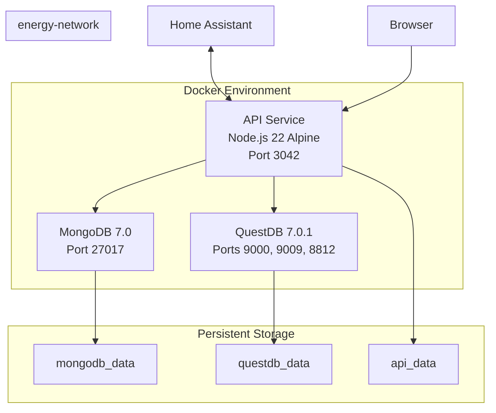

# Docker Setup - Energy Dashboard

Complete Docker configuration for the Energy Dashboard project, supporting both development and production deployments.

## Quick Start

```bash
# Development (databases only, run API locally)
./scripts/docker.sh dev
npm run dev

# Production (all services in Docker)
./scripts/docker.sh prod
```

## Overview

This Docker setup provides:

- **MongoDB** for application state (settings, entities, subscriptions)
- **QuestDB** for time-series energy data (readings, statistics)
- **API Service** running Platformatic Watt with Fastify + React frontend
- **Helper scripts** for common operations
- **Health checks** for all services
- **Named volumes** for data persistence
- **Bridge network** for service communication

## Architecture



## Files

| File | Purpose |
|------|---------|
| `docker-compose.yml` | Main service orchestration |
| `docker/Dockerfile.api` | Multi-stage API image build |
| `.dockerignore` | Exclude files from build context |
| `scripts/docker.sh` | Helper script for operations |
| `scripts/docker-test.sh` | Validation script |
| `.env.production.example` | Production environment template |
| `docker-compose.override.example.yml` | Local customization template |

## Services

### MongoDB
- **Image**: `mongo:7.0`
- **Port**: 27017
- **Volume**: `mongodb_data`
- **Health Check**: `mongosh` ping every 10s
- **Purpose**: Application state storage

### QuestDB
- **Image**: `questdb/questdb:7.0.1`
- **Ports**:
  - 9000: HTTP API & Web Console
  - 9009: InfluxDB Line Protocol (ILP)
  - 8812: PostgreSQL wire protocol
- **Volume**: `questdb_data`
- **Health Check**: HTTP query every 15s
- **Purpose**: Time-series data storage

### API Service
- **Base Image**: `node:22-alpine`
- **Port**: 3042 (configurable)
- **Build**: Multi-stage (builder + production)
- **Health Check**: HTTP /api/health every 30s
- **User**: Non-root (`nodejs:nodejs`)
- **Command**: `npm start` (runs `wattpm start`)

## Environment Configuration

### Development (.env)
```bash
PORT=3042
NODE_ENV=development
MONGODB_URI=mongodb://localhost:27017/energy_dashboard
QUESTDB_HOST=localhost
QUESTDB_ILP_PORT=9009
QUESTDB_HTTP_PORT=9000
HA_URL=homeassistant.local:8123
HA_TOKEN=your_token_here
```

### Production (Docker)
```bash
PORT=3042
NODE_ENV=production
MONGODB_URI=mongodb://mongodb:27017/energy_dashboard  # Note: 'mongodb' service name
QUESTDB_HOST=questdb                                  # Note: 'questdb' service name
QUESTDB_ILP_PORT=9009
QUESTDB_HTTP_PORT=9000
HA_URL=homeassistant.local:8123
HA_TOKEN=your_production_token
```

## Helper Script Commands

The `./scripts/docker.sh` script provides:

```bash
# Development
./scripts/docker.sh dev        # Start databases only
./scripts/docker.sh prod       # Start all services (production)

# Management
./scripts/docker.sh down       # Stop all services
./scripts/docker.sh restart    # Restart all services
./scripts/docker.sh status     # Show service status

# Logs
./scripts/docker.sh logs       # View all logs
./scripts/docker.sh logs api   # View specific service logs

# Database Access
./scripts/docker.sh mongo      # Open MongoDB shell
./scripts/docker.sh questdb    # Open QuestDB console

# Maintenance
./scripts/docker.sh rebuild    # Rebuild and restart API
./scripts/docker.sh clean      # Remove containers and volumes (WARNING: deletes data!)

# Help
./scripts/docker.sh help       # Show all commands
```

## Dockerfile Details

### Multi-Stage Build

**Stage 1: Builder**
- Base: `node:22-alpine`
- Install build dependencies (Python, make, g++ for native modules)
- Copy all package files
- Install all dependencies (including dev)
- Build frontend assets with Vite

**Stage 2: Production**
- Base: `node:22-alpine`
- Install runtime dependencies only
- Copy production dependencies from builder
- Copy built application code
- Create non-root user
- Configure health check
- Expose port 3042

### Security Features
- Non-root user (`nodejs:nodejs`)
- Minimal Alpine base image
- No dev dependencies in production
- Proper file ownership
- Volume permissions

### Optimization
- Layer caching for dependencies
- Multi-stage build reduces image size
- Only production dependencies included
- Built frontend assets (no Vite in production)

## Networking

All services communicate over `energy-network` bridge network:

```yaml
networks:
  energy-network:
    name: energy-network
    driver: bridge
```

Services can reference each other by service name:
- `mongodb://mongodb:27017` (not localhost)
- `questdb:9009` (not localhost)

## Data Persistence

Named volumes ensure data survives container restarts:

```yaml
volumes:
  mongodb_data:
    name: energy-dashboard-mongodb-data
  questdb_data:
    name: energy-dashboard-questdb-data
  api_data:
    name: energy-dashboard-api-data
```

### Backup

**MongoDB:**
```bash
docker compose exec mongodb mongodump --db energy_dashboard --out /tmp/backup
docker compose cp mongodb:/tmp/backup ./backup
```

**QuestDB:**
```bash
docker compose stop questdb
docker compose cp questdb:/var/lib/questdb ./questdb-backup
docker compose start questdb
```

### Restore

**MongoDB:**
```bash
docker compose cp ./backup mongodb:/tmp/backup
docker compose exec mongodb mongorestore --db energy_dashboard /tmp/backup/energy_dashboard
```

## Health Checks

All services include health checks for reliability:

### MongoDB
```yaml
healthcheck:
  test: ["CMD", "mongosh", "--eval", "db.adminCommand('ping')"]
  interval: 10s
  timeout: 5s
  retries: 5
  start_period: 10s
```

### QuestDB
```yaml
healthcheck:
  test: ["CMD-SHELL", "curl -f http://localhost:9000/exec?query=SELECT%201 || exit 1"]
  interval: 15s
  timeout: 5s
  retries: 3
  start_period: 20s
```

### API
```yaml
healthcheck:
  test: ["CMD-SHELL", "wget --no-verbose --tries=1 --spider http://localhost:3042/api/health || exit 1"]
  interval: 30s
  timeout: 5s
  retries: 3
  start_period: 30s
```

The API service depends on MongoDB and QuestDB health checks, ensuring it only starts when dependencies are ready.

## Validation

Test your Docker setup:

```bash
# Basic validation
./scripts/docker-test.sh

# Full validation (includes build and service tests)
./scripts/docker-test.sh --full
```

The validation script checks:
- Docker and Docker Compose installation
- Configuration file syntax
- Environment variables
- Network and volume configuration
- Service health (with --full flag)

## Troubleshooting

### API can't connect to MongoDB
```bash
# Check MongoDB is healthy
docker compose ps mongodb

# View MongoDB logs
docker compose logs mongodb

# Test network connectivity
docker compose exec api ping mongodb
```

### API can't connect to QuestDB
```bash
# Check QuestDB is healthy
docker compose ps questdb

# View QuestDB logs
docker compose logs questdb

# Test QuestDB HTTP endpoint
curl http://localhost:9000/exec?query=SELECT+1
```

### Build failures
```bash
# Clean build cache
docker compose build --no-cache api

# Check for disk space
docker system df

# Prune unused resources
docker system prune
```

### Permission errors
```bash
# Check volume permissions
docker compose exec api ls -la /app/data

# Reset volumes (WARNING: deletes data)
./scripts/docker.sh clean
```

### Logs not showing
```bash
# View all logs
docker compose logs

# Follow logs in real-time
docker compose logs -f

# Last 100 lines
docker compose logs --tail=100
```

## CI/CD

GitHub Actions workflow (`.github/workflows/docker.yml`) provides:

1. **Validation**: Dockerfile and docker-compose.yml syntax checking
2. **Build**: Multi-platform image builds with caching
3. **Test**: Service health checks in CI environment
4. **Push**: Automatic image push to GitHub Container Registry

Workflow runs on:
- Push to `main` or `develop` branches
- Pull requests
- Changes to Docker-related files

## Development Workflow

### Standard Development
```bash
# 1. Start databases
./scripts/docker.sh dev

# 2. Run API locally with hot reload
npm run dev

# 3. Make changes, API auto-reloads

# 4. Stop when done
./scripts/docker.sh down
```

### Full Docker Development
```bash
# 1. Start all services
./scripts/docker.sh prod

# 2. Make changes

# 3. Rebuild and restart API
./scripts/docker.sh rebuild

# 4. View logs
./scripts/docker.sh logs api
```

## Production Deployment

### Initial Setup
```bash
# 1. Copy and configure environment
cp .env.example .env
# Edit .env with production values

# 2. Validate configuration
./scripts/docker-test.sh

# 3. Start services
./scripts/docker.sh prod

# 4. Verify health
curl http://localhost:3042/api/health
```

### Updates
```bash
# 1. Pull latest code
git pull

# 2. Rebuild API
./scripts/docker.sh rebuild

# 3. Verify health
./scripts/docker.sh logs api
curl http://localhost:3042/api/health
```

### Monitoring
```bash
# Service status
./scripts/docker.sh status

# View logs
./scripts/docker.sh logs

# Check health
curl http://localhost:3042/api/health
curl http://localhost:9000/exec?query=SELECT+1
```

## Customization

Create `docker-compose.override.yml` for local customization:

```yaml
version: '3.8'

services:
  api:
    volumes:
      # Mount source for hot reload
      - ./web/api:/app/web/api
      - /app/web/api/node_modules

    environment:
      - LOG_LEVEL=debug
```

This file is automatically loaded by Docker Compose and overrides settings from `docker-compose.yml`.

## Resource Limits

To limit resource usage, add to your `docker-compose.override.yml`:

```yaml
services:
  api:
    deploy:
      resources:
        limits:
          cpus: '1.0'
          memory: 512M
        reservations:
          cpus: '0.5'
          memory: 256M

  mongodb:
    deploy:
      resources:
        limits:
          cpus: '1.0'
          memory: 1G

  questdb:
    deploy:
      resources:
        limits:
          cpus: '2.0'
          memory: 2G
```

## Best Practices

1. **Use named volumes** for data persistence
2. **Set resource limits** in production
3. **Monitor logs** regularly with `./scripts/docker.sh logs`
4. **Backup data** before major updates
5. **Test in staging** before production deployment
6. **Use health checks** to ensure service availability
7. **Keep images updated** for security patches
8. **Use .env files** for configuration (never commit secrets)
9. **Run validation** before deployment
10. **Monitor resource usage** with `docker stats`

## Additional Resources

- [Docker Documentation](https://docs.docker.com/)
- [Docker Compose Documentation](https://docs.docker.com/compose/)
- [MongoDB Docker Hub](https://hub.docker.com/_/mongo)
- [QuestDB Docker Hub](https://hub.docker.com/r/questdb/questdb)
- [Node.js Docker Best Practices](https://github.com/nodejs/docker-node/blob/main/docs/BestPractices.md)
