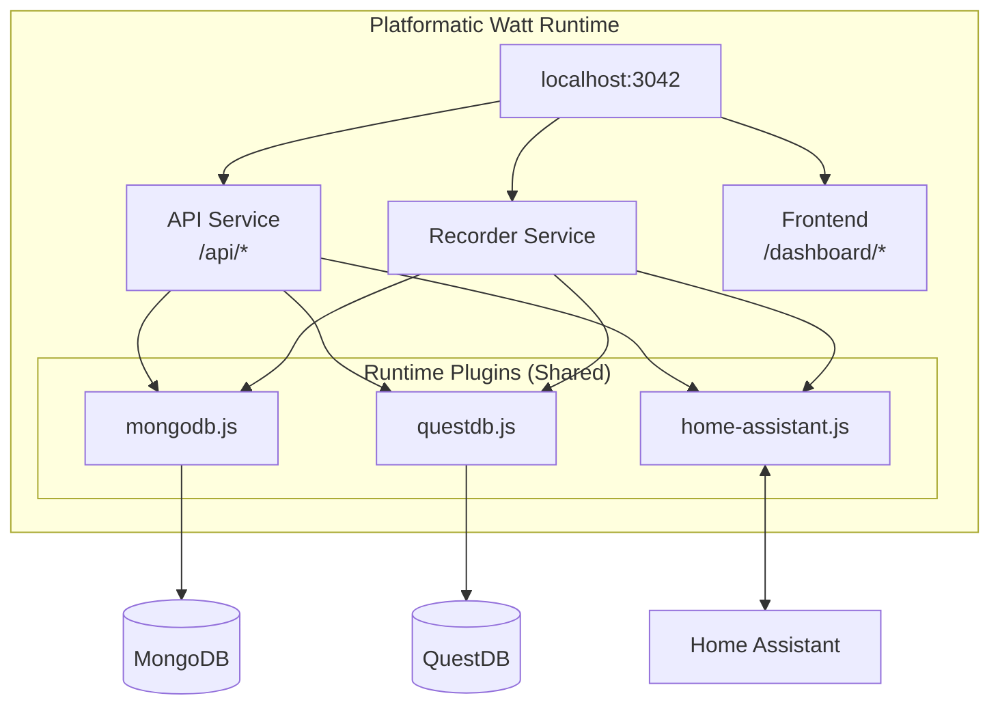

[](https://github.com/teknologist/ha-energy-analytics/actions/workflows/ci.yml)
[](https://github.com/teknologist/ha-energy-analytics/actions)
[](https://github.com/teknologist/ha-energy-analytics)
[](https://github.com/teknologist/ha-energy-analytics)
[](https://nodejs.org/)
[](LICENSE)

# Energy Dashboard

A standalone energy monitoring dashboard that fetches consumption data from Home Assistant via WebSocket API and provides analysis, charts, and consolidated views.

## Architecture



### Key Architecture Points

- **Runtime-Level Shared Plugins**: MongoDB, QuestDB, and Home Assistant plugins are registered at the Watt runtime level, making decorators available to all services
- **Independent Recorder Service**: Event recording runs as a separate service for better separation of concerns
- **Shared Connection Pools**: All services share the same database connections

## Data Flow


## Features

- **Real-time sync** from Home Assistant via WebSocket API
- **Dual database**: MongoDB (app state) + QuestDB (time-series)
- **Multiple aggregations**: hourly, daily, monthly
- **Interactive charts** with Recharts
- **Entity auto-discovery** for energy/power sensors
- **OpenAPI documentation** at `/api/documentation`

## Prerequisites

- Node.js 22.19+ (Platformatic Watt requirement)
- Docker (for MongoDB and QuestDB)
- Home Assistant with long-lived access token
- Energy sensors configured in Home Assistant

## Setup

1. **Clone and install dependencies**

```bash
cd energy-dashboard
npm install
cd web/api && npm install && cd ../..
cd web/frontend && npm install && cd ../..
```

2. **Configure environment**

```bash
cp .env.sample .env
# Edit .env with your Home Assistant details
```

Required environment variables:

| Variable | Description |
|----------|-------------|
| `HA_URL` | Home Assistant URL (e.g., `192.168.1.100:8123`) |
| `HA_TOKEN` | Long-lived access token from HA |
| `PORT` | Server port (default: 3042) |
| `MONGODB_URI` | MongoDB connection string (default: `mongodb://localhost:27017/energy_dashboard`) |
| `QUESTDB_HOST` | QuestDB host (default: `localhost`) |
| `QUESTDB_ILP_PORT` | QuestDB ILP port (default: `9009`) |
| `QUESTDB_HTTP_PORT` | QuestDB HTTP port (default: `9000`) |

3. **Get a Home Assistant token**

   - Go to your HA profile → Long-Lived Access Tokens
   - Create a new token and copy it to `.env`

4. **Run in development mode**

```bash
npm run dev
```

5. **Access the dashboard**

   - Dashboard: http://localhost:3042/dashboard
   - API docs: http://localhost:3042/api/documentation

## API Endpoints

### Entities

| Endpoint | Method | Description |
|----------|--------|-------------|
| `/api/entities` | GET | List energy entities from HA |
| `/api/entities/cached` | GET | List cached entities |
| `/api/entities/energy-config` | GET | Get HA energy dashboard config |

### Statistics

| Endpoint | Method | Description |
|----------|--------|-------------|
| `/api/statistics/sync` | POST | Sync data from HA to cache |
| `/api/statistics/:entity_id` | GET | Get hourly statistics |
| `/api/statistics/:entity_id/daily` | GET | Get daily summary |
| `/api/statistics/:entity_id/monthly` | GET | Get monthly summary |
| `/api/statistics/compare` | POST | Compare multiple entities |

### Real-time Subscription

| Endpoint | Method | Description |
|----------|--------|-------------|
| `/api/subscription/status` | GET | Get WebSocket subscription status |
| `/api/subscription/backfill` | POST | Force backfill for missed data |
| `/api/readings/:entity_id` | GET | Get real-time readings |

### System

| Endpoint | Method | Description |
|----------|--------|-------------|
| `/api/health` | GET | Health check |
| `/api/status` | GET | Detailed system status |

## Usage

1. **Initial sync**: Click "Sync from HA" to pull historical data
2. **Select entity**: Choose an energy sensor from the dropdown
3. **View charts**: Daily consumption bar chart + hourly line chart
4. **Change time range**: Use the dropdown to adjust the view period

## Data Flow

1. **Sync**: Real-time events via WebSocket, backfill via HA recorder API
2. **Store**: App state in MongoDB, time-series data in QuestDB
3. **Query**: QuestDB for time-series aggregations, MongoDB for settings/entities
4. **Display**: React components render charts with Recharts

## Tech Stack

### Backend
- **Runtime**: Platformatic Watt (orchestrates API and frontend)
- **API**: Fastify with `@platformatic/service`
- **App State**: MongoDB (settings, entities, subscriptions)
- **Time-Series**: QuestDB (energy readings, statistics)
- **WebSocket**: Native `ws` client for Home Assistant

### Frontend
- **Framework**: React 18 with Vite
- **Routing**: TanStack Router
- **Data Fetching**: TanStack Query
- **Charts**: Recharts
- **UI Components**: shadcn/ui (Radix UI + Tailwind CSS)

## Extending

### Add new aggregations

Use QuestDB's `SAMPLE BY` for time-series aggregations in `web/api/plugins/questdb.js`:

```javascript
async getWeeklySummary(entityId, startTime, endTime) {
  const sql = `
    SELECT timestamp, sum(sum) as total
    FROM energy_statistics
    WHERE entity_id = '${entityId}'
    AND timestamp BETWEEN '${startTime}' AND '${endTime}'
    SAMPLE BY 1w
  `;
  return this.query(sql);
}
```

### Add cost calculations

Create a new route in `web/api/routes/` that joins statistics with tariff data from MongoDB.

### Real-time Sync (Recorder Service)

The Recorder service (`web/recorder/`) runs as an independent Platformatic Watt service that automatically handles data synchronization:

- **WebSocket subscription**: Listens to `state_changed` events from Home Assistant via shared `fastify.ha` plugin
- **Real-time ingestion**: Energy readings stored immediately to QuestDB as events occur
- **Heartbeat checks**: Every 3 minutes, verifies subscription is active
- **Sync log cleanup**: TTL index auto-expires sync logs after 7 days
- **Hourly backfill**: Reconciles any gaps by fetching from HA recorder API

No cron jobs needed - sync is fully automatic once connected to Home Assistant.

**Directory Structure:**
```
runtime-plugins/           # Shared plugins (all services access)
├── mongodb.js             # Application state
├── questdb.js             # Time-series data
└── home-assistant.js      # HA WebSocket client
web/
├── api/                   # API routes only
├── recorder/              # Event recording service
│   └── plugins/
│       └── event-recorder.js
└── frontend/
```

#### Manual sync (if needed)

```bash
# Force sync for a specific period
curl -X POST http://localhost:3042/api/statistics/sync \
  -H 'Content-Type: application/json' \
  -d '{"period": "hour"}'

# Check subscription status
curl http://localhost:3042/api/subscription/status

# Force backfill for missed data
curl -X POST http://localhost:3042/api/subscription/backfill
```

## Production

```bash
# Using Docker Compose (recommended)
docker compose -f docker-compose.prod.yml up -d

# Or manually
npm run build
npm run start
```

Consider adding:
- Reverse proxy (nginx/Caddy/Traefik)
- MongoDB backup with mongodump
- QuestDB data directory backups

## License

MIT
