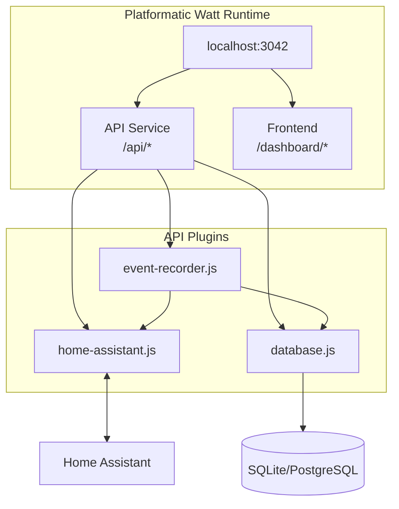
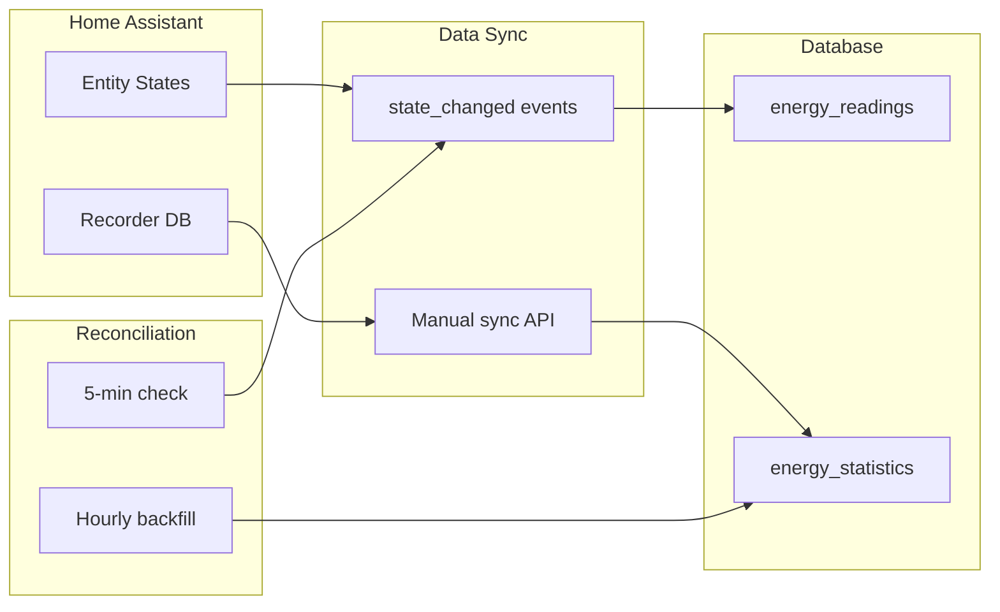

# Energy Dashboard

A standalone energy monitoring dashboard that fetches consumption data from Home Assistant via WebSocket API and provides analysis, charts, and consolidated views.

## Architecture



## Data Flow



## Features

- **Real-time sync** from Home Assistant via WebSocket API
- **Local caching** with SQLite for fast queries
- **Multiple aggregations**: hourly, daily, monthly
- **Interactive charts** with Recharts
- **Entity auto-discovery** for energy/power sensors
- **OpenAPI documentation** at `/api/documentation`

## Prerequisites

- Node.js 20+
- Home Assistant with long-lived access token
- Energy sensors configured in Home Assistant

## Setup

1. **Clone and install dependencies**

```bash
cd energy-dashboard
npm install
cd web/api && npm install && cd ../..
cd web/frontend && npm install && cd ../..
```

2. **Configure environment**

```bash
cp .env.sample .env
# Edit .env with your Home Assistant details
```

Required environment variables:

| Variable | Description |
|----------|-------------|
| `HA_URL` | Home Assistant URL (e.g., `192.168.1.100:8123`) |
| `HA_TOKEN` | Long-lived access token from HA |
| `PORT` | Server port (default: 3042) |
| `DATABASE_PATH` | SQLite database path (default: `./data/energy.db`) |

3. **Get a Home Assistant token**

   - Go to your HA profile → Long-Lived Access Tokens
   - Create a new token and copy it to `.env`

4. **Run in development mode**

```bash
npm run dev
```

5. **Access the dashboard**

   - Dashboard: http://localhost:3042/dashboard
   - API docs: http://localhost:3042/api/documentation

## API Endpoints

### Entities

| Endpoint | Method | Description |
|----------|--------|-------------|
| `/api/entities` | GET | List energy entities from HA |
| `/api/entities/cached` | GET | List cached entities |
| `/api/entities/energy-config` | GET | Get HA energy dashboard config |

### Statistics

| Endpoint | Method | Description |
|----------|--------|-------------|
| `/api/statistics/sync` | POST | Sync data from HA to cache |
| `/api/statistics/:entity_id` | GET | Get hourly statistics |
| `/api/statistics/:entity_id/daily` | GET | Get daily summary |
| `/api/statistics/:entity_id/monthly` | GET | Get monthly summary |
| `/api/statistics/compare` | POST | Compare multiple entities |

### System

| Endpoint | Method | Description |
|----------|--------|-------------|
| `/api/health` | GET | Health check |
| `/api/status` | GET | Detailed system status |

## Usage

1. **Initial sync**: Click "Sync from HA" to pull historical data
2. **Select entity**: Choose an energy sensor from the dropdown
3. **View charts**: Daily consumption bar chart + hourly line chart
4. **Change time range**: Use the dropdown to adjust the view period

## Data Flow

1. **Sync**: POST to `/api/statistics/sync` fetches from HA WebSocket API
2. **Cache**: Data stored in SQLite with proper indexing
3. **Query**: Frontend fetches aggregated data from cached records
4. **Display**: React components render charts with Recharts

## Tech Stack

### Backend
- **Runtime**: Platformatic Watt (orchestrates API and frontend)
- **API**: Fastify with `@platformatic/service`
- **Database**: Knex.js with SQLite/PostgreSQL support
- **WebSocket**: Native `ws` client for Home Assistant

### Frontend
- **Framework**: React 18 with Vite
- **Routing**: TanStack Router
- **Data Fetching**: TanStack Query
- **Charts**: Recharts
- **UI Components**: shadcn/ui (Radix UI + Tailwind CSS)

## Extending

### Add new aggregations

Edit `web/api/plugins/database.js` to add new prepared statements:

```javascript
getWeeklySummary: db.prepare(`
  SELECT 
    entity_id,
    strftime('%Y-%W', start_time) as week,
    SUM(sum) as total
  FROM energy_statistics
  WHERE entity_id = ? AND start_time >= ? AND start_time <= ?
  GROUP BY entity_id, strftime('%Y-%W', start_time)
`)
```

### Add cost calculations

Create a new route in `web/api/routes/` that joins statistics with tariff data.

### Scheduled sync

Add a cron job or use node-cron to periodically call the sync endpoint:

```javascript
import cron from 'node-cron'

// Sync every hour
cron.schedule('0 * * * *', () => {
  fetch('http://localhost:3042/api/statistics/sync', {
    method: 'POST',
    headers: { 'Content-Type': 'application/json' },
    body: JSON.stringify({ period: 'hour' })
  })
})
```

## Production

```bash
npm run build
npm run start
```

Consider adding:
- Reverse proxy (nginx/Caddy)
- Process manager (PM2)
- Backup strategy for SQLite database

## License

MIT
