# Flow Report: Energy Dashboard Data Flows & Interactions

**Date:** 2026-01-02
**Project:** Energy Dashboard (energy-tracker)

---

## Overview

This report analyzes all data flows, component interactions, and system behaviors in the Energy Dashboard project, comparing current implementation against the specification.

---

## System Architecture Flow

### Current Architecture

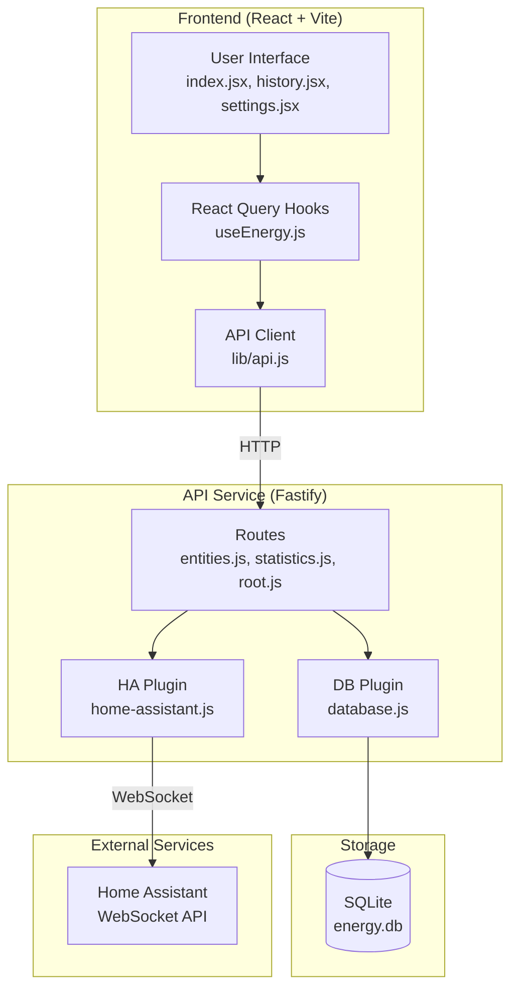

### Spec Required Architecture

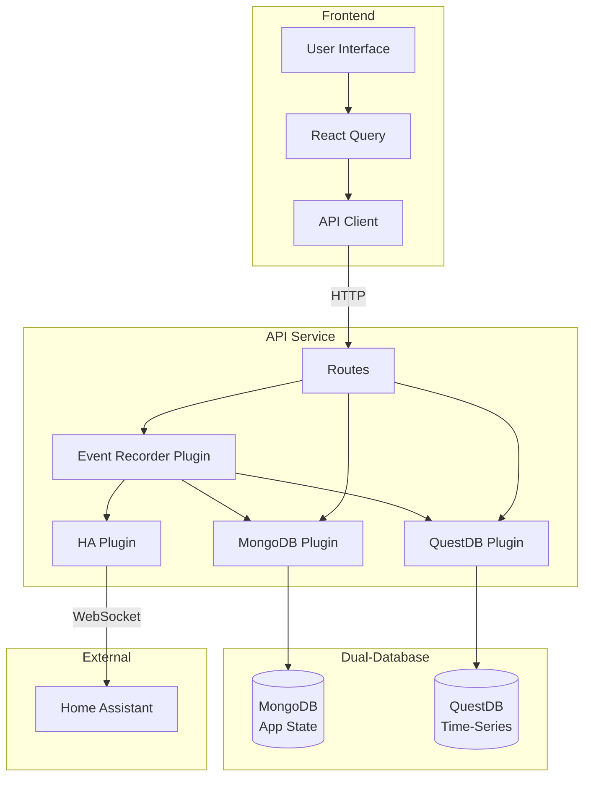

**Key Differences:**
- Current: Single SQLite database
- Required: MongoDB (config/state) + QuestDB (metrics)
- Current: No event recorder
- Required: Event-driven sync with reconciliation

---

## Data Flow Diagrams

### Flow 1: Manual Data Sync (Current Implementation)

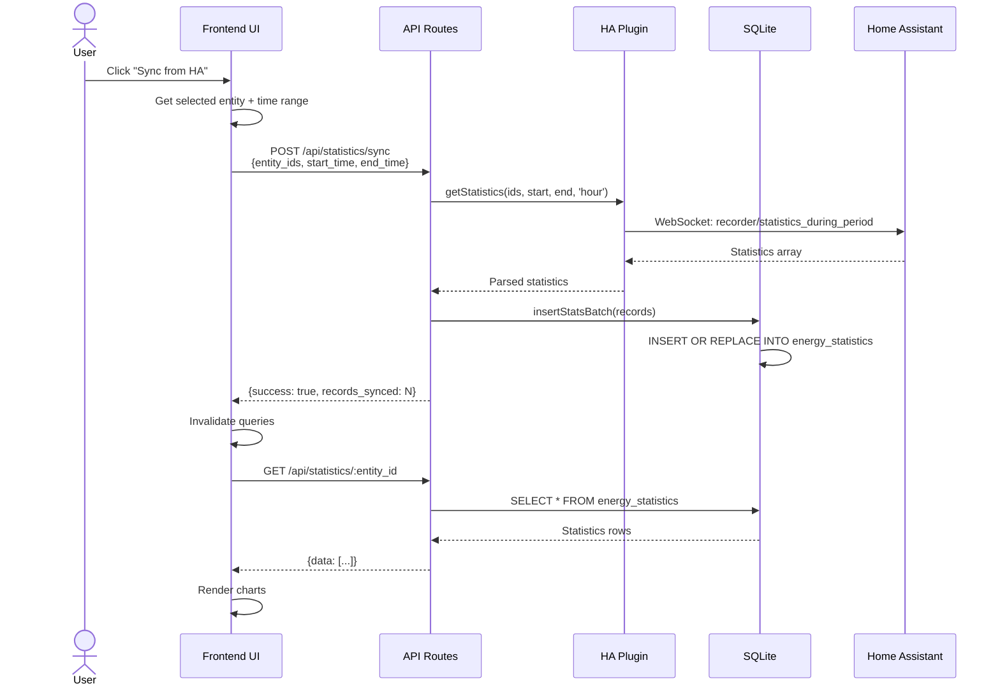

**Characteristics:**
- User-initiated
- Synchronous (blocks until complete)
- No automatic updates
- Gaps during offline periods

---

### Flow 2: Real-Time Event Sync (Spec Required)

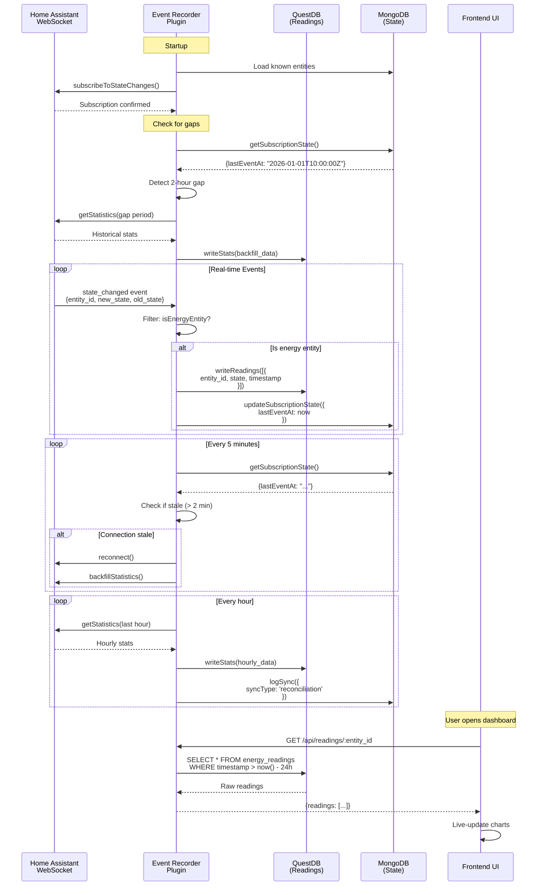

**Characteristics:**
- Automatic, continuous
- Sub-second latency
- Gap-aware reconciliation
- Resilient to network failures

---

### Flow 3: Entity Discovery & Tracking

#### Current Flow

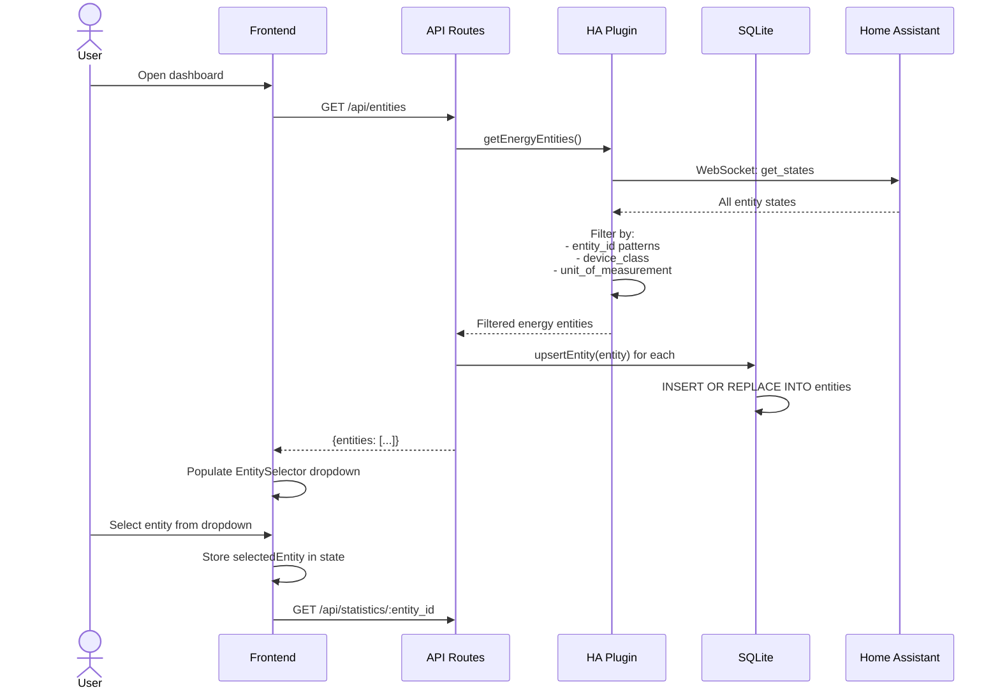

**Issues:**
- No user control over which entities to track
- All discovered entities are stored
- No "tracked" vs "available" distinction

#### Spec Required Flow

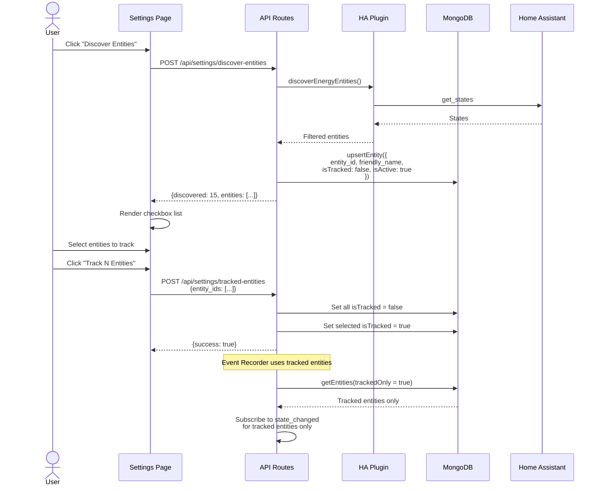

**Improvements:**
- User explicitly chooses which entities to track
- Reduces noise from irrelevant sensors
- Saves ingestion bandwidth

---

### Flow 4: Settings Configuration

#### Current Flow
**Status:** Frontend exists, backend missing

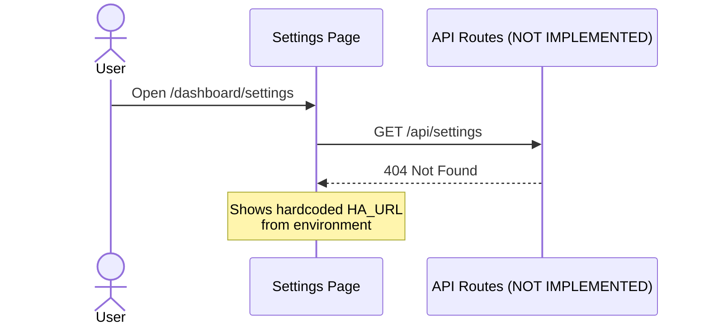

#### Spec Required Flow

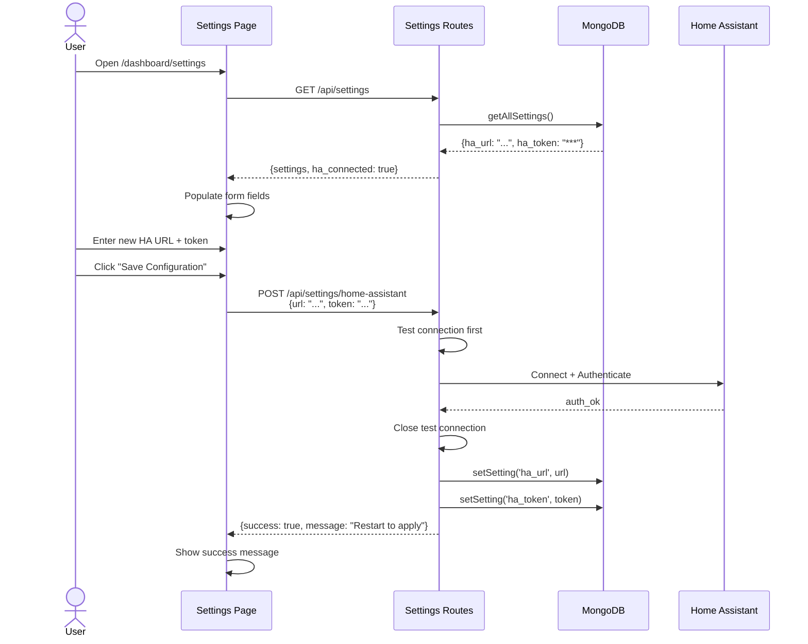

**Benefits:**
- No manual `.env` editing
- Connection validation before saving
- Stored securely in database

---

### Flow 5: Query & Display Statistics

#### Current Flow

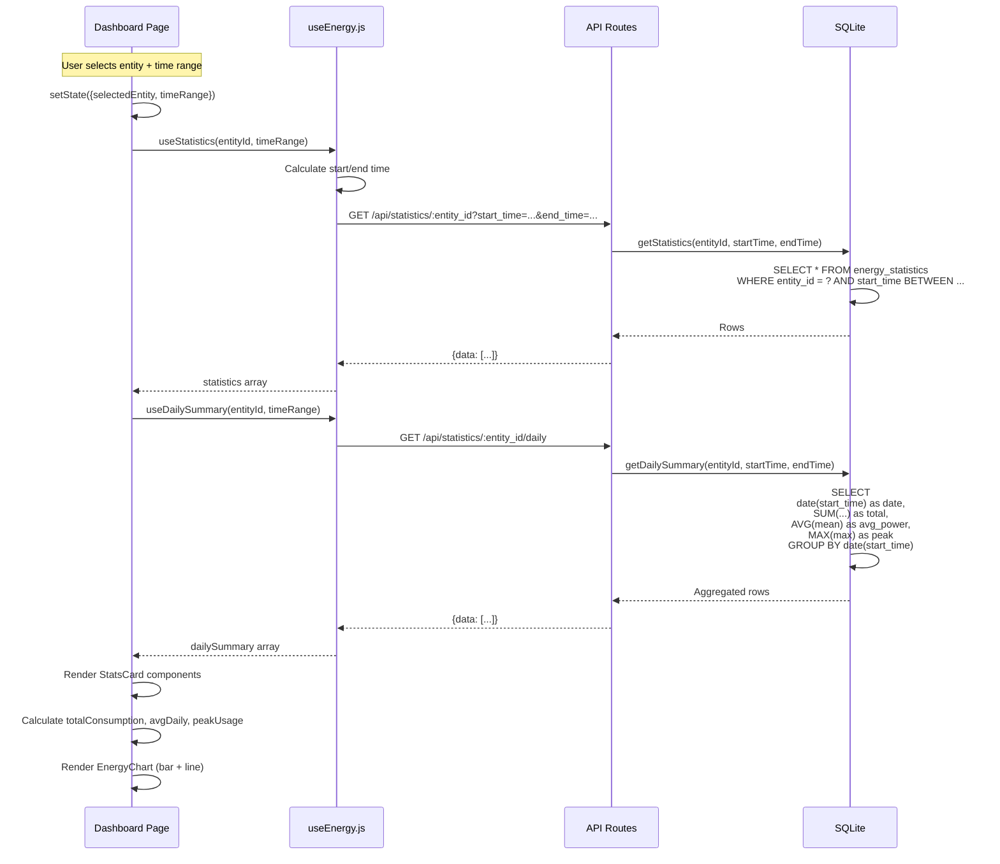

**Characteristics:**
- Reactive to user input
- Queries refreshed every 60s (polling)
- Manual sync required for new data

#### Spec Flow with Real-time Updates

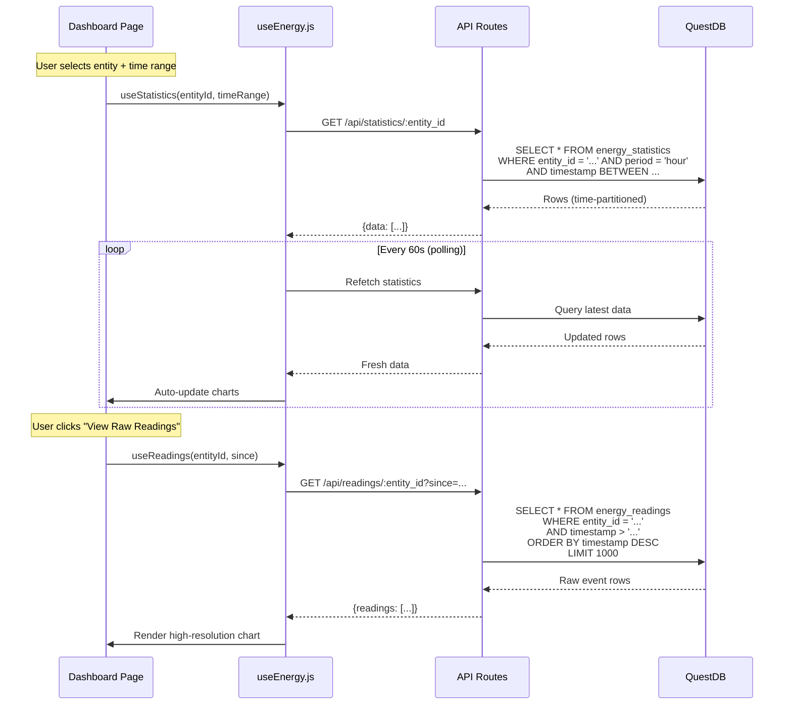

**Improvements:**
- Real-time data automatically appears
- Access to raw readings (sub-hourly)
- Time-series optimized queries

---

## Component Interaction Map

### Frontend Component Hierarchy

```
App (main.jsx)
├── QueryClientProvider
│   └── RouterProvider
│       └── RootLayout (__root.jsx)
│           ├── Header (Navigation + HA Status)
│           └── Outlet
│               ├── DashboardPage (index.jsx)
│               │   ├── EntitySelector
│               │   ├── TimeRangeSelect
│               │   ├── SyncButton
│               │   ├── StatsCard × 4
│               │   └── EnergyChart × 2
│               ├── HistoryPage (history.jsx)
│               └── SettingsPage (settings.jsx)
│                   ├── Connection Status Card
│                   ├── HA Config Form
│                   └── Entity Discovery Card
```

### Hook Dependencies

```
useEnergy.js
├── useStatus()
│   └── fetchStatus() → GET /api/status (MISSING)
├── useEntities()
│   └── fetchEntities() → GET /api/entities
├── useStatistics(entityId, timeRange)
│   └── fetchStatistics() → GET /api/statistics/:entity_id
├── useDailySummary(entityId, timeRange)
│   └── fetchDailySummary() → GET /api/statistics/:entity_id/daily
└── useSyncData()
    └── syncData() → POST /api/statistics/sync
```

### API Plugin Dependency Graph

#### Current

```
fastify
├── database.js (SQLite)
└── home-assistant.js
    └── database.js (optional, used in routes)
```

**Issues:**
- No explicit dependency declaration
- HA plugin doesn't depend on database
- Routes manually access both plugins

#### Spec Required

```
fastify
├── mongodb.js
├── questdb.js
├── home-assistant.js
│   └── mongodb.js (for settings)
└── event-recorder.js
    ├── home-assistant.js
    ├── mongodb.js
    └── questdb.js
```

**Benefits:**
- Clear dependency chain
- Proper plugin loading order
- Fail-fast if dependencies missing

---

## State Management Flow

### Frontend State (React Query)

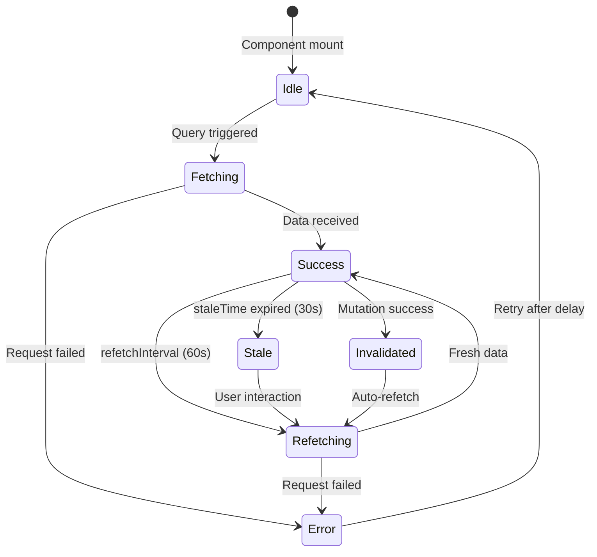

**Key Behaviors:**
- `staleTime: 30000ms`: Data considered fresh for 30s
- `refetchInterval: 60000ms`: Auto-refetch statistics every 60s
- `refetchOnWindowFocus: true`: Refetch when tab becomes active
- Mutations invalidate related queries

### Backend State (Database)

#### Current (SQLite)

```
energy_statistics
├── entity_id (indexed)
├── start_time (indexed)
└── UNIQUE(entity_id, start_time, period)

entities
└── entity_id (primary key)

sync_log
└── entity_id (indexed)
```

**Issues:**
- No subscription state tracking
- No settings storage
- No entity tracking preferences

#### Spec (MongoDB + QuestDB)

**MongoDB Collections:**
```
settings
├── _id: "ha_url"
├── _id: "ha_token"
└── ...

entities
├── _id: entity_id
├── isTracked: boolean
└── isActive: boolean

subscriptionState
└── _id: "subscription" (singleton)
    ├── subscriptionId
    ├── lastEventAt
    └── status

syncLog
└── entityId (indexed)
```

**QuestDB Tables:**
```
energy_readings (partitioned by DAY)
├── entity_id (SYMBOL, indexed)
├── state (DOUBLE)
└── timestamp (TIMESTAMP, designated)

energy_statistics (partitioned by MONTH)
├── entity_id (SYMBOL, indexed)
├── period (SYMBOL)
└── timestamp (TIMESTAMP, designated)
```

---

## Error Handling & Recovery Flows

### Current Error Handling

```mermaid
flowchart TD
    Request[API Request] --> Try{Try}
    Try -->|Success| Return[Return Data]
    Try -->|Error| Log[fastify.log.error]
    Log --> Reply[reply.code(500)]
    Reply --> UI[UI receives error]
    UI --> Fallback{Has fallback?}
    Fallback -->|Yes| Cache[Try /api/entities/cached]
    Fallback -->|No| ShowError[Display error message]
```

**Limitations:**
- Generic 500 errors
- No retry logic in backend
- Frontend relies on React Query retry (3 attempts)

### Spec Error Handling & Recovery

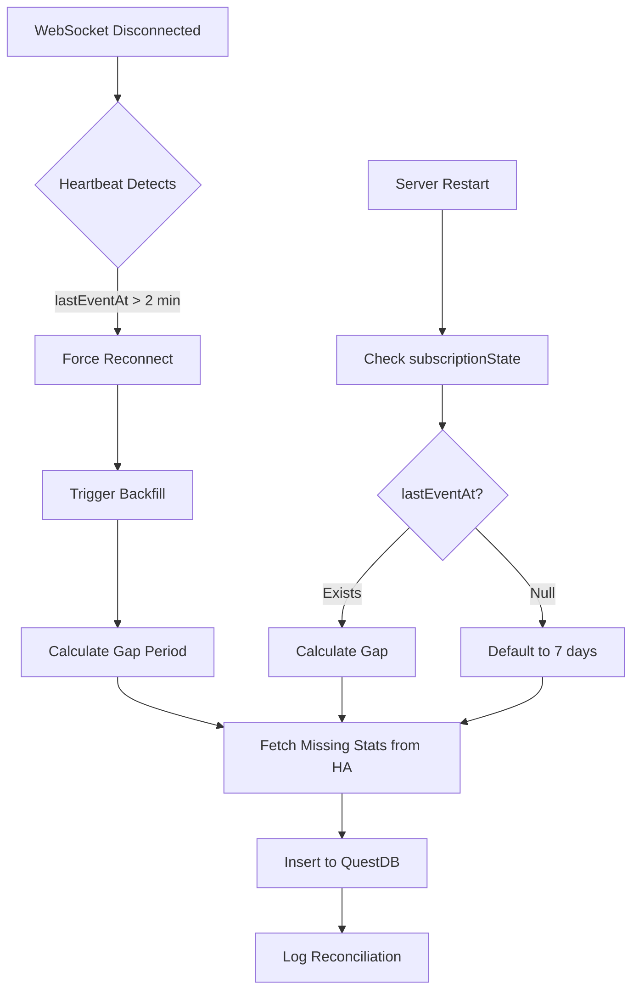

**Improvements:**
- Automatic gap detection
- Self-healing reconnection
- Startup recovery logic

---

## Performance Characteristics

### Current Implementation

| Operation | Method | Performance |
|-----------|--------|-------------|
| Entity listing | SQLite SELECT | ~10ms (few entities) |
| Statistics query | SQLite SELECT with date filter | ~50ms (7 days hourly) |
| Daily aggregation | SQLite GROUP BY | ~100ms (30 days) |
| Sync operation | HA API + batch INSERT | ~2-5s (depends on period) |
| Manual sync | Synchronous, blocks UI | User waits 2-5s |

**Bottlenecks:**
- SQLite GROUP BY on large datasets
- No connection pooling (single SQLite connection)
- Synchronous sync blocks response

### Spec Performance Targets

| Operation | Method | Target Performance |
|-----------|--------|-------------------|
| Entity listing | MongoDB query | <10ms |
| Statistics query | QuestDB SAMPLE BY | <50ms (millions of rows) |
| Raw readings | QuestDB time-partitioned query | <100ms (1 million rows) |
| Event ingestion | QuestDB ILP | <1ms per event |
| Sync operation | Background task | Non-blocking, async |

**Optimizations:**
- QuestDB time-partitioned storage (auto-pruning)
- ILP batch writes (millions/sec throughput)
- MongoDB indexes on isTracked, entityId
- Async backfill (doesn't block user)

---

## Security & Data Privacy

### Current

- **HA Token**: Stored in `.env` file
- **Transport**: No HTTPS (local network only)
- **Database**: SQLite file (no access control)

### Spec

- **HA Token**: Stored in MongoDB (still plain text, but centralized)
- **Transport**: Can add Nginx with TLS termination
- **Database**: MongoDB + QuestDB can add authentication
- **Docker**: Isolated containers, network segmentation

**Recommendations:**
- Add MongoDB authentication in production
- Use Kubernetes secrets or Vault for tokens
- Enable QuestDB access control
- Add Nginx with TLS for external access

---

## Scalability Analysis

### Current Limits

| Metric | Current Limit | Reason |
|--------|--------------|--------|
| Entities tracked | ~50 | Manual sync becomes slow |
| Retention period | ~1 year | SQLite file size grows |
| Event ingestion rate | ~1 event/sec | Not designed for real-time |
| Concurrent users | ~5 | SQLite WAL mode, single process |

### Spec Scalability

| Metric | Spec Capacity | Reason |
|--------|--------------|--------|
| Entities tracked | 1000+ | MongoDB horizontal scaling |
| Retention period | 10+ years | QuestDB partitioned storage |
| Event ingestion rate | 10,000+ events/sec | ILP protocol |
| Concurrent users | 100+ | QuestDB read replicas |

---

## Monitoring & Observability

### Current

- **Logging**: Fastify console logs
- **Metrics**: None
- **Health checks**: Basic root route `/`

### Spec

**Proposed Additions:**
```javascript
// /api/status
{
  homeAssistant: {
    connected: true,
    lastEventAt: "2026-01-02T10:00:00Z",
    subscriptionId: 12345
  },
  databases: {
    mongodb: "connected",
    questdb: "connected"
  },
  eventRecorder: {
    status: "active",
    knownEntities: 15,
    eventsToday: 45231
  },
  sync: {
    lastReconciliation: "2026-01-02T09:00:00Z",
    nextScheduled: "2026-01-02T10:00:00Z"
  }
}
```

**Metrics to Track:**
- Events ingested per minute
- Query latency (p50, p95, p99)
- WebSocket connection uptime
- Gap detection occurrences

---

## Deployment Flow

### Current

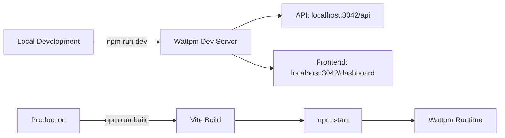

### Spec (Docker)

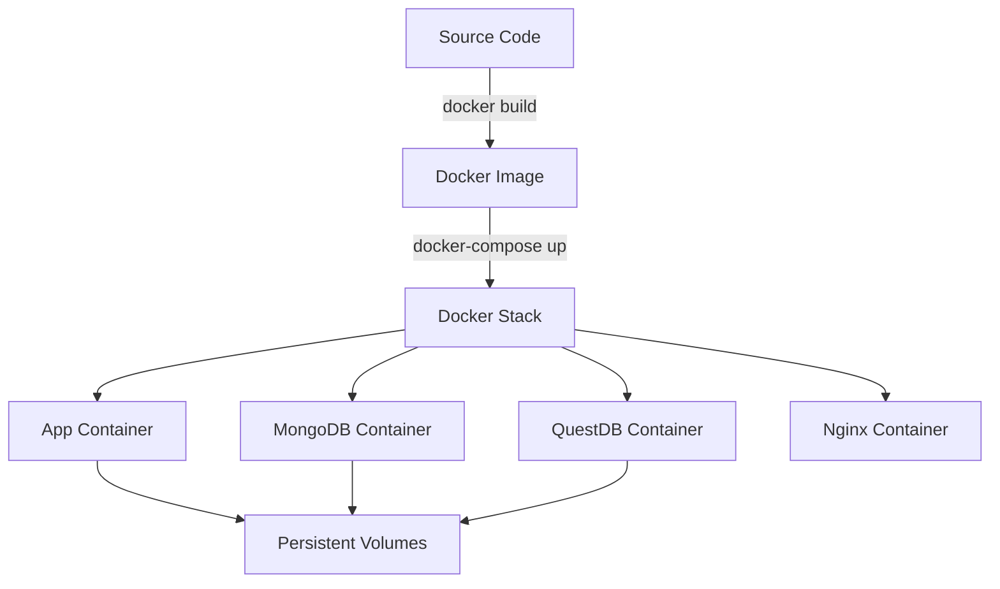

---

## Integration Points

### Home Assistant Integration

**Methods:**
1. **WebSocket API** (Current + Spec):
   - `get_states`: Fetch all entity states
   - `recorder/statistics_during_period`: Historical data
   - `energy/get_prefs`: Energy dashboard config
   - `subscribe_events`: Real-time state changes (SPEC)

2. **HTTP API** (Alternative, not used):
   - REST endpoints for entities/states
   - Less efficient than WebSocket

### Frontend ↔ API Contract

**Data Formats:**
```typescript
// Entity
{
  entity_id: string
  friendly_name: string
  state: string | number
  device_class?: string
  unit_of_measurement?: string
}

// Statistic
{
  entity_id: string
  start_time: ISO8601
  end_time?: ISO8601
  state: number
  sum: number
  mean: number
  min: number
  max: number
  period: 'hour' | 'day' | 'month'
}

// Daily Summary
{
  date: ISO8601
  total: number
  avg_power: number
  peak: number
  readings: number
}
```

---

## Conclusion

The current implementation provides a **functional manual sync workflow** with a polished frontend, but lacks the **real-time event-driven architecture** required by the specification. The primary flows missing are:

1. **Real-time Event Ingestion**: WebSocket subscription to `state_changed` events
2. **Reconciliation Logic**: Heartbeat monitoring and gap backfilling
3. **Dual-Database Operations**: MongoDB for state, QuestDB for metrics
4. **Settings Persistence**: Dynamic HA configuration via UI

**Flow Completeness:**
- ✅ Manual sync: 100%
- ⚠️ Entity discovery: 70% (no tracking preferences)
- ❌ Real-time sync: 0%
- ❌ Reconciliation: 0%
- ❌ Settings management: 0%
- ❌ Docker deployment: 0%

**Next Steps:**
1. Implement dual-database plugins (MongoDB + QuestDB)
2. Build event recorder plugin with subscription logic
3. Add settings routes and persistence
4. Create Docker deployment manifests
