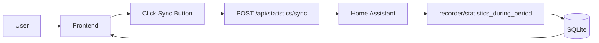
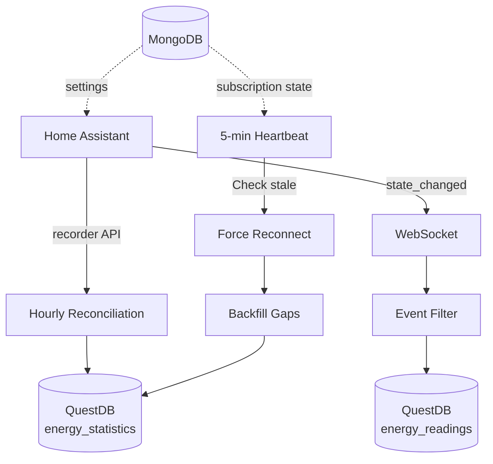

# Investigation Report: Energy Dashboard Current State Analysis

**Date:** 2026-01-02
**Project:** Energy Dashboard (energy-tracker)
**Status:** Phase 1 Implementation Partially Complete

---

## Executive Summary

The Energy Dashboard project is currently in a **partially implemented state** with a working frontend foundation and basic API layer. However, there are **critical gaps** between the current implementation and the specification, particularly around:

1. **Database Architecture**: Currently using SQLite only; spec requires MongoDB + QuestDB dual-database architecture
2. **Real-time Event Sync**: Event recorder plugin is completely missing
3. **Settings UI**: Settings page exists but needs backend integration
4. **Reconciliation System**: No backfill or heartbeat monitoring implemented
5. **Docker Deployment**: No Docker setup currently exists

---

## Current Implementation Status

### ✅ IMPLEMENTED (Working)

#### Frontend Foundation (Complete)
- **Package.json**: All dependencies correctly specified
  - React 18.3.1, TanStack Query 5.90.16, TanStack Router 1.120.3
  - Recharts 2.15.3, Tailwind CSS, shadcn/ui (Radix primitives)
  - All devDependencies present

- **Vite Configuration** (`vite.config.js`):
  - TanStack Router plugin configured
  - Path aliases (`@` → `./src`)
  - API proxy to `http://api.plt.local`
  - Base path `/dashboard/` correctly set

- **Tailwind + PostCSS**:
  - Full HSL color system (dark theme)
  - shadcn/ui design tokens
  - Border radius variables

- **Main Entry** (`main.jsx`):
  - QueryClient with 30s staleTime
  - Router with basepath `/dashboard`
  - Proper context passing

- **Utilities** (`lib/utils.js`):
  - `cn()` for className merging
  - `formatEntityName()`, `formatNumber()`, `getTimeRange()`, `formatDate()`

- **API Client** (`lib/api.js`):
  - All endpoints defined (entities, statistics, daily summary, sync, status)
  - Proper error handling with fallback to cached entities

- **React Hooks** (`hooks/useEnergy.js`):
  - `useStatus()`, `useEntities()`, `useStatistics()`, `useDailySummary()`, `useSyncData()`
  - Query invalidation on mutations
  - Polling intervals configured

- **Routes**:
  - `__root.jsx`: Navigation layout with HA connection status
  - `index.jsx`: Dashboard page with entity selector, time range, stats cards, charts
  - `history.jsx`, `settings.jsx`: Placeholder implementations

- **UI Components**:
  - `components/ui/button.jsx`, `card.jsx`, `select.jsx`
  - `EntitySelector.jsx`, `StatsCard.jsx`, `EnergyChart.jsx`

#### API Layer (Partial)
- **Platformatic Configuration**:
  - `platformatic.json`: Service with plugins and routes
  - `watt.json` (frontend): Vite service with `/dashboard` basePath

- **Database Plugin** (`database.js`):
  - SQLite with better-sqlite3
  - WAL mode enabled
  - Tables: `energy_statistics`, `sync_log`, `entities`
  - Prepared statements for performance
  - Helper methods: `insertStatsBatch()`, `getStatistics()`, `getDailySummary()`, `getMonthlySummary()`

- **Home Assistant Plugin** (`home-assistant.js`):
  - WebSocket client with auth flow
  - `getEnergyEntities()`: Filters by entity_id patterns and device_class
  - `getStatistics()`: Calls `recorder/statistics_during_period`
  - `getEnergyPreferences()`: Fetches HA energy dashboard config

- **Routes**:
  - `entities.js`: `/api/entities`, `/api/entities/cached`, `/api/entities/energy-config`
  - `statistics.js`: `/api/statistics/sync` (POST), `/api/statistics/:entity_id` (GET), `/api/statistics/:entity_id/daily`, `/api/statistics/:entity_id/monthly`, `/api/statistics/compare`
  - `root.js`: Basic health check

- **Root Configuration**:
  - `watt.json`: Runtime with autoload from `./web`, entrypoint `api`, port 3042
  - `package.json`: Scripts for `dev`, `start`, `build` using wattpm

---

### ❌ MISSING (Critical Gaps)

#### 1. Dual-Database Architecture
**Current:** SQLite only
**Required:** MongoDB (application state) + QuestDB (time-series)

**Impact:**
- Cannot handle high-volume real-time ingestion efficiently
- No proper separation of mutable config vs append-only time-series data
- Missing ILP ingestion for sub-millisecond writes
- No `SAMPLE BY` time-series queries

**Files Needed:**
- `web/api/plugins/mongodb.js`: MongoDB client with collections (settings, entities, subscriptionState, syncLog)
- `web/api/plugins/questdb.js`: QuestDB ILP sender + HTTP query client
- Schema updates to split responsibilities

#### 2. Event Recorder Plugin
**Current:** Not implemented
**Required:** Real-time state_changed event subscription

**Impact:**
- No real-time data capture
- Relying entirely on manual sync (polling)
- Missing gap detection and reconciliation
- No startup backfill logic

**Files Needed:**
- `web/api/plugins/event-recorder.js`
  - Subscribe to `state_changed` events
  - Filter energy entities
  - Write raw readings to QuestDB
  - Update subscription state in MongoDB
  - Heartbeat monitoring (5-min interval)
  - Hourly reconciliation backfill

#### 3. Real-time API Routes
**Current:** Not implemented
**Required:** Endpoints for readings and subscription status

**Files Needed:**
- `web/api/routes/realtime.js`
  - `GET /api/readings/:entity_id`: Fetch raw readings from QuestDB
  - `GET /api/readings/:entity_id/hourly`: Aggregate readings with `SAMPLE BY`
  - `GET /api/subscription/status`: Subscription state from MongoDB
  - `POST /api/subscription/backfill`: Force backfill trigger

#### 4. Settings Backend Integration
**Current:** Frontend UI exists, but no backend routes
**Required:** Full CRUD for HA config

**Files Needed:**
- `web/api/routes/settings.js`
  - `GET /api/settings`: Fetch all settings from MongoDB
  - `POST /api/settings/home-assistant`: Save HA URL + token, test connection
  - `POST /api/settings/test-connection`: Validate credentials
  - `POST /api/settings/discover-entities`: Trigger entity discovery
  - `POST /api/settings/tracked-entities`: Set which entities to track

#### 5. Status Endpoint
**Current:** Frontend calls `/api/status`, but route doesn't exist
**Required:** System health check

**Files Needed:**
- Update `web/api/routes/root.js` to add `/api/status`:
  - HA connection status
  - Database connectivity (MongoDB, QuestDB)
  - Subscription state
  - Last sync times

#### 6. Docker Deployment
**Current:** No Docker files
**Required:** Full containerized deployment for home lab

**Files Needed:**
- `Dockerfile`: Multi-stage build (builder + production)
- `docker-compose.yml`: Development with MongoDB, QuestDB, app
- `docker-compose.prod.yml`: Production with backups, Nginx, Watchtower
- `docker/nginx/nginx.conf`: Reverse proxy config
- `docker/questdb/server.conf`: QuestDB tuning
- `.dockerignore`

---

## Architecture Discrepancies

### Database Layer

| Component | Current | Spec Required | Status |
|-----------|---------|---------------|--------|
| Application State | SQLite | MongoDB | ❌ Not Implemented |
| Time-Series Data | SQLite | QuestDB | ❌ Not Implemented |
| Schema | Single `energy_statistics` table | Separate `energy_readings` + `energy_statistics` | ❌ Partially |
| Ingestion Method | Batch inserts via Knex | ILP streaming (QuestDB) | ❌ Missing |

**Critical Issue:** Current SQLite schema cannot handle high-frequency real-time events efficiently. The spec requires QuestDB's ILP protocol for sub-millisecond ingestion and time-series optimized queries.

### Data Sync Strategy

| Layer | Current | Spec Required | Status |
|-------|---------|---------------|--------|
| Real-time Events | ❌ Not implemented | WebSocket `state_changed` subscription | ❌ Missing |
| Manual Sync | ✅ `/api/statistics/sync` | ✅ Same | ✅ Working |
| Reconciliation | ❌ Not implemented | Heartbeat (5-min) + Hourly backfill | ❌ Missing |
| Startup Recovery | ❌ Not implemented | Gap detection on init | ❌ Missing |

**Critical Issue:** Without event-driven sync, the dashboard has no real-time data. The current implementation requires manual sync button clicks.

### Plugin Dependencies

**Spec Plugin Chain:**
```
home-assistant.js → mongodb.js
                 ↓
event-recorder.js → mongodb.js + questdb.js + home-assistant.js
                 ↓
routes/*         → event-recorder.js
```

**Current Implementation:**
```
home-assistant.js (standalone)
database.js (SQLite only)
routes/* → home-assistant.js + database.js
```

**Missing Links:**
- `mongodb.js` plugin
- `questdb.js` plugin
- `event-recorder.js` plugin with dependency chain

---

## API Endpoint Coverage

### ✅ Implemented Endpoints

| Endpoint | Method | Status |
|----------|--------|--------|
| `/api/entities` | GET | ✅ Working |
| `/api/entities/cached` | GET | ✅ Working |
| `/api/entities/energy-config` | GET | ✅ Working |
| `/api/statistics/:entity_id` | GET | ✅ Working |
| `/api/statistics/:entity_id/daily` | GET | ✅ Working |
| `/api/statistics/:entity_id/monthly` | GET | ✅ Working |
| `/api/statistics/sync` | POST | ✅ Working |
| `/api/statistics/compare` | POST | ✅ Working |
| `/` | GET | ✅ Health check |

### ❌ Missing Endpoints (from spec)

| Endpoint | Method | Required For |
|----------|--------|--------------|
| `/api/status` | GET | System health, frontend status indicator |
| `/api/readings/:entity_id` | GET | Raw event data from QuestDB |
| `/api/readings/:entity_id/hourly` | GET | Aggregated readings |
| `/api/subscription/status` | GET | Event subscription state |
| `/api/subscription/backfill` | POST | Manual reconciliation trigger |
| `/api/settings` | GET | Settings page |
| `/api/settings/home-assistant` | POST | HA config UI |
| `/api/settings/test-connection` | POST | Connection validation |
| `/api/settings/discover-entities` | POST | Entity discovery trigger |
| `/api/settings/tracked-entities` | POST | Entity tracking preferences |

---

## Critical Issues Analysis

### Issue 1: Database Architecture Mismatch
**Severity:** 🔴 Critical
**Blocker:** Yes

**Problem:**
- Spec mandates MongoDB + QuestDB dual-database architecture
- Current implementation uses only SQLite
- SQLite cannot handle real-time ingestion at scale (events every few seconds)
- Missing time-series optimizations (`SAMPLE BY`, partitioning, ILP)

**Impact:**
- Real-time event sync will fail under load
- Cannot implement reconciliation strategy (needs MongoDB subscription state)
- Settings cannot be stored dynamically (SQLite schema is rigid)

**Resolution Required:**
1. Add `mongodb.js` plugin with collections (settings, entities, subscriptionState, syncLog)
2. Add `questdb.js` plugin with ILP sender for writes, HTTP client for queries
3. Migrate `energy_statistics` to QuestDB
4. Add `energy_readings` table in QuestDB
5. Update all routes to use appropriate database

---

### Issue 2: Event-Driven Sync Missing
**Severity:** 🔴 Critical
**Blocker:** Yes

**Problem:**
- No WebSocket subscription to HA `state_changed` events
- Dashboard has no real-time updates
- Relies entirely on manual sync button

**Impact:**
- Users must manually click "Sync from HA" to see new data
- No automatic gap filling
- Missing data during server restarts or network issues

**Resolution Required:**
1. Implement `event-recorder.js` plugin
2. Subscribe to `state_changed` events on startup
3. Filter for energy entities
4. Write raw readings to QuestDB
5. Implement heartbeat monitoring
6. Implement hourly reconciliation

---

### Issue 3: Settings Backend Not Connected
**Severity:** 🟠 High
**Blocker:** No (but needed for usability)

**Problem:**
- Settings page exists in frontend
- Backend routes missing (`/api/settings`, `/api/settings/home-assistant`, etc.)
- HA credentials hardcoded in `.env` instead of UI-configurable

**Impact:**
- Users cannot configure HA connection via UI
- Cannot save settings to database
- Cannot test connection before saving

**Resolution Required:**
1. Add `settings.js` route
2. Implement CRUD operations in MongoDB
3. Add connection validation before saving
4. Implement entity discovery flow

---

### Issue 4: Missing Real-time Routes
**Severity:** 🟡 Medium
**Blocker:** No (but needed for full functionality)

**Problem:**
- Frontend has hooks for real-time readings
- Backend routes missing
- No endpoint to check subscription status

**Impact:**
- Cannot display raw event data
- Cannot show subscription health
- Cannot manually trigger backfill

**Resolution Required:**
1. Add `realtime.js` route
2. Implement QuestDB queries for raw readings
3. Expose subscription state from MongoDB
4. Add backfill trigger endpoint

---

### Issue 5: Docker Deployment Missing
**Severity:** 🟢 Low
**Blocker:** No (only for home lab deployment)

**Problem:**
- Spec includes full Docker setup
- Currently no containerization
- Cannot deploy to home lab easily

**Impact:**
- Manual setup required
- No service orchestration
- No automatic restarts or updates

**Resolution Required:**
1. Create Dockerfile with multi-stage build
2. Create docker-compose.yml for dev
3. Create docker-compose.prod.yml for production
4. Add Nginx reverse proxy config
5. Add backup automation

---

## Data Flow Analysis

### Current Flow (Manual Sync Only)



**Problems:**
- No automatic updates
- Missing data during offline periods
- High latency (user-triggered)

### Required Flow (Spec)



**Benefits:**
- Real-time updates (sub-second)
- Automatic gap filling
- Resilient to restarts/network issues

---

## Recommendations

### Phase 1: Critical Database Migration
1. Implement MongoDB plugin for application state
2. Implement QuestDB plugin for time-series data
3. Create schema for both databases
4. Migrate existing SQLite data to new structure
5. Update routes to use appropriate database

**Estimated Effort:** 8-12 hours

### Phase 2: Real-time Event Sync
1. Implement event-recorder plugin
2. Add WebSocket subscription logic
3. Implement heartbeat monitoring
4. Implement reconciliation backfill
5. Add real-time routes

**Estimated Effort:** 10-15 hours

### Phase 3: Settings Integration
1. Implement settings routes
2. Connect frontend to backend
3. Add connection testing
4. Add entity discovery flow

**Estimated Effort:** 4-6 hours

### Phase 4: Docker Deployment
1. Create Dockerfile
2. Create docker-compose files
3. Add Nginx configuration
4. Test deployment workflow

**Estimated Effort:** 6-8 hours

---

## Next Steps

1. **Decision Required:** Proceed with dual-database architecture or simplify to SQLite-only?
   - If simplified: Remove QuestDB/MongoDB from spec, accept performance limitations
   - If full implementation: Follow Phase 1-4 plan above

2. **Verify Spec Alignment:** Confirm dual-database requirement with stakeholder

3. **Implement Critical Path:**
   - Phase 1 (Database) → Phase 2 (Event Sync) → Phase 3 (Settings) → Phase 4 (Docker)

---

## Conclusion

The Energy Dashboard has a **solid frontend foundation** and a **working manual sync flow**, but is **missing critical real-time capabilities** required by the specification. The primary gap is the **dual-database architecture** (MongoDB + QuestDB) and the **event-driven sync system**.

**Status:** ~40% complete (frontend + basic API)
**Blockers:** Database architecture, event recorder plugin, settings backend
**Risk Level:** Medium (can work with manual sync, but not production-ready)
