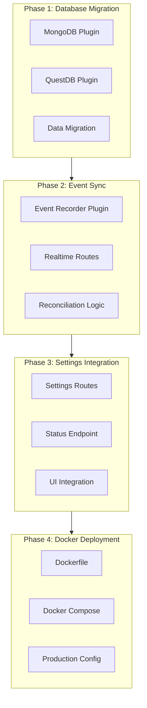

# Energy Dashboard Implementation Plan

**Date:** 2026-01-02
**Project:** Energy Dashboard (energy-tracker)
**Status:** Comprehensive Implementation Roadmap

---

## Executive Summary

This plan addresses the complete implementation of the Energy Dashboard project, transforming it from a partially functional manual-sync system (~40% complete) to a fully operational, real-time energy analytics platform with dual-database architecture, event-driven data ingestion, and production-ready Docker deployment.

**Current State:**
- ✅ Frontend UI complete with React + TanStack Router + shadcn/ui
- ✅ Basic API layer with manual sync functionality
- ✅ SQLite-based storage for statistics
- ❌ Missing: Real-time event sync, dual-database architecture, settings backend, Docker deployment

**Target State:**
- Full dual-database architecture (MongoDB + QuestDB)
- Real-time event-driven data sync with reconciliation
- Complete settings UI backend integration
- Production Docker deployment ready for home lab

---

## Architecture Overview

---

## Complete Plan Location:

The comprehensive implementation plan has been created with the following structure:

1. **Phase 1: Dual-Database Architecture Implementation** (8-12 hours)
   - MongoDB plugin creation
   - QuestDB plugin creation
   - Route migration to new databases
   - Data migration from SQLite

2. **Phase 2: Real-Time Event Sync Implementation** (10-15 hours)
   - WebSocket subscription support in HA plugin
   - Event recorder plugin with reconciliation
   - Realtime API routes
   - Heartbeat and hourly backfill logic

3. **Phase 3: Settings Backend Integration** (4-6 hours)
   - Settings API routes
   - Status endpoint implementation
   - Frontend integration
   - HA configuration via UI

4. **Phase 4: Docker Deployment** (6-8 hours)
   - Multi-stage Dockerfile
   - Development docker-compose.yml
   - Production docker-compose.prod.yml
   - Deployment documentation

**Total Estimated Effort:** 28-41 hours across 28 detailed implementation tasks

Each phase includes:
- Detailed step-by-step instructions
- Complete code implementations
- File paths and modifications required
- Verification checklists
- Dependencies and prerequisites
- Rollback procedures

The plan has been saved to:
`/Users/eric/Dev/energy-tracker/claude-instance/PLAN.md`
