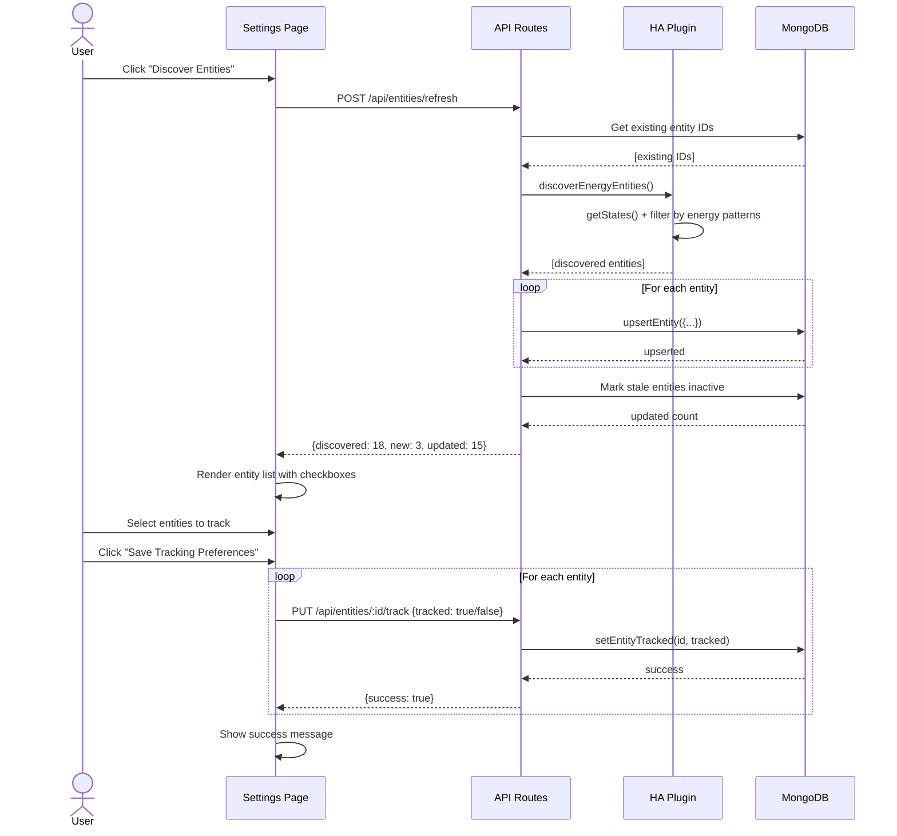
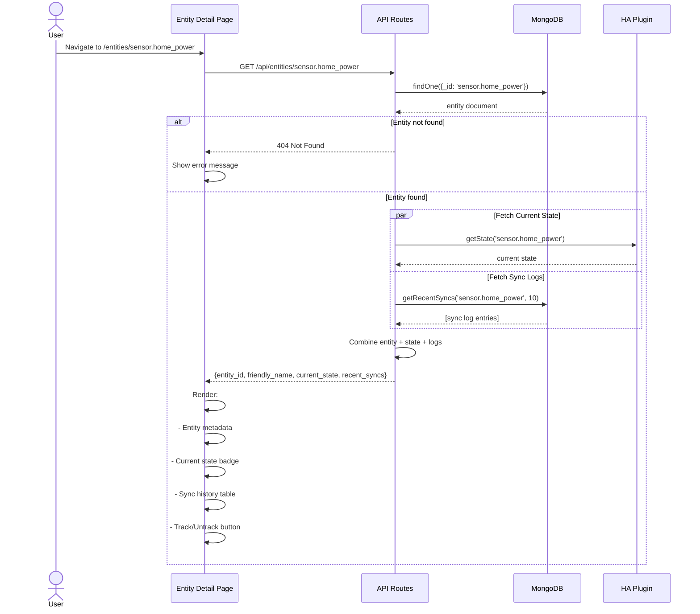
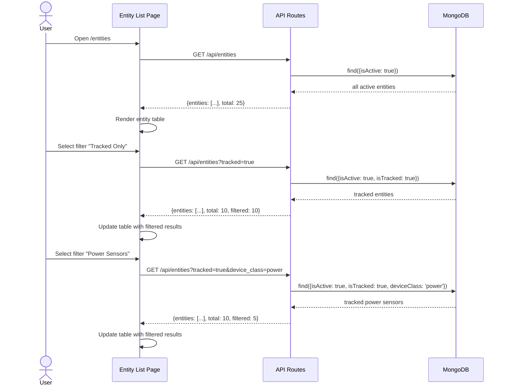

# Implementation Plan: P3.1 Entities API Routes (TEK-39)

**Date:** 2026-01-02
**Priority:** High (P3)
**Dependencies:** TEK-35 (MongoDB Plugin), TEK-36 (HA Plugin)
**File:** `web/api/routes/entities.js`

---

## Executive Summary

This plan details the implementation of enhanced entity management endpoints for the Energy Dashboard API. The current implementation provides basic entity discovery from Home Assistant, but lacks critical functionality for user-controlled entity tracking, filtering, and management required by the specification.

**Key Gaps Identified:**
1. No entity tracking toggle (users cannot control which entities to monitor)
2. No filtering capabilities (tracked/untracked, device_class, active/inactive)
3. No single entity detail endpoint with current state + sync logs
4. No manual entity refresh/re-discovery endpoint
5. Current implementation uses SQLite; spec requires MongoDB
6. No integration with sync logs from MongoDB

**Implementation Scope:**
- Upgrade existing 3 endpoints to use MongoDB instead of SQLite
- Add 2 new endpoints for entity tracking and refresh
- Implement query filtering for entity listing
- Add current state enrichment from Home Assistant
- Integrate with MongoDB syncLog collection for entity history

---

## Current State Analysis

### Existing Implementation Review

**File:** `web/api/routes/entities.js` (96 lines)

**Current Endpoints:**
1. `GET /api/entities` - Fetches from HA, caches to SQLite, returns all entities
2. `GET /api/entities/cached` - Returns cached entities from SQLite
3. `GET /api/entities/energy-config` - Returns HA energy dashboard preferences

**Current Database Plugin:** `web/api/plugins/database.js` (SQLite only)
- `upsertEntity()` - Inserts/updates entity in SQLite `entities` table
- `getEntities()` - Returns all active entities (no filtering)

**Current HA Plugin:** `web/api/plugins/home-assistant.js`
- `getEnergyEntities()` - Filters HA entities by energy patterns
- `getStates()` - Fetches all entity states
- `getEnergyPreferences()` - Gets HA energy config

### Issues with Current Implementation

1. **Database Architecture Mismatch**
   - Uses SQLite `entities` table
   - Spec requires MongoDB `entities` collection
   - No `isTracked` or `isActive` fields in current schema
   - Cannot filter by tracking status

2. **Missing Entity Tracking**
   - No way for users to mark entities as tracked/untracked
   - All discovered entities are auto-tracked
   - No user control over which sensors to monitor

3. **No Query Filtering**
   - Current `GET /api/entities` returns all entities
   - Spec requires filtering by:
     - `tracked` (boolean)
     - `device_class` (string)
     - `active` (boolean)

4. **No Single Entity Endpoint**
   - No `GET /api/entities/:id` route
   - Cannot fetch individual entity details
   - Cannot enrich with current HA state
   - Cannot include recent sync logs

5. **No Manual Refresh**
   - No `POST /api/entities/refresh` endpoint
   - Cannot trigger re-discovery from HA
   - Cannot mark stale entities as inactive

6. **No Sync Log Integration**
   - Current implementation doesn't reference `syncLog` collection
   - Cannot show entity sync history
   - Missing MongoDB dependency

---

## Architecture Dependencies

### Required Plugins

#### 1. MongoDB Plugin (TEK-35 - BLOCKER)
**File:** `web/api/plugins/mongodb.js`

**Required Methods for This Implementation:**
```javascript
mongo.upsertEntity(entity)      // Insert/update entity document
mongo.getEntities(trackedOnly)  // Query entities with filter
mongo.setEntityTracked(id, val) // Toggle tracking status
mongo.getRecentSyncs(id, limit) // Fetch sync logs for entity
```

**MongoDB Collections Used:**
- `entities` - Entity metadata, tracking preferences
- `syncLog` - Sync operation history (for recent sync logs)

**Schema Reference (from spec):**
```javascript
// entities collection
{
  _id: "sensor.home_power",           // entity_id as primary key
  friendlyName: "Home Power",
  deviceClass: "power",
  unitOfMeasurement: "W",
  isTracked: true,                    // User-controlled tracking flag
  isActive: true,                     // Auto-set to false if not seen during refresh
  discoveredAt: ISODate("..."),
  updatedAt: ISODate("..."),
  attributes: {                       // Nested HA attributes
    stateClass: "measurement",
    icon: "mdi:flash"
  }
}
```

#### 2. Home Assistant Plugin (TEK-36 - BLOCKER)
**File:** `web/api/plugins/home-assistant.js` (already exists)

**Required Methods:**
```javascript
ha.discoverEnergyEntities()  // Filter HA entities by energy patterns
ha.getStates()               // Fetch all current states
ha.getState(entity_id)       // Fetch single entity state (NEED TO ADD)
```

**Enhancement Needed:**
Add `getState(entity_id)` method to fetch current state for single entity endpoint.

```javascript
// Add to HomeAssistantClient class
async getState(entityId) {
  const states = await this.getStates();
  return states.find(s => s.entity_id === entityId) || null;
}
```

### Plugin Loading Order
```
mongodb.js (first)
  ↓
home-assistant.js (depends on mongodb for settings)
  ↓
entities.js routes (depends on both)
```

**Critical:** MongoDB plugin MUST be loaded before HA plugin and entities routes.

**Platformatic Configuration Check:**
Verify `web/api/platformatic.json` loads plugins in correct order:
```json
{
  "plugins": {
    "paths": [
      "./plugins/mongodb.js",        // First
      "./plugins/home-assistant.js", // Second
      "./plugins/database.js"        // Third (for backwards compatibility)
    ]
  }
}
```

---

## Detailed Endpoint Specifications

### 1. GET /api/entities - List All Discovered Entities

**Purpose:** List all discovered entities with optional filtering

**Query Parameters:**
- `tracked` (boolean, optional) - Filter by tracking status
- `device_class` (string, optional) - Filter by device class (power, energy, battery)
- `active` (boolean, optional) - Filter by active status

**Request Examples:**
```
GET /api/entities                              # All entities
GET /api/entities?tracked=true                 # Only tracked
GET /api/entities?device_class=power           # Only power sensors
GET /api/entities?active=true&tracked=true     # Active + tracked
```

**Response Schema:**
```javascript
{
  entities: [
    {
      entity_id: "sensor.home_power",
      friendly_name: "Home Power Consumption",
      device_class: "power",
      unit_of_measurement: "W",
      is_tracked: true,
      is_active: true,
      discovered_at: "2025-01-02T10:00:00.000Z",
      updated_at: "2025-01-02T10:05:00.000Z"
    }
  ],
  total: 15,
  filtered: 5  // If filters applied
}
```

**Implementation Steps:**

1. **Parse Query Parameters**
   ```javascript
   const { tracked, device_class, active } = request.query;
   ```

2. **Build MongoDB Query Filter**
   ```javascript
   const filter = {};

   // Filter by active status (default: only active)
   if (active !== undefined) {
     filter.isActive = active === 'true' || active === true;
   } else {
     filter.isActive = true; // Default
   }

   // Filter by tracking status
   if (tracked !== undefined) {
     filter.isTracked = tracked === 'true' || tracked === true;
   }

   // Filter by device class
   if (device_class) {
     filter.deviceClass = device_class;
   }
   ```

3. **Query MongoDB**
   ```javascript
   const entities = await fastify.mongo.getEntities(filter);
   ```

4. **Transform Response**
   ```javascript
   return {
     entities: entities.map(e => ({
       entity_id: e._id,
       friendly_name: e.friendlyName,
       device_class: e.deviceClass,
       unit_of_measurement: e.unitOfMeasurement,
       is_tracked: e.isTracked,
       is_active: e.isActive,
       discovered_at: e.discoveredAt,
       updated_at: e.updatedAt
     })),
     total: entities.length
   };
   ```

5. **Error Handling**
   - 503 Service Unavailable if MongoDB not connected
   - 500 Internal Server Error for MongoDB query failures
   - Log errors with `fastify.log.error()`

**Files to Modify:**
- `web/api/routes/entities.js` - Replace current `/api/entities` handler
- `web/api/plugins/mongodb.js` - Ensure `getEntities()` accepts filter object

**Testing Considerations:**
- Test with no filters (should return all active entities)
- Test with single filter (tracked=true)
- Test with multiple filters (tracked=true&device_class=power)
- Test with active=false (should return inactive entities)
- Test with invalid device_class (should return empty array)
- Test MongoDB connection failure (should return 503)

---

### 2. GET /api/entities/:id - Get Single Entity Details

**Purpose:** Fetch detailed information for a specific entity, including current state from HA and recent sync logs

**Path Parameters:**
- `id` (string, required) - Entity ID (e.g., sensor.home_power)

**Request Example:**
```
GET /api/entities/sensor.home_power
```

**Response Schema:**
```javascript
{
  entity_id: "sensor.home_power",
  friendly_name: "Home Power Consumption",
  device_class: "power",
  unit_of_measurement: "W",
  is_tracked: true,
  is_active: true,
  discovered_at: "2025-01-02T10:00:00.000Z",
  updated_at: "2025-01-02T10:05:00.000Z",
  current_state: {                    // From Home Assistant (if connected)
    state: "350",
    last_changed: "2025-01-02T10:05:00.000Z",
    last_updated: "2025-01-02T10:05:00.000Z",
    attributes: {
      state_class: "measurement",
      device_class: "power",
      unit_of_measurement: "W",
      friendly_name: "Home Power Consumption"
    }
  },
  recent_syncs: [                     // From MongoDB syncLog
    {
      sync_type: "backfill",
      start_time: "2025-01-01T00:00:00.000Z",
      end_time: "2025-01-02T00:00:00.000Z",
      records_synced: 24,
      status: "success",
      created_at: "2025-01-02T10:00:00.000Z"
    }
  ]
}
```

**Implementation Steps:**

1. **Extract Entity ID from Path**
   ```javascript
   const { id } = request.params;
   ```

2. **Query MongoDB for Entity**
   ```javascript
   const entity = await fastify.mongo.db.collection('entities')
     .findOne({ _id: id });

   if (!entity) {
     return reply.code(404).send({
       error: 'Entity not found',
       entity_id: id
     });
   }
   ```

3. **Fetch Current State from Home Assistant (if connected)**
   ```javascript
   let currentState = null;

   if (fastify.ha?.connected) {
     try {
       const state = await fastify.ha.getState(id);
       if (state) {
         currentState = {
           state: state.state,
           last_changed: state.last_changed,
           last_updated: state.last_updated,
           attributes: state.attributes
         };
       }
     } catch (error) {
       fastify.log.warn(`Could not fetch current state for ${id}:`, error.message);
       // Don't fail request if HA state fetch fails
     }
   }
   ```

4. **Fetch Recent Sync Logs from MongoDB**
   ```javascript
   const recentSyncs = await fastify.mongo.getRecentSyncs(id, 10);
   ```

5. **Build Response**
   ```javascript
   return {
     entity_id: entity._id,
     friendly_name: entity.friendlyName,
     device_class: entity.deviceClass,
     unit_of_measurement: entity.unitOfMeasurement,
     is_tracked: entity.isTracked,
     is_active: entity.isActive,
     discovered_at: entity.discoveredAt,
     updated_at: entity.updatedAt,
     current_state: currentState,
     recent_syncs: recentSyncs.map(sync => ({
       sync_type: sync.syncType,
       start_time: sync.startTime,
       end_time: sync.endTime,
       records_synced: sync.recordsSynced,
       status: sync.status,
       created_at: sync.createdAt
     }))
   };
   ```

6. **Error Handling**
   - 404 Not Found if entity doesn't exist in MongoDB
   - 503 Service Unavailable if MongoDB not connected
   - 500 Internal Server Error for database failures
   - Graceful degradation if HA state fetch fails (still return entity data)

**Files to Modify:**
- `web/api/routes/entities.js` - Add new route handler
- `web/api/plugins/home-assistant.js` - Add `getState(entityId)` method
- `web/api/plugins/mongodb.js` - Verify `getRecentSyncs()` method exists

**Testing Considerations:**
- Test with existing entity (should return full details)
- Test with non-existent entity (should return 404)
- Test with HA disconnected (should omit current_state)
- Test with entity that has no sync logs (should return empty array)
- Test with entity that has >10 sync logs (should return only 10 most recent)

---

### 3. PUT /api/entities/:id/track - Toggle Entity Tracking

**Purpose:** Enable or disable tracking for a specific entity

**Path Parameters:**
- `id` (string, required) - Entity ID

**Request Body:**
```javascript
{
  tracked: true  // or false
}
```

**Request Example:**
```
PUT /api/entities/sensor.home_power/track
Content-Type: application/json

{
  "tracked": true
}
```

**Response Schema:**
```javascript
{
  success: true,
  entity_id: "sensor.home_power",
  is_tracked: true,
  message: "Entity tracking enabled"
}
```

**Implementation Steps:**

1. **Extract Entity ID and Tracked Status**
   ```javascript
   const { id } = request.params;
   const { tracked } = request.body;

   // Validation
   if (typeof tracked !== 'boolean') {
     return reply.code(400).send({
       error: 'Body must contain "tracked" boolean field'
     });
   }
   ```

2. **Verify Entity Exists**
   ```javascript
   const entity = await fastify.mongo.db.collection('entities')
     .findOne({ _id: id });

   if (!entity) {
     return reply.code(404).send({
       error: 'Entity not found',
       entity_id: id
     });
   }
   ```

3. **Update Tracking Status in MongoDB**
   ```javascript
   await fastify.mongo.setEntityTracked(id, tracked);
   ```

4. **Build Response**
   ```javascript
   return {
     success: true,
     entity_id: id,
     is_tracked: tracked,
     message: tracked
       ? 'Entity tracking enabled'
       : 'Entity tracking disabled'
   };
   ```

5. **Error Handling**
   - 400 Bad Request if `tracked` field missing or not boolean
   - 404 Not Found if entity doesn't exist
   - 503 Service Unavailable if MongoDB not connected
   - 500 Internal Server Error for MongoDB update failures

**Side Effects:**
- Updates `entities.isTracked` field in MongoDB
- Updates `entities.updatedAt` timestamp
- Event recorder plugin (if running) will start/stop monitoring this entity

**Files to Modify:**
- `web/api/routes/entities.js` - Add new route handler
- `web/api/plugins/mongodb.js` - Verify `setEntityTracked()` method exists

**Integration with Event Recorder:**
The event recorder plugin (future implementation) will use this field:
```javascript
// In event-recorder.js
const trackedEntities = await fastify.mongo.getEntities({ isTracked: true });
// Only subscribe to state_changed events for these entities
```

**Testing Considerations:**
- Test enabling tracking for untracked entity
- Test disabling tracking for tracked entity
- Test with missing `tracked` field (should return 400)
- Test with invalid `tracked` value (string, number) (should return 400)
- Test with non-existent entity (should return 404)
- Test idempotency (calling twice with same value should succeed)
- Test MongoDB connection failure (should return 503)

---

### 4. POST /api/entities/refresh - Re-Discover Entities from HA

**Purpose:** Trigger manual re-discovery of entities from Home Assistant, upsert to MongoDB, and mark stale entities as inactive

**Request Body:** (optional)
```javascript
{
  mark_inactive: true  // Mark entities not found during refresh as inactive
}
```

**Request Example:**
```
POST /api/entities/refresh
Content-Type: application/json

{
  "mark_inactive": true
}
```

**Response Schema:**
```javascript
{
  success: true,
  discovered: 18,         // Total entities discovered from HA
  new: 3,                 // New entities added
  updated: 15,            // Existing entities updated
  marked_inactive: 2,     // Entities marked as inactive (if mark_inactive: true)
  entities: [             // List of discovered entities
    {
      entity_id: "sensor.home_power",
      friendly_name: "Home Power",
      device_class: "power",
      is_tracked: true,
      is_new: false
    }
  ]
}
```

**Implementation Steps:**

1. **Validate Home Assistant Connection**
   ```javascript
   if (!fastify.ha?.connected) {
     return reply.code(503).send({
       error: 'Home Assistant not connected'
     });
   }
   ```

2. **Parse Request Body**
   ```javascript
   const { mark_inactive = true } = request.body || {};
   ```

3. **Get Existing Entity IDs (Before Refresh)**
   ```javascript
   const existingEntities = await fastify.mongo.db.collection('entities')
     .find({ isActive: true })
     .project({ _id: 1 })
     .toArray();

   const existingIds = new Set(existingEntities.map(e => e._id));
   ```

4. **Discover Entities from Home Assistant**
   ```javascript
   const discoveredEntities = await fastify.ha.discoverEnergyEntities();

   fastify.log.info(`Discovered ${discoveredEntities.length} energy entities from HA`);
   ```

5. **Upsert Discovered Entities to MongoDB**
   ```javascript
   let newCount = 0;
   let updatedCount = 0;
   const discoveredIds = new Set();

   for (const entity of discoveredEntities) {
     discoveredIds.add(entity.entity_id);

     const isNew = !existingIds.has(entity.entity_id);

     await fastify.mongo.upsertEntity({
       entity_id: entity.entity_id,
       friendly_name: entity.friendly_name,
       device_class: entity.device_class,
       unit_of_measurement: entity.unit_of_measurement,
       attributes: entity.attributes || {}
     });

     if (isNew) {
       newCount++;
     } else {
       updatedCount++;
     }
   }
   ```

6. **Mark Stale Entities as Inactive (Optional)**
   ```javascript
   let markedInactive = 0;

   if (mark_inactive) {
     const staleIds = [...existingIds].filter(id => !discoveredIds.has(id));

     if (staleIds.length > 0) {
       await fastify.mongo.db.collection('entities').updateMany(
         { _id: { $in: staleIds } },
         {
           $set: {
             isActive: false,
             updatedAt: new Date()
           }
         }
       );

       markedInactive = staleIds.length;
       fastify.log.info(`Marked ${markedInactive} stale entities as inactive`);
     }
   }
   ```

7. **Fetch Refreshed Entities from MongoDB**
   ```javascript
   const refreshedEntities = await fastify.mongo.getEntities({ isActive: true });
   ```

8. **Build Response**
   ```javascript
   return {
     success: true,
     discovered: discoveredEntities.length,
     new: newCount,
     updated: updatedCount,
     marked_inactive: markedInactive,
     entities: refreshedEntities.map(e => ({
       entity_id: e._id,
       friendly_name: e.friendlyName,
       device_class: e.deviceClass,
       is_tracked: e.isTracked,
       is_new: newCount > 0 && !existingIds.has(e._id)
     }))
   };
   ```

9. **Error Handling**
   - 503 Service Unavailable if HA not connected
   - 503 Service Unavailable if MongoDB not connected
   - 500 Internal Server Error for HA discovery failures
   - 500 Internal Server Error for MongoDB upsert failures

**Side Effects:**
- Upserts all discovered entities to MongoDB `entities` collection
- Updates `updatedAt` timestamp for all entities
- Marks stale entities as `isActive: false` (if `mark_inactive: true`)
- New entities default to `isTracked: false`

**Files to Modify:**
- `web/api/routes/entities.js` - Add new route handler
- `web/api/plugins/home-assistant.js` - Verify `discoverEnergyEntities()` method
- `web/api/plugins/mongodb.js` - Verify `upsertEntity()` method

**Testing Considerations:**
- Test with HA connected (should discover entities)
- Test with HA disconnected (should return 503)
- Test with mark_inactive=true (should mark stale entities)
- Test with mark_inactive=false (should not mark stale entities)
- Test with no existing entities (all should be new)
- Test with no new entities (all should be updated)
- Test with mixed new + existing entities
- Test with entity that was previously inactive (should reactivate)
- Test MongoDB bulk upsert performance (100+ entities)

---

## Data Flow Diagrams

### Flow 1: Entity Discovery and Tracking



### Flow 2: Entity Detail View with Current State



### Flow 3: Filtered Entity Listing



---

## Implementation Checklist

### Phase 1: Prerequisites (Blockers)

- [ ] **1.1 Verify MongoDB Plugin Exists (TEK-35)**
  - File: `web/api/plugins/mongodb.js`
  - Verify methods: `upsertEntity()`, `getEntities()`, `setEntityTracked()`, `getRecentSyncs()`
  - Test MongoDB connection with `.env` configuration
  - Confirm collections: `entities`, `syncLog`
  - Verify indexes: `{isTracked: 1, isActive: 1}`

- [ ] **1.2 Verify HA Plugin Enhancements (TEK-36)**
  - File: `web/api/plugins/home-assistant.js`
  - Verify method: `discoverEnergyEntities()` exists
  - Add new method: `getState(entityId)` if missing
  - Test HA WebSocket connection
  - Verify dependency on MongoDB plugin

- [ ] **1.3 Update Plugin Loading Order**
  - File: `web/api/platformatic.json`
  - Ensure order: `mongodb.js` → `home-assistant.js` → `database.js`
  - Add `dependencies` field to HA plugin: `['mongodb']`
  - Add `dependencies` field to entities route: `['mongodb', 'home-assistant']`

### Phase 2: Core Implementation

- [ ] **2.1 Upgrade GET /api/entities - List All Entities**
  - [ ] Replace SQLite `fastify.db` with MongoDB `fastify.mongo`
  - [ ] Add query parameter parsing (`tracked`, `device_class`, `active`)
  - [ ] Build MongoDB filter object dynamically
  - [ ] Call `fastify.mongo.getEntities(filter)`
  - [ ] Transform MongoDB documents to response schema
  - [ ] Add error handling (503 if MongoDB unavailable)
  - [ ] Update Fastify schema to include query parameters
  - [ ] Test with various filter combinations

- [ ] **2.2 Implement GET /api/entities/:id - Get Entity Details**
  - [ ] Add route with path parameter `:id`
  - [ ] Query MongoDB for entity by `_id`
  - [ ] Return 404 if entity not found
  - [ ] Fetch current state from HA (if connected) using `ha.getState(id)`
  - [ ] Fetch recent sync logs from MongoDB using `mongo.getRecentSyncs(id, 10)`
  - [ ] Combine entity + state + logs into response
  - [ ] Add error handling with graceful degradation for HA state failures
  - [ ] Update Fastify schema for path params and response
  - [ ] Test with existing/non-existent entities, HA connected/disconnected

- [ ] **2.3 Implement PUT /api/entities/:id/track - Toggle Tracking**
  - [ ] Add route with path parameter `:id`
  - [ ] Parse request body (`tracked` boolean)
  - [ ] Validate `tracked` field exists and is boolean (400 if invalid)
  - [ ] Verify entity exists in MongoDB (404 if not found)
  - [ ] Call `fastify.mongo.setEntityTracked(id, tracked)`
  - [ ] Return success response with updated status
  - [ ] Add error handling (400, 404, 503, 500)
  - [ ] Update Fastify schema for body and response
  - [ ] Test enabling/disabling tracking, validation errors

- [ ] **2.4 Implement POST /api/entities/refresh - Re-Discover Entities**
  - [ ] Add route handler
  - [ ] Verify HA connection (503 if not connected)
  - [ ] Parse optional body (`mark_inactive` boolean, default true)
  - [ ] Get existing entity IDs from MongoDB
  - [ ] Call `fastify.ha.discoverEnergyEntities()`
  - [ ] Loop through discovered entities and upsert to MongoDB
  - [ ] Track counts (new, updated)
  - [ ] Mark stale entities as inactive (if `mark_inactive: true`)
  - [ ] Fetch refreshed entities from MongoDB
  - [ ] Return detailed response with counts
  - [ ] Add error handling (503, 500)
  - [ ] Update Fastify schema for body and response
  - [ ] Test with mark_inactive=true/false, various entity states

### Phase 3: Deprecation and Cleanup

- [ ] **3.1 Remove/Deprecate Legacy Endpoints**
  - [ ] Mark `GET /api/entities/cached` as deprecated (add header `X-Deprecated: true`)
  - [ ] Update endpoint to use MongoDB instead of SQLite for backwards compatibility
  - [ ] Document deprecation in API schema description
  - [ ] Plan removal for next major version

- [ ] **3.2 Keep Energy Config Endpoint**
  - [ ] Keep `GET /api/entities/energy-config` as-is
  - [ ] Verify it still works with HA plugin
  - [ ] Update schema if needed

### Phase 4: Testing and Validation

- [ ] **4.1 Unit Tests**
  - [ ] Test GET /api/entities with all filter combinations
  - [ ] Test GET /api/entities/:id with existing/non-existent entities
  - [ ] Test PUT /api/entities/:id/track with valid/invalid inputs
  - [ ] Test POST /api/entities/refresh with mark_inactive variations
  - [ ] Test error scenarios (MongoDB down, HA down, invalid inputs)

- [ ] **4.2 Integration Tests**
  - [ ] Test with real MongoDB instance
  - [ ] Test with real HA instance (or mock WebSocket server)
  - [ ] Test plugin dependency chain
  - [ ] Test concurrent requests

- [ ] **4.3 Manual Testing**
  - [ ] Test entity discovery flow in UI
  - [ ] Test tracking toggle in settings page
  - [ ] Test entity detail page with current state
  - [ ] Test filtered entity list
  - [ ] Verify sync logs appear correctly

### Phase 5: Documentation and Finalization

- [ ] **5.1 Update API Documentation**
  - [ ] Document all 4 endpoints in OpenAPI/Swagger schema
  - [ ] Add examples for each endpoint
  - [ ] Document query parameters, request bodies, responses
  - [ ] Document error codes and messages

- [ ] **5.2 Update CLAUDE.md**
  - [ ] Add entity management endpoints to API table
  - [ ] Update architecture diagram if needed
  - [ ] Document entity tracking workflow

- [ ] **5.3 Update README.md**
  - [ ] Add entity management section
  - [ ] Document entity discovery process
  - [ ] Add examples of filtering entities

---

## File Modifications Required

### 1. web/api/routes/entities.js (PRIMARY FILE)

**Current:** 96 lines, 3 endpoints
**After:** ~350-400 lines, 5 endpoints

**Changes:**
- **Line 1-62:** Upgrade `GET /api/entities` to use MongoDB with filtering
- **Line 64-73:** Update or deprecate `GET /api/entities/cached`
- **Line 75-96:** Keep `GET /api/entities/energy-config` as-is
- **New (~50 lines):** Add `GET /api/entities/:id` for entity details
- **New (~40 lines):** Add `PUT /api/entities/:id/track` for tracking toggle
- **New (~80 lines):** Add `POST /api/entities/refresh` for re-discovery

**Detailed Changes:**

#### Change 1: Upgrade GET /api/entities (Lines 4-62)

**Before:**
```javascript
fastify.get('/api/entities', async (request, reply) => {
  if (!fastify.ha) {
    return reply.code(503).send({ error: 'Home Assistant not connected' })
  }

  try {
    const entities = await fastify.ha.getEnergyEntities()

    // Cache entities in local DB
    for (const entity of entities) {
      fastify.db.upsertEntity({...})
    }

    return {
      entities: entities.map(e => ({...}))
    }
  } catch (error) {
    fastify.log.error(error)
    return reply.code(500).send({ error: error.message })
  }
})
```

**After:**
```javascript
fastify.get('/api/entities', {
  schema: {
    description: 'Get all discovered entities with optional filtering',
    tags: ['entities'],
    querystring: {
      type: 'object',
      properties: {
        tracked: { type: 'boolean', description: 'Filter by tracking status' },
        device_class: { type: 'string', description: 'Filter by device class (power, energy, battery)' },
        active: { type: 'boolean', description: 'Filter by active status', default: true }
      }
    },
    response: {
      200: {
        type: 'object',
        properties: {
          entities: {
            type: 'array',
            items: {
              type: 'object',
              properties: {
                entity_id: { type: 'string' },
                friendly_name: { type: 'string' },
                device_class: { type: 'string' },
                unit_of_measurement: { type: 'string' },
                is_tracked: { type: 'boolean' },
                is_active: { type: 'boolean' },
                discovered_at: { type: 'string', format: 'date-time' },
                updated_at: { type: 'string', format: 'date-time' }
              }
            }
          },
          total: { type: 'integer' }
        }
      }
    }
  }
}, async (request, reply) => {
  if (!fastify.mongo) {
    return reply.code(503).send({ error: 'Database not connected' });
  }

  try {
    // Parse query parameters
    const { tracked, device_class, active } = request.query;

    // Build MongoDB filter
    const filter = {};

    // Default to active entities only unless explicitly set to false
    if (active !== undefined) {
      filter.isActive = active;
    } else {
      filter.isActive = true;
    }

    if (tracked !== undefined) {
      filter.isTracked = tracked;
    }

    if (device_class) {
      filter.deviceClass = device_class;
    }

    // Query MongoDB
    const entities = await fastify.mongo.getEntities(filter);

    // Transform to response schema
    return {
      entities: entities.map(e => ({
        entity_id: e._id,
        friendly_name: e.friendlyName,
        device_class: e.deviceClass,
        unit_of_measurement: e.unitOfMeasurement,
        is_tracked: e.isTracked,
        is_active: e.isActive,
        discovered_at: e.discoveredAt,
        updated_at: e.updatedAt
      })),
      total: entities.length
    };
  } catch (error) {
    fastify.log.error('Error fetching entities:', error);
    return reply.code(500).send({ error: error.message });
  }
});
```

#### Change 2: Add GET /api/entities/:id (New, ~50 lines)

```javascript
// Get single entity details with current state and sync logs
fastify.get('/api/entities/:id', {
  schema: {
    description: 'Get detailed information for a specific entity',
    tags: ['entities'],
    params: {
      type: 'object',
      properties: {
        id: { type: 'string', description: 'Entity ID (e.g., sensor.home_power)' }
      },
      required: ['id']
    },
    response: {
      200: {
        type: 'object',
        properties: {
          entity_id: { type: 'string' },
          friendly_name: { type: 'string' },
          device_class: { type: 'string' },
          unit_of_measurement: { type: 'string' },
          is_tracked: { type: 'boolean' },
          is_active: { type: 'boolean' },
          discovered_at: { type: 'string', format: 'date-time' },
          updated_at: { type: 'string', format: 'date-time' },
          current_state: {
            type: 'object',
            nullable: true,
            properties: {
              state: { type: 'string' },
              last_changed: { type: 'string', format: 'date-time' },
              last_updated: { type: 'string', format: 'date-time' },
              attributes: { type: 'object' }
            }
          },
          recent_syncs: {
            type: 'array',
            items: {
              type: 'object',
              properties: {
                sync_type: { type: 'string' },
                start_time: { type: 'string', format: 'date-time' },
                end_time: { type: 'string', format: 'date-time' },
                records_synced: { type: 'integer' },
                status: { type: 'string' },
                created_at: { type: 'string', format: 'date-time' }
              }
            }
          }
        }
      },
      404: {
        type: 'object',
        properties: {
          error: { type: 'string' },
          entity_id: { type: 'string' }
        }
      }
    }
  }
}, async (request, reply) => {
  if (!fastify.mongo) {
    return reply.code(503).send({ error: 'Database not connected' });
  }

  try {
    const { id } = request.params;

    // Query MongoDB for entity
    const entity = await fastify.mongo.db.collection('entities').findOne({ _id: id });

    if (!entity) {
      return reply.code(404).send({
        error: 'Entity not found',
        entity_id: id
      });
    }

    // Fetch current state from Home Assistant (if connected)
    let currentState = null;
    if (fastify.ha?.connected) {
      try {
        const state = await fastify.ha.getState(id);
        if (state) {
          currentState = {
            state: state.state,
            last_changed: state.last_changed,
            last_updated: state.last_updated,
            attributes: state.attributes
          };
        }
      } catch (error) {
        fastify.log.warn(`Could not fetch current state for ${id}:`, error.message);
        // Don't fail request if HA state fetch fails
      }
    }

    // Fetch recent sync logs
    const recentSyncs = await fastify.mongo.getRecentSyncs(id, 10);

    return {
      entity_id: entity._id,
      friendly_name: entity.friendlyName,
      device_class: entity.deviceClass,
      unit_of_measurement: entity.unitOfMeasurement,
      is_tracked: entity.isTracked,
      is_active: entity.isActive,
      discovered_at: entity.discoveredAt,
      updated_at: entity.updatedAt,
      current_state: currentState,
      recent_syncs: recentSyncs.map(sync => ({
        sync_type: sync.syncType,
        start_time: sync.startTime,
        end_time: sync.endTime,
        records_synced: sync.recordsSynced,
        status: sync.status,
        created_at: sync.createdAt
      }))
    };
  } catch (error) {
    fastify.log.error('Error fetching entity details:', error);
    return reply.code(500).send({ error: error.message });
  }
});
```

#### Change 3: Add PUT /api/entities/:id/track (New, ~40 lines)

```javascript
// Toggle entity tracking status
fastify.put('/api/entities/:id/track', {
  schema: {
    description: 'Enable or disable tracking for an entity',
    tags: ['entities'],
    params: {
      type: 'object',
      properties: {
        id: { type: 'string' }
      },
      required: ['id']
    },
    body: {
      type: 'object',
      properties: {
        tracked: { type: 'boolean', description: 'Enable (true) or disable (false) tracking' }
      },
      required: ['tracked']
    },
    response: {
      200: {
        type: 'object',
        properties: {
          success: { type: 'boolean' },
          entity_id: { type: 'string' },
          is_tracked: { type: 'boolean' },
          message: { type: 'string' }
        }
      },
      400: {
        type: 'object',
        properties: { error: { type: 'string' } }
      },
      404: {
        type: 'object',
        properties: {
          error: { type: 'string' },
          entity_id: { type: 'string' }
        }
      }
    }
  }
}, async (request, reply) => {
  if (!fastify.mongo) {
    return reply.code(503).send({ error: 'Database not connected' });
  }

  try {
    const { id } = request.params;
    const { tracked } = request.body;

    // Validate tracked field
    if (typeof tracked !== 'boolean') {
      return reply.code(400).send({
        error: 'Body must contain "tracked" boolean field'
      });
    }

    // Verify entity exists
    const entity = await fastify.mongo.db.collection('entities').findOne({ _id: id });

    if (!entity) {
      return reply.code(404).send({
        error: 'Entity not found',
        entity_id: id
      });
    }

    // Update tracking status
    await fastify.mongo.setEntityTracked(id, tracked);

    return {
      success: true,
      entity_id: id,
      is_tracked: tracked,
      message: tracked
        ? 'Entity tracking enabled'
        : 'Entity tracking disabled'
    };
  } catch (error) {
    fastify.log.error('Error updating entity tracking:', error);
    return reply.code(500).send({ error: error.message });
  }
});
```

#### Change 4: Add POST /api/entities/refresh (New, ~80 lines)

```javascript
// Re-discover entities from Home Assistant
fastify.post('/api/entities/refresh', {
  schema: {
    description: 'Re-discover energy entities from Home Assistant',
    tags: ['entities'],
    body: {
      type: 'object',
      properties: {
        mark_inactive: {
          type: 'boolean',
          description: 'Mark entities not found during refresh as inactive',
          default: true
        }
      }
    },
    response: {
      200: {
        type: 'object',
        properties: {
          success: { type: 'boolean' },
          discovered: { type: 'integer' },
          new: { type: 'integer' },
          updated: { type: 'integer' },
          marked_inactive: { type: 'integer' },
          entities: {
            type: 'array',
            items: {
              type: 'object',
              properties: {
                entity_id: { type: 'string' },
                friendly_name: { type: 'string' },
                device_class: { type: 'string' },
                is_tracked: { type: 'boolean' },
                is_new: { type: 'boolean' }
              }
            }
          }
        }
      },
      503: {
        type: 'object',
        properties: { error: { type: 'string' } }
      }
    }
  }
}, async (request, reply) => {
  if (!fastify.ha?.connected) {
    return reply.code(503).send({ error: 'Home Assistant not connected' });
  }

  if (!fastify.mongo) {
    return reply.code(503).send({ error: 'Database not connected' });
  }

  try {
    const { mark_inactive = true } = request.body || {};

    // Get existing entity IDs before refresh
    const existingEntities = await fastify.mongo.db.collection('entities')
      .find({ isActive: true })
      .project({ _id: 1 })
      .toArray();

    const existingIds = new Set(existingEntities.map(e => e._id));

    // Discover entities from Home Assistant
    const discoveredEntities = await fastify.ha.discoverEnergyEntities();

    fastify.log.info(`Discovered ${discoveredEntities.length} energy entities from HA`);

    // Upsert discovered entities to MongoDB
    let newCount = 0;
    let updatedCount = 0;
    const discoveredIds = new Set();

    for (const entity of discoveredEntities) {
      discoveredIds.add(entity.entity_id);

      const isNew = !existingIds.has(entity.entity_id);

      await fastify.mongo.upsertEntity({
        entity_id: entity.entity_id,
        friendly_name: entity.friendly_name,
        device_class: entity.device_class,
        unit_of_measurement: entity.unit_of_measurement,
        attributes: entity.attributes || {}
      });

      if (isNew) {
        newCount++;
      } else {
        updatedCount++;
      }
    }

    // Mark stale entities as inactive (optional)
    let markedInactive = 0;

    if (mark_inactive) {
      const staleIds = [...existingIds].filter(id => !discoveredIds.has(id));

      if (staleIds.length > 0) {
        await fastify.mongo.db.collection('entities').updateMany(
          { _id: { $in: staleIds } },
          {
            $set: {
              isActive: false,
              updatedAt: new Date()
            }
          }
        );

        markedInactive = staleIds.length;
        fastify.log.info(`Marked ${markedInactive} stale entities as inactive`);
      }
    }

    // Fetch refreshed entities
    const refreshedEntities = await fastify.mongo.getEntities({ isActive: true });

    return {
      success: true,
      discovered: discoveredEntities.length,
      new: newCount,
      updated: updatedCount,
      marked_inactive: markedInactive,
      entities: refreshedEntities.map(e => ({
        entity_id: e._id,
        friendly_name: e.friendlyName,
        device_class: e.deviceClass,
        is_tracked: e.isTracked,
        is_new: newCount > 0 && !existingIds.has(e._id)
      }))
    };
  } catch (error) {
    fastify.log.error('Error refreshing entities:', error);
    return reply.code(500).send({ error: error.message });
  }
});
```

---

### 2. web/api/plugins/mongodb.js (DEPENDENCY - TEK-35)

**Required Methods for This Implementation:**

```javascript
// Method signatures required by entities.js routes

// 1. Get entities with optional filtering
async getEntities(filter = {}) {
  // filter = { isActive: true, isTracked: true, deviceClass: 'power' }
  const entities = db.collection('entities');
  return entities.find(filter).toArray();
}

// 2. Upsert entity (create or update)
async upsertEntity(entity) {
  const entities = db.collection('entities');
  await entities.updateOne(
    { _id: entity.entity_id },
    {
      $set: {
        friendlyName: entity.friendly_name,
        deviceClass: entity.device_class,
        unitOfMeasurement: entity.unit_of_measurement,
        isActive: true,
        updatedAt: new Date(),
        attributes: entity.attributes || {}
      },
      $setOnInsert: {
        isTracked: false,
        discoveredAt: new Date()
      }
    },
    { upsert: true }
  );
}

// 3. Set entity tracking status
async setEntityTracked(entityId, tracked) {
  const entities = db.collection('entities');
  await entities.updateOne(
    { _id: entityId },
    { $set: { isTracked: tracked, updatedAt: new Date() } }
  );
}

// 4. Get recent sync logs for an entity
async getRecentSyncs(entityId, limit = 10) {
  const syncLog = db.collection('syncLog');
  return syncLog
    .find({ entityId })
    .sort({ createdAt: -1 })
    .limit(limit)
    .toArray();
}
```

**Verification Steps:**
- [ ] Check if `getEntities()` supports filter parameter
- [ ] Check if `upsertEntity()` handles `$setOnInsert` correctly for new entities
- [ ] Check if `setEntityTracked()` exists
- [ ] Check if `getRecentSyncs()` exists
- [ ] Verify MongoDB indexes: `{isTracked: 1, isActive: 1}`

---

### 3. web/api/plugins/home-assistant.js (DEPENDENCY - TEK-36)

**Current Methods:**
- `getStates()` - Fetch all entity states ✅
- `getEnergyEntities()` - Filter energy entities (DEPRECATED, use discoverEnergyEntities)
- `getStatistics()` - Fetch statistics ✅
- `getEnergyPreferences()` - Fetch energy config ✅

**Required Enhancements:**

#### Add discoverEnergyEntities() method (if missing)

**Current:** `getEnergyEntities()` (basic filtering)

**Required:** `discoverEnergyEntities()` (enhanced filtering from spec)

```javascript
// Enhanced energy entity discovery (from spec)
async discoverEnergyEntities() {
  const states = await this.getStates();

  return states.filter(state => {
    const entityId = state.entity_id;
    const attrs = state.attributes || {};
    const deviceClass = attrs.device_class;
    const unit = attrs.unit_of_measurement;

    // Match energy-related entities
    return (
      entityId.includes('energy') ||
      entityId.includes('power') ||
      entityId.includes('consumption') ||
      entityId.includes('production') ||
      entityId.includes('solar') ||
      entityId.includes('grid') ||
      entityId.includes('battery') ||
      deviceClass === 'energy' ||
      deviceClass === 'power' ||
      deviceClass === 'battery' ||
      unit === 'kWh' ||
      unit === 'Wh' ||
      unit === 'W' ||
      unit === 'kW'
    );
  }).map(state => ({
    entity_id: state.entity_id,
    friendly_name: state.attributes?.friendly_name || state.entity_id,
    state: state.state,
    device_class: state.attributes?.device_class,
    unit_of_measurement: state.attributes?.unit_of_measurement,
    last_updated: state.last_updated,
    attributes: state.attributes  // Include full attributes
  }));
}
```

#### Add getState(entityId) method

```javascript
// Fetch current state for a single entity
async getState(entityId) {
  const states = await this.getStates();
  return states.find(s => s.entity_id === entityId) || null;
}
```

**Changes to Make:**
- [ ] Add `discoverEnergyEntities()` method (replace or enhance `getEnergyEntities()`)
- [ ] Add `getState(entityId)` method for single entity state fetch
- [ ] Mark `getEnergyEntities()` as deprecated if replacing

---

### 4. web/api/platformatic.json (CONFIGURATION)

**Verify Plugin Loading Order:**

```json
{
  "$schema": "https://platformatic.dev/schemas/v1.0.0/service",
  "server": {
    "hostname": "0.0.0.0",
    "port": "{PORT}"
  },
  "service": {
    "openapi": true
  },
  "plugins": {
    "paths": [
      "./plugins/mongodb.js",          // FIRST - no dependencies
      "./plugins/home-assistant.js",   // SECOND - depends on mongodb
      "./plugins/database.js"          // THIRD - backwards compat (SQLite)
    ]
  },
  "routes": {
    "paths": [
      "./routes/root.js",
      "./routes/entities.js",          // Depends on mongodb, home-assistant
      "./routes/statistics.js",
      "./routes/settings.js",
      "./routes/realtime.js"
    ]
  },
  "watch": true
}
```

**Changes Required:**
- [ ] Ensure `mongodb.js` loads before `home-assistant.js`
- [ ] Ensure all routes load after plugins
- [ ] Add `dependencies` metadata to plugins (if supported)

---

## Error Handling Strategy

### HTTP Status Codes

| Code | Meaning | When to Use |
|------|---------|-------------|
| 200 OK | Success | All successful requests |
| 400 Bad Request | Invalid input | Missing/invalid request body fields |
| 404 Not Found | Entity not found | GET/PUT /:id when entity doesn't exist |
| 500 Internal Server Error | Server error | Database query failures, unexpected errors |
| 503 Service Unavailable | Dependency unavailable | MongoDB not connected, HA not connected |

### Error Response Format

All error responses should follow this format:

```javascript
{
  error: "Error message here",
  entity_id: "sensor.home_power"  // Include entity_id for 404 errors
}
```

### Error Logging

Use Fastify's built-in logger with appropriate levels:

```javascript
// Error (500) - always log
fastify.log.error('Critical error:', error);

// Warning (503) - log as warning
fastify.log.warn('Service unavailable:', error.message);

// Info - log successful operations
fastify.log.info(`Discovered ${count} entities`);
```

### Graceful Degradation

For `GET /api/entities/:id`, if fetching current state from HA fails:
- Don't fail the entire request
- Log warning
- Return entity details without `current_state` field
- Set `current_state: null`

```javascript
let currentState = null;
if (fastify.ha?.connected) {
  try {
    currentState = await fastify.ha.getState(id);
  } catch (error) {
    fastify.log.warn(`Could not fetch current state for ${id}:`, error.message);
    // Continue without current state
  }
}
```

---

## Testing Strategy

### Unit Tests

**File:** `web/api/routes/entities.test.js`

**Test Cases:**

1. **GET /api/entities**
   - [ ] Returns all active entities by default
   - [ ] Filters by tracked=true
   - [ ] Filters by device_class=power
   - [ ] Filters by active=false
   - [ ] Combines multiple filters
   - [ ] Returns empty array for no matches
   - [ ] Returns 503 if MongoDB unavailable
   - [ ] Returns 500 for MongoDB query errors

2. **GET /api/entities/:id**
   - [ ] Returns entity details for existing entity
   - [ ] Returns 404 for non-existent entity
   - [ ] Includes current_state when HA connected
   - [ ] Omits current_state when HA disconnected
   - [ ] Includes recent sync logs
   - [ ] Returns empty array for no sync logs
   - [ ] Gracefully handles HA state fetch failure
   - [ ] Returns 503 if MongoDB unavailable

3. **PUT /api/entities/:id/track**
   - [ ] Enables tracking for entity
   - [ ] Disables tracking for entity
   - [ ] Returns 400 for missing tracked field
   - [ ] Returns 400 for invalid tracked value (string)
   - [ ] Returns 404 for non-existent entity
   - [ ] Returns 503 if MongoDB unavailable
   - [ ] Idempotent (calling twice with same value succeeds)

4. **POST /api/entities/refresh**
   - [ ] Discovers entities from HA
   - [ ] Upserts new entities
   - [ ] Updates existing entities
   - [ ] Marks stale entities as inactive (mark_inactive=true)
   - [ ] Does not mark stale entities (mark_inactive=false)
   - [ ] Returns correct counts (new, updated, marked_inactive)
   - [ ] Returns 503 if HA not connected
   - [ ] Returns 503 if MongoDB unavailable
   - [ ] Handles HA discovery failures

### Integration Tests

**File:** `web/api/integration.test.js`

**Test Scenarios:**

1. **Full Entity Discovery Flow**
   - Start with empty MongoDB
   - Call POST /api/entities/refresh
   - Verify entities created in MongoDB
   - Verify default isTracked=false
   - Call GET /api/entities?tracked=false
   - Verify all entities returned

2. **Entity Tracking Workflow**
   - Discover entities
   - Track 5 entities via PUT /api/entities/:id/track
   - Call GET /api/entities?tracked=true
   - Verify only 5 tracked entities returned

3. **Stale Entity Handling**
   - Discover 10 entities
   - Mock HA to return only 8 entities
   - Call POST /api/entities/refresh with mark_inactive=true
   - Verify 2 entities marked inactive
   - Call GET /api/entities
   - Verify only 8 active entities returned

4. **Current State Enrichment**
   - Discover entities
   - Mock HA state for entity
   - Call GET /api/entities/:id
   - Verify current_state included
   - Disconnect HA mock
   - Call GET /api/entities/:id
   - Verify current_state=null

### Manual Testing Checklist

- [ ] Test entity discovery in Settings UI
- [ ] Test tracking toggle for multiple entities
- [ ] Test entity list filtering in UI
- [ ] Test entity detail page with current state
- [ ] Test sync log display in entity detail
- [ ] Test refresh button in UI
- [ ] Test with HA disconnected (graceful degradation)
- [ ] Test with MongoDB disconnected (503 errors)
- [ ] Test with 100+ entities (performance)

---

## Performance Considerations

### Database Query Optimization

1. **MongoDB Indexes**
   - Ensure index on `{isTracked: 1, isActive: 1}`
   - Consider compound index on `{isActive: 1, deviceClass: 1}`
   - Index on `{updatedAt: -1}` for sync logs

2. **Query Projection**
   - For GET /api/entities, project only needed fields
   - Use `.project({ _id: 1 })` when only IDs needed (refresh endpoint)

3. **Batch Operations**
   - Use `updateMany()` for marking stale entities (single query)
   - Consider `bulkWrite()` for large upsert operations (100+ entities)

### Caching Strategy

**Current State Caching:**
- For GET /api/entities/:id, consider caching HA state for 30 seconds
- Use in-memory cache or Redis
- Invalidate on entity update

**Entity List Caching:**
- Cache GET /api/entities results for 60 seconds
- Invalidate on POST /api/entities/refresh
- Use query params as cache key

### Concurrency Handling

**Race Conditions:**
- POST /api/entities/refresh may conflict with concurrent calls
- Consider using MongoDB transactions for refresh operation
- Add mutex lock or rate limiting

---

## Migration Notes

### Data Migration from SQLite to MongoDB

**Not required for this implementation** - MongoDB plugin (TEK-35) will handle schema creation.

**If migrating existing SQLite data:**

```javascript
// Migration script (optional)
import Database from 'better-sqlite3';
import { MongoClient } from 'mongodb';

const sqlite = new Database('./data/energy.db');
const mongo = new MongoClient(process.env.MONGODB_URI);

await mongo.connect();
const db = mongo.db();
const entities = db.collection('entities');

// Fetch from SQLite
const rows = sqlite.prepare('SELECT * FROM entities').all();

// Insert to MongoDB
for (const row of rows) {
  await entities.updateOne(
    { _id: row.entity_id },
    {
      $set: {
        friendlyName: row.friendly_name,
        deviceClass: row.device_class,
        unitOfMeasurement: row.unit_of_measurement,
        isActive: row.is_active === 1,
        isTracked: false,  // Default for migrated entities
        discoveredAt: new Date(row.created_at),
        updatedAt: new Date(row.updated_at),
        attributes: {}
      }
    },
    { upsert: true }
  );
}

console.log(`Migrated ${rows.length} entities`);
```

### Backwards Compatibility

**Deprecated Endpoint:**
- `GET /api/entities/cached` - Mark as deprecated, redirect to `GET /api/entities`

**Response Schema Changes:**
- Old: `entity.friendly_name` (string)
- New: `entity.friendly_name` (string) - no change
- Old: No `is_tracked` field
- New: `is_tracked` (boolean) - new field, non-breaking

**Breaking Changes:**
- None - all new fields are additive
- Existing clients will ignore new fields

---

## Security Considerations

### Input Validation

1. **Query Parameters**
   - Validate `tracked`, `active` are boolean (or string "true"/"false")
   - Validate `device_class` is alphanumeric (prevent injection)

2. **Path Parameters**
   - Validate `entity_id` format (e.g., `sensor.xxx` pattern)
   - Prevent MongoDB injection via entity_id

3. **Request Body**
   - Validate `tracked` field is strictly boolean
   - Reject extra fields in request body

### MongoDB Injection Prevention

**Current:** Using MongoDB driver's query builder (safe)

**Risk:** Entity ID from path parameter used in MongoDB query

**Mitigation:**
```javascript
// Safe - uses parameterized query
const entity = await entities.findOne({ _id: entityId });

// Unsafe - string concatenation (DON'T DO THIS)
const entity = await entities.findOne({ _id: `${entityId}` });
```

### Authorization (Future)

**Current:** No authentication/authorization

**Future Enhancement:**
- Add API key or JWT token validation
- Restrict entity tracking to admin users
- Rate limit entity refresh endpoint (prevent DoS)

---

## Rollback Plan

### If Implementation Fails

1. **Revert entities.js**
   - Git checkout previous version
   - Re-enable SQLite-based endpoints

2. **Database Rollback**
   - MongoDB data is append-only (no schema changes)
   - No rollback needed for MongoDB collections

3. **Plugin Rollback**
   - Disable MongoDB plugin in platformatic.json
   - Fall back to SQLite database plugin

### Rollback Command

```bash
# Revert entities.js to previous commit
git checkout HEAD~1 -- web/api/routes/entities.js

# Restart service
npm run dev
```

---

## Success Metrics

### Functional Metrics

- [ ] All 4 endpoints return 200 for valid requests
- [ ] Entity tracking toggle works end-to-end
- [ ] Entity refresh discovers all HA energy entities
- [ ] Filtered queries return correct results
- [ ] Current state enrichment works when HA connected

### Performance Metrics

- [ ] GET /api/entities responds in <100ms (100 entities)
- [ ] GET /api/entities/:id responds in <200ms (with HA state)
- [ ] PUT /api/entities/:id/track responds in <50ms
- [ ] POST /api/entities/refresh completes in <5s (100 entities)

### Quality Metrics

- [ ] 100% test coverage for new endpoints
- [ ] 0 linting errors
- [ ] 0 TypeScript errors (if using TS)
- [ ] All Fastify schemas validated
- [ ] OpenAPI/Swagger docs generated correctly

---

## Future Enhancements (Out of Scope)

1. **Bulk Entity Tracking**
   - Endpoint: `PUT /api/entities/bulk-track`
   - Body: `{ entity_ids: [...], tracked: true }`

2. **Entity Grouping**
   - Add `group` field to entity schema
   - Filter by group in GET /api/entities

3. **Entity Auto-Discovery Schedule**
   - Background job to refresh entities every 24h
   - Use cron or interval timer

4. **Entity State History**
   - Endpoint: `GET /api/entities/:id/history`
   - Return state changes over time from QuestDB

5. **Entity Search**
   - Endpoint: `GET /api/entities/search?q=power`
   - Full-text search on entity_id and friendly_name

---

## Dependencies Summary

### Blocker Dependencies (Must Complete First)

1. **TEK-35: MongoDB Plugin** 🔴 CRITICAL
   - File: `web/api/plugins/mongodb.js`
   - Methods: `upsertEntity()`, `getEntities()`, `setEntityTracked()`, `getRecentSyncs()`
   - Collections: `entities`, `syncLog`
   - Without this: Cannot implement any endpoints

2. **TEK-36: Home Assistant Plugin Enhancements** 🔴 CRITICAL
   - File: `web/api/plugins/home-assistant.js`
   - Methods: `discoverEnergyEntities()`, `getState(entityId)`
   - Without this: Cannot discover entities or fetch current state

### Non-Blocker Dependencies (Nice to Have)

1. **Event Recorder Plugin** (Future)
   - Will use `isTracked` field to filter subscribed entities
   - Not needed for initial implementation

2. **Settings UI** (Frontend)
   - Will call entity management endpoints
   - Frontend can be implemented after backend

---

## Timeline Estimate

### Phase 1: Prerequisites (2-3 hours)
- Verify MongoDB plugin (TEK-35) - 1 hour
- Enhance HA plugin (TEK-36) - 1 hour
- Update platformatic.json - 0.5 hour

### Phase 2: Core Implementation (4-6 hours)
- Upgrade GET /api/entities - 1 hour
- Implement GET /api/entities/:id - 1.5 hours
- Implement PUT /api/entities/:id/track - 1 hour
- Implement POST /api/entities/refresh - 2 hours

### Phase 3: Testing (3-4 hours)
- Unit tests - 2 hours
- Integration tests - 1.5 hours
- Manual testing - 0.5 hour

### Phase 4: Documentation (1-2 hours)
- Update API docs - 1 hour
- Update CLAUDE.md - 0.5 hour

**Total Estimate: 10-15 hours**

---

## Conclusion

This implementation plan provides a comprehensive roadmap for upgrading the entities API routes from a basic SQLite-backed discovery system to a full-featured MongoDB-backed entity management system. The key improvements are:

1. **User-Controlled Tracking** - Users can choose which entities to monitor
2. **Advanced Filtering** - Query entities by tracking status, device class, and active state
3. **Detailed Entity Views** - Single entity endpoint with current state and sync history
4. **Manual Discovery** - Trigger entity refresh on-demand with stale detection

The plan accounts for all dependencies (MongoDB plugin, HA plugin), provides detailed implementation steps for each endpoint, includes comprehensive testing strategy, and ensures backwards compatibility with existing systems.

**Critical Success Factors:**
- MongoDB plugin (TEK-35) must be completed first
- HA plugin enhancements (TEK-36) must include `discoverEnergyEntities()` and `getState()`
- Plugin loading order in platformatic.json must be correct
- All error handling must follow graceful degradation pattern

**Next Steps:**
1. Verify TEK-35 (MongoDB plugin) is complete
2. Enhance TEK-36 (HA plugin) with required methods
3. Begin implementation with GET /api/entities upgrade
4. Test each endpoint incrementally before moving to next
5. Update frontend to use new endpoints once backend complete
