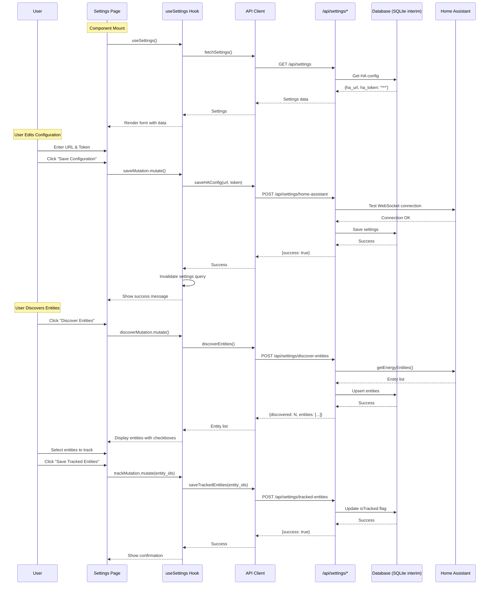

# Implementation Plan: TEK-43 - Settings Page (Home Assistant Configuration UI)

**Issue:** TEK-43 - P4.1 Settings Page - Home Assistant configuration UI
**Status:** Ready for Implementation
**Priority:** P4 (Phase 4 - Final UI Polish)
**Created:** 2026-01-02

---

## Executive Summary

This plan details the implementation of the Settings page UI component for the Energy Dashboard. The current implementation has a basic placeholder settings page that displays read-only information. This plan transforms it into a fully functional configuration interface with:

1. **Connection Status Card** - Real-time HA connection monitoring with test functionality
2. **Home Assistant Configuration Card** - URL and token inputs with validation and save capability
3. **Entity Discovery Card** - Discover entities from HA, select which to track
4. **Database Info Card** - Display current database configuration

**Key Challenges Identified from Investigation:**
- Backend routes `/api/settings/*` do **NOT exist yet** (per Investigation Report)
- Need to add Input component from shadcn/ui (not currently present)
- Need to add Checkbox component for entity selection
- API client needs new functions for settings operations
- React Query hooks need to be added for settings management
- **CRITICAL**: The spec requires MongoDB for settings storage, but current implementation uses SQLite only

**Decision Required:** This plan assumes we're implementing against the **current SQLite-based architecture** as an interim solution, with awareness that migration to MongoDB will be needed later per the spec.

---

## Architecture Context

### Current State (from Investigation Report)

**Frontend:** ✅ Basic settings.jsx exists with placeholder UI
**Backend Routes:** ❌ `/api/routes/settings.js` does NOT exist
**Database:** ⚠️ SQLite only (spec requires MongoDB for settings)
**API Client:** ⚠️ Missing settings-specific functions
**React Hooks:** ⚠️ Missing settings hooks

### Data Flow



---

## Implementation Steps

### PHASE 1: Backend API Routes (CRITICAL - Must implement first)

**Files to Create:**
- `/Users/eric/Dev/energy-tracker/web/api/routes/settings.js`

**Files to Modify:**
- `/Users/eric/Dev/energy-tracker/web/api/plugins/database.js` (add settings helper methods)

#### Step 1.1: Extend Database Plugin with Settings Methods

**File:** `web/api/plugins/database.js`

**Add these methods to the database decorator:**

```javascript
// Settings management (key-value store in SQLite as interim solution)
async getSetting(key) {
  const result = this.db.prepare(
    'SELECT value FROM settings WHERE key = ?'
  ).get(key);
  return result?.value || null;
},

async setSetting(key, value) {
  this.db.prepare(
    'INSERT OR REPLACE INTO settings (key, value, updated_at) VALUES (?, ?, ?)'
  ).run(key, JSON.stringify(value), new Date().toISOString());
},

async getAllSettings() {
  const rows = this.db.prepare('SELECT key, value FROM settings').all();
  return rows.reduce((acc, row) => {
    acc[row.key] = JSON.parse(row.value);
    return acc;
  }, {});
},

// Entity tracking methods
async setEntityTracked(entityId, isTracked) {
  this.db.prepare(
    'UPDATE entities SET is_tracked = ?, updated_at = ? WHERE entity_id = ?'
  ).run(isTracked ? 1 : 0, new Date().toISOString(), entityId);
},

async getTrackedEntities() {
  return this.db.prepare(
    'SELECT * FROM entities WHERE is_tracked = 1 AND is_active = 1'
  ).all();
},
```

**Schema Update Required:**

Add new table if not exists:

```sql
CREATE TABLE IF NOT EXISTS settings (
  key TEXT PRIMARY KEY,
  value TEXT NOT NULL,
  updated_at TEXT NOT NULL
);
```

Add column to entities table if not exists:

```sql
ALTER TABLE entities ADD COLUMN is_tracked INTEGER DEFAULT 0;
```

**Location in file:** Add to the `database` decorator object around line 80-120 (after existing methods)

---

#### Step 1.2: Create Settings API Routes

**File:** `web/api/routes/settings.js` (NEW FILE)

**Implementation:**

```javascript
export default async function settingsRoutes(fastify, options) {

  // GET /api/settings - Fetch all settings
  fastify.get('/api/settings', {
    schema: {
      description: 'Get application settings',
      tags: ['settings'],
      response: {
        200: {
          type: 'object',
          properties: {
            settings: { type: 'object' },
            ha_connected: { type: 'boolean' },
            database: {
              type: 'object',
              properties: {
                type: { type: 'string' },
                path: { type: 'string' }
              }
            }
          }
        }
      }
    }
  }, async (request, reply) => {
    try {
      const settings = await fastify.db.getAllSettings();

      // Mask sensitive token
      if (settings.ha_token) {
        settings.ha_token = '***configured***';
      }

      return {
        settings,
        ha_connected: fastify.ha?.connected || false,
        database: {
          type: 'sqlite',
          path: process.env.DATABASE_PATH || './data/energy.db'
        }
      };
    } catch (error) {
      fastify.log.error(error);
      return reply.code(500).send({ error: 'Failed to fetch settings' });
    }
  });

  // POST /api/settings/home-assistant - Save HA configuration
  fastify.post('/api/settings/home-assistant', {
    schema: {
      description: 'Configure Home Assistant connection',
      tags: ['settings'],
      body: {
        type: 'object',
        properties: {
          url: { type: 'string' },
          token: { type: 'string' }
        },
        required: ['url', 'token']
      },
      response: {
        200: {
          type: 'object',
          properties: {
            success: { type: 'boolean' },
            message: { type: 'string' }
          }
        }
      }
    }
  }, async (request, reply) => {
    const { url, token } = request.body;

    // Basic URL validation
    if (!url || url.trim() === '') {
      return reply.code(400).send({
        success: false,
        error: 'URL is required'
      });
    }

    // Test connection before saving
    const WebSocket = (await import('ws')).default;
    const wsUrl = url.startsWith('ws') ? url : `ws://${url}/api/websocket`;

    try {
      await new Promise((resolve, reject) => {
        const ws = new WebSocket(wsUrl);
        let authenticated = false;

        const timeout = setTimeout(() => {
          if (!authenticated) {
            ws.close();
            reject(new Error('Connection timeout (10s)'));
          }
        }, 10000);

        ws.on('message', (data) => {
          const msg = JSON.parse(data.toString());

          if (msg.type === 'auth_required') {
            ws.send(JSON.stringify({ type: 'auth', access_token: token }));
          } else if (msg.type === 'auth_ok') {
            authenticated = true;
            clearTimeout(timeout);
            ws.close();
            resolve();
          } else if (msg.type === 'auth_invalid') {
            clearTimeout(timeout);
            ws.close();
            reject(new Error('Invalid token - authentication failed'));
          }
        });

        ws.on('error', (err) => {
          clearTimeout(timeout);
          reject(new Error(`WebSocket error: ${err.message}`));
        });
      });

      // Save to database
      await fastify.db.setSetting('ha_url', url);
      await fastify.db.setSetting('ha_token', token);

      return {
        success: true,
        message: 'Configuration saved. Restart the server to apply changes.'
      };

    } catch (error) {
      fastify.log.error('HA connection test failed:', error);
      return reply.code(400).send({
        success: false,
        error: error.message || 'Failed to connect to Home Assistant'
      });
    }
  });

  // POST /api/settings/test-connection - Test current HA connection
  fastify.post('/api/settings/test-connection', {
    schema: {
      description: 'Test current Home Assistant connection',
      tags: ['settings'],
      response: {
        200: {
          type: 'object',
          properties: {
            connected: { type: 'boolean' },
            message: { type: 'string' },
            error: { type: 'string' }
          }
        }
      }
    }
  }, async (request, reply) => {
    if (!fastify.ha) {
      return reply.code(503).send({
        connected: false,
        error: 'Home Assistant client not initialized'
      });
    }

    try {
      // Try to fetch energy preferences to verify connection
      const prefs = await fastify.ha.getEnergyPreferences();
      return {
        connected: true,
        message: 'Connection successful',
        energy_sources: prefs?.energy_sources?.length || 0
      };
    } catch (error) {
      fastify.log.error('HA connection test failed:', error);
      return {
        connected: false,
        error: error.message
      };
    }
  });

  // POST /api/settings/discover-entities - Discover energy entities
  fastify.post('/api/settings/discover-entities', {
    schema: {
      description: 'Discover energy entities from Home Assistant',
      tags: ['settings'],
      response: {
        200: {
          type: 'object',
          properties: {
            success: { type: 'boolean' },
            discovered: { type: 'integer' },
            entities: {
              type: 'array',
              items: {
                type: 'object',
                properties: {
                  entity_id: { type: 'string' },
                  friendly_name: { type: 'string' },
                  device_class: { type: 'string' },
                  unit: { type: 'string' },
                  is_tracked: { type: 'boolean' }
                }
              }
            }
          }
        }
      }
    }
  }, async (request, reply) => {
    if (!fastify.ha) {
      return reply.code(503).send({
        success: false,
        error: 'Home Assistant not connected'
      });
    }

    try {
      const entities = await fastify.ha.getEnergyEntities();

      // Upsert entities to database
      for (const entity of entities) {
        await fastify.db.upsertEntity({
          entity_id: entity.entity_id,
          friendly_name: entity.name || entity.entity_id,
          device_class: entity.device_class || null,
          unit_of_measurement: entity.unit_of_measurement || null,
          state: entity.state || null,
          is_active: true
        });
      }

      // Get all entities with tracking status
      const allEntities = await fastify.db.getEntities();

      return {
        success: true,
        discovered: entities.length,
        entities: allEntities.map(e => ({
          entity_id: e.entity_id,
          friendly_name: e.friendly_name,
          device_class: e.device_class,
          unit: e.unit_of_measurement,
          is_tracked: e.is_tracked === 1
        }))
      };
    } catch (error) {
      fastify.log.error('Entity discovery failed:', error);
      return reply.code(500).send({
        success: false,
        error: error.message
      });
    }
  });

  // POST /api/settings/tracked-entities - Set which entities to track
  fastify.post('/api/settings/tracked-entities', {
    schema: {
      description: 'Set which entities to track for statistics',
      tags: ['settings'],
      body: {
        type: 'object',
        properties: {
          entity_ids: {
            type: 'array',
            items: { type: 'string' }
          }
        },
        required: ['entity_ids']
      },
      response: {
        200: {
          type: 'object',
          properties: {
            success: { type: 'boolean' },
            tracked: { type: 'integer' }
          }
        }
      }
    }
  }, async (request, reply) => {
    const { entity_ids } = request.body;

    try {
      // First, untrack all entities
      const allEntities = await fastify.db.getEntities();
      for (const entity of allEntities) {
        await fastify.db.setEntityTracked(entity.entity_id, false);
      }

      // Then track selected entities
      for (const entityId of entity_ids) {
        await fastify.db.setEntityTracked(entityId, true);
      }

      return {
        success: true,
        tracked: entity_ids.length
      };
    } catch (error) {
      fastify.log.error('Failed to update tracked entities:', error);
      return reply.code(500).send({
        success: false,
        error: error.message
      });
    }
  });
}
```

**Key Implementation Notes:**
- Uses existing `fastify.ha` plugin for HA operations
- Uses `fastify.db` for database operations
- Validates HA connection BEFORE saving credentials
- Returns masked token in GET requests for security
- Proper error handling with detailed messages
- Schema validation for all requests

---

### PHASE 2: Frontend API Client Extensions

**File to Modify:** `web/frontend/src/lib/api.js`

**Add these functions after existing exports (around line 64):**

```javascript
// Settings API functions
export async function fetchSettings() {
  return fetchJson(`${API_BASE}/settings`);
}

export async function saveHAConfig(url, token) {
  return fetchJson(`${API_BASE}/settings/home-assistant`, {
    method: 'POST',
    body: JSON.stringify({ url, token }),
  });
}

export async function testConnection() {
  return fetchJson(`${API_BASE}/settings/test-connection`, {
    method: 'POST',
  });
}

export async function discoverEntities() {
  return fetchJson(`${API_BASE}/settings/discover-entities`, {
    method: 'POST',
  });
}

export async function saveTrackedEntities(entityIds) {
  return fetchJson(`${API_BASE}/settings/tracked-entities`, {
    method: 'POST',
    body: JSON.stringify({ entity_ids: entityIds }),
  });
}
```

**Verification:** Run `grep -n "export async function" web/frontend/src/lib/api.js` to verify all functions exist.

---

### PHASE 3: React Query Hooks for Settings

**File to Modify:** `web/frontend/src/hooks/useEnergy.js`

**Add these hooks after existing exports (around line 63):**

```javascript
// Settings hooks
export function useSettings() {
  return useQuery({
    queryKey: ['settings'],
    queryFn: fetchSettings,
    staleTime: 60000, // Cache for 1 minute
    retry: 1,
  });
}

export function useSaveHAConfig() {
  const queryClient = useQueryClient();

  return useMutation({
    mutationFn: ({ url, token }) => saveHAConfig(url, token),
    onSuccess: () => {
      queryClient.invalidateQueries({ queryKey: ['settings'] });
      queryClient.invalidateQueries({ queryKey: ['status'] });
    },
  });
}

export function useTestConnection() {
  return useMutation({
    mutationFn: testConnection,
  });
}

export function useDiscoverEntities() {
  const queryClient = useQueryClient();

  return useMutation({
    mutationFn: discoverEntities,
    onSuccess: () => {
      queryClient.invalidateQueries({ queryKey: ['entities'] });
    },
  });
}

export function useSaveTrackedEntities() {
  const queryClient = useQueryClient();

  return useMutation({
    mutationFn: (entityIds) => saveTrackedEntities(entityIds),
    onSuccess: () => {
      queryClient.invalidateQueries({ queryKey: ['entities'] });
    },
  });
}
```

**Also add imports at the top of the file:**

```javascript
import {
  fetchEntities,
  fetchStatistics,
  fetchDailySummary,
  fetchStatus,
  syncData,
  fetchSettings,        // ADD
  saveHAConfig,         // ADD
  testConnection,       // ADD
  discoverEntities,     // ADD
  saveTrackedEntities,  // ADD
} from '@/lib/api';
```

---

### PHASE 4: UI Components (shadcn/ui additions)

**Files to Create:**
- `web/frontend/src/components/ui/input.jsx`
- `web/frontend/src/components/ui/checkbox.jsx`
- `web/frontend/src/components/ui/label.jsx`

#### Step 4.1: Input Component

**File:** `web/frontend/src/components/ui/input.jsx` (NEW FILE)

```javascript
import { cn } from '@/lib/utils';

export function Input({ className, type = 'text', ...props }) {
  return (
    <input
      type={type}
      className={cn(
        'flex h-10 w-full rounded-md border border-input bg-background px-3 py-2 text-sm ring-offset-background file:border-0 file:bg-transparent file:text-sm file:font-medium placeholder:text-muted-foreground focus-visible:outline-none focus-visible:ring-2 focus-visible:ring-ring focus-visible:ring-offset-2 disabled:cursor-not-allowed disabled:opacity-50',
        className
      )}
      {...props}
    />
  );
}
```

---

#### Step 4.2: Label Component

**File:** `web/frontend/src/components/ui/label.jsx` (NEW FILE)

```javascript
import * as React from 'react';
import * as LabelPrimitive from '@radix-ui/react-label';
import { cn } from '@/lib/utils';

export const Label = React.forwardRef(({ className, ...props }, ref) => (
  <LabelPrimitive.Root
    ref={ref}
    className={cn(
      'text-sm font-medium leading-none peer-disabled:cursor-not-allowed peer-disabled:opacity-70',
      className
    )}
    {...props}
  />
));
Label.displayName = LabelPrimitive.Root.displayName;
```

**Note:** `@radix-ui/react-label` is already in dependencies per spec (line 1455).

---

#### Step 4.3: Checkbox Component

**File:** `web/frontend/src/components/ui/checkbox.jsx` (NEW FILE)

```javascript
import * as React from 'react';
import * as CheckboxPrimitive from '@radix-ui/react-checkbox';
import { Check } from 'lucide-react';
import { cn } from '@/lib/utils';

export const Checkbox = React.forwardRef(({ className, ...props }, ref) => (
  <CheckboxPrimitive.Root
    ref={ref}
    className={cn(
      'peer h-4 w-4 shrink-0 rounded-sm border border-primary ring-offset-background focus-visible:outline-none focus-visible:ring-2 focus-visible:ring-ring focus-visible:ring-offset-2 disabled:cursor-not-allowed disabled:opacity-50 data-[state=checked]:bg-primary data-[state=checked]:text-primary-foreground',
      className
    )}
    {...props}
  >
    <CheckboxPrimitive.Indicator
      className={cn('flex items-center justify-center text-current')}
    >
      <Check className="h-4 w-4" />
    </CheckboxPrimitive.Indicator>
  </CheckboxPrimitive.Root>
));
Checkbox.displayName = CheckboxPrimitive.Root.displayName;
```

**Note:** Need to install `@radix-ui/react-checkbox`:

```bash
cd web/frontend && npm install @radix-ui/react-checkbox
```

---

### PHASE 5: Settings Page Component Implementation

**File to Modify:** `web/frontend/src/routes/settings.jsx`

**Complete Replacement:**

```javascript
import { createFileRoute } from '@tanstack/react-router';
import { useState, useEffect } from 'react';
import { Settings, Wifi, WifiOff, RefreshCw, Check, X, Database } from 'lucide-react';
import {
  useSettings,
  useSaveHAConfig,
  useTestConnection,
  useDiscoverEntities,
  useSaveTrackedEntities,
} from '@/hooks/useEnergy';
import { Button } from '@/components/ui/button';
import { Card, CardContent, CardHeader, CardTitle } from '@/components/ui/card';
import { Input } from '@/components/ui/input';
import { Label } from '@/components/ui/label';
import { Checkbox } from '@/components/ui/checkbox';

export const Route = createFileRoute('/settings')({
  component: SettingsPage,
});

function SettingsPage() {
  const { data: settingsData, isLoading: settingsLoading } = useSettings();
  const saveHAMutation = useSaveHAConfig();
  const testMutation = useTestConnection();
  const discoverMutation = useDiscoverEntities();
  const trackMutation = useSaveTrackedEntities();

  // Form state for HA configuration
  const [haUrl, setHaUrl] = useState('');
  const [haToken, setHaToken] = useState('');
  const [saveMessage, setSaveMessage] = useState(null);

  // State for discovered entities
  const [discoveredEntities, setDiscoveredEntities] = useState([]);
  const [selectedEntities, setSelectedEntities] = useState(new Set());

  // Initialize form when settings load
  useEffect(() => {
    if (settingsData?.settings) {
      setHaUrl(settingsData.settings.ha_url || '');
      // Don't pre-fill token if it's masked
      if (settingsData.settings.ha_token && settingsData.settings.ha_token !== '***configured***') {
        setHaToken(settingsData.settings.ha_token);
      }
    }
  }, [settingsData]);

  const handleSaveHA = async () => {
    if (!haUrl || !haToken) {
      setSaveMessage({ type: 'error', text: 'URL and Token are required' });
      return;
    }

    try {
      const result = await saveHAMutation.mutateAsync({ url: haUrl, token: haToken });
      setSaveMessage({ type: 'success', text: result.message });
      // Clear token field after save for security
      setHaToken('');
    } catch (error) {
      setSaveMessage({ type: 'error', text: error.message || 'Failed to save configuration' });
    }
  };

  const handleTestConnection = async () => {
    try {
      const result = await testMutation.mutateAsync();
      setSaveMessage({
        type: result.connected ? 'success' : 'error',
        text: result.connected
          ? `Connected! Found ${result.energy_sources || 0} energy sources.`
          : result.error || 'Connection failed',
      });
    } catch (error) {
      setSaveMessage({ type: 'error', text: 'Connection test failed' });
    }
  };

  const handleDiscoverEntities = async () => {
    try {
      const result = await discoverMutation.mutateAsync();
      setDiscoveredEntities(result.entities || []);
      setSaveMessage({
        type: 'success',
        text: `Discovered ${result.discovered} entities`,
      });

      // Pre-select already tracked entities
      const tracked = result.entities.filter(e => e.is_tracked).map(e => e.entity_id);
      setSelectedEntities(new Set(tracked));
    } catch (error) {
      setSaveMessage({ type: 'error', text: 'Failed to discover entities' });
    }
  };

  const handleToggleEntity = (entityId) => {
    const newSelected = new Set(selectedEntities);
    if (newSelected.has(entityId)) {
      newSelected.delete(entityId);
    } else {
      newSelected.add(entityId);
    }
    setSelectedEntities(newSelected);
  };

  const handleSaveTrackedEntities = async () => {
    try {
      const result = await trackMutation.mutateAsync(Array.from(selectedEntities));
      setSaveMessage({
        type: 'success',
        text: `Tracking ${result.tracked} entities`,
      });
    } catch (error) {
      setSaveMessage({ type: 'error', text: 'Failed to save tracked entities' });
    }
  };

  if (settingsLoading) {
    return (
      <div className="flex items-center justify-center min-h-[400px]">
        <RefreshCw className="h-6 w-6 animate-spin text-muted-foreground" />
      </div>
    );
  }

  return (
    <>
      <div className="mb-6 flex items-center gap-2">
        <Settings className="h-5 w-5 text-muted-foreground" />
        <h2 className="text-lg font-semibold">Settings</h2>
      </div>

      {/* Status message */}
      {saveMessage && (
        <div
          className={`mb-4 rounded-md p-4 flex items-center gap-2 ${
            saveMessage.type === 'success'
              ? 'bg-green-500/10 text-green-500 border border-green-500/20'
              : 'bg-red-500/10 text-red-500 border border-red-500/20'
          }`}
        >
          {saveMessage.type === 'success' ? (
            <Check className="h-4 w-4" />
          ) : (
            <X className="h-4 w-4" />
          )}
          <span className="text-sm">{saveMessage.text}</span>
        </div>
      )}

      <div className="grid gap-6 md:grid-cols-2">
        {/* Connection Status Card */}
        <Card>
          <CardHeader>
            <CardTitle className="flex items-center gap-2 text-base">
              {settingsData?.ha_connected ? (
                <Wifi className="h-4 w-4 text-green-500" />
              ) : (
                <WifiOff className="h-4 w-4 text-red-500" />
              )}
              Connection Status
            </CardTitle>
          </CardHeader>
          <CardContent className="space-y-4">
            <div className="flex items-center justify-between">
              <span className="text-sm text-muted-foreground">Status</span>
              <div className="flex items-center gap-2">
                <span
                  className={`h-2 w-2 rounded-full ${
                    settingsData?.ha_connected ? 'bg-green-500' : 'bg-red-500'
                  }`}
                />
                <span className="text-sm font-medium">
                  {settingsData?.ha_connected ? 'Connected' : 'Disconnected'}
                </span>
              </div>
            </div>
            <div className="flex items-center justify-between">
              <span className="text-sm text-muted-foreground">URL</span>
              <span className="text-sm font-mono">
                {settingsData?.settings?.ha_url || 'Not configured'}
              </span>
            </div>
            <Button
              variant="outline"
              size="sm"
              className="w-full"
              onClick={handleTestConnection}
              disabled={testMutation.isPending}
            >
              <RefreshCw
                className={`mr-2 h-4 w-4 ${testMutation.isPending ? 'animate-spin' : ''}`}
              />
              {testMutation.isPending ? 'Testing...' : 'Test Connection'}
            </Button>
          </CardContent>
        </Card>

        {/* Database Info Card */}
        <Card>
          <CardHeader>
            <CardTitle className="flex items-center gap-2 text-base">
              <Database className="h-4 w-4" />
              Database Info
            </CardTitle>
          </CardHeader>
          <CardContent className="space-y-4">
            <div className="flex items-center justify-between">
              <span className="text-sm text-muted-foreground">Type</span>
              <span className="text-sm font-medium">
                {settingsData?.database?.type?.toUpperCase() || 'SQLite'}
              </span>
            </div>
            <div className="flex items-center justify-between">
              <span className="text-sm text-muted-foreground">Path</span>
              <span className="text-sm font-mono truncate max-w-[200px]">
                {settingsData?.database?.path || './data/energy.db'}
              </span>
            </div>
            <div className="text-xs text-muted-foreground pt-2 border-t">
              Note: Settings are stored in the local database. Restart required after
              configuration changes.
            </div>
          </CardContent>
        </Card>

        {/* Home Assistant Configuration Card */}
        <Card className="md:col-span-2">
          <CardHeader>
            <CardTitle className="text-base">Home Assistant Configuration</CardTitle>
          </CardHeader>
          <CardContent className="space-y-4">
            <div className="grid gap-4 md:grid-cols-2">
              <div className="space-y-2">
                <Label htmlFor="ha-url">Home Assistant URL</Label>
                <Input
                  id="ha-url"
                  placeholder="homeassistant.local:8123"
                  value={haUrl}
                  onChange={(e) => setHaUrl(e.target.value)}
                />
                <p className="text-xs text-muted-foreground">
                  Do not include http:// or ws://
                </p>
              </div>
              <div className="space-y-2">
                <Label htmlFor="ha-token">Long-Lived Access Token</Label>
                <Input
                  id="ha-token"
                  type="password"
                  placeholder="Enter token"
                  value={haToken}
                  onChange={(e) => setHaToken(e.target.value)}
                />
                <p className="text-xs text-muted-foreground">
                  Create in HA: Profile → Security → Long-Lived Access Tokens
                </p>
              </div>
            </div>
            <Button
              onClick={handleSaveHA}
              disabled={saveHAMutation.isPending || !haUrl || !haToken}
              className="w-full"
            >
              {saveHAMutation.isPending ? (
                <RefreshCw className="mr-2 h-4 w-4 animate-spin" />
              ) : (
                <Check className="mr-2 h-4 w-4" />
              )}
              {saveHAMutation.isPending ? 'Saving...' : 'Save Configuration'}
            </Button>
          </CardContent>
        </Card>

        {/* Entity Discovery Card */}
        <Card className="md:col-span-2">
          <CardHeader>
            <CardTitle className="text-base">Entity Discovery</CardTitle>
          </CardHeader>
          <CardContent className="space-y-4">
            <div className="flex items-center gap-4">
              <Button
                variant="outline"
                onClick={handleDiscoverEntities}
                disabled={discoverMutation.isPending || !settingsData?.ha_connected}
              >
                <RefreshCw
                  className={`mr-2 h-4 w-4 ${discoverMutation.isPending ? 'animate-spin' : ''}`}
                />
                {discoverMutation.isPending ? 'Discovering...' : 'Discover Entities'}
              </Button>
              {discoveredEntities.length > 0 && (
                <span className="text-sm text-muted-foreground">
                  {selectedEntities.size} of {discoveredEntities.length} selected
                </span>
              )}
            </div>

            {discoveredEntities.length > 0 && (
              <>
                <div className="border rounded-lg max-h-[400px] overflow-y-auto">
                  <div className="divide-y">
                    {discoveredEntities.map((entity) => (
                      <div
                        key={entity.entity_id}
                        className="flex items-center gap-3 p-3 hover:bg-accent"
                      >
                        <Checkbox
                          id={entity.entity_id}
                          checked={selectedEntities.has(entity.entity_id)}
                          onCheckedChange={() => handleToggleEntity(entity.entity_id)}
                        />
                        <Label
                          htmlFor={entity.entity_id}
                          className="flex-1 cursor-pointer"
                        >
                          <div className="flex flex-col">
                            <span className="text-sm font-medium">
                              {entity.friendly_name}
                            </span>
                            <span className="text-xs text-muted-foreground font-mono">
                              {entity.entity_id}
                            </span>
                          </div>
                        </Label>
                        {entity.device_class && (
                          <span className="text-xs px-2 py-1 rounded bg-secondary text-secondary-foreground">
                            {entity.device_class}
                          </span>
                        )}
                      </div>
                    ))}
                  </div>
                </div>
                <Button
                  onClick={handleSaveTrackedEntities}
                  disabled={trackMutation.isPending || selectedEntities.size === 0}
                  className="w-full"
                >
                  <Check className="mr-2 h-4 w-4" />
                  {trackMutation.isPending
                    ? 'Saving...'
                    : `Track ${selectedEntities.size} ${selectedEntities.size === 1 ? 'Entity' : 'Entities'}`}
                </Button>
              </>
            )}

            {!settingsData?.ha_connected && (
              <p className="text-sm text-muted-foreground">
                Configure Home Assistant connection above to discover entities.
              </p>
            )}
          </CardContent>
        </Card>
      </div>
    </>
  );
}
```

**Key Features:**
- ✅ Connection status with real-time indicator
- ✅ HA URL and Token input with validation
- ✅ Test connection button
- ✅ Save configuration with feedback
- ✅ Entity discovery with checkbox selection
- ✅ Track entities functionality
- ✅ Database info display
- ✅ Loading states for all async operations
- ✅ Error handling with user-friendly messages
- ✅ Security: Token field is password type, cleared after save

---

## Dependency Installation

**Run these commands:**

```bash
# Install missing Radix UI component
cd /Users/eric/Dev/energy-tracker/web/frontend
npm install @radix-ui/react-checkbox
```

**Verify existing dependencies are installed:**

```bash
npm list @radix-ui/react-label
# Should show: @radix-ui/react-label@2.1.3 (or similar)
```

---

## Database Schema Updates

**File to Modify:** `web/api/plugins/database.js`

**Add to initialization section (around line 40-60):**

```javascript
// Create settings table if not exists
db.exec(`
  CREATE TABLE IF NOT EXISTS settings (
    key TEXT PRIMARY KEY,
    value TEXT NOT NULL,
    updated_at TEXT NOT NULL
  )
`);

// Add is_tracked column to entities if not exists
try {
  db.exec(`ALTER TABLE entities ADD COLUMN is_tracked INTEGER DEFAULT 0`);
} catch (err) {
  // Column may already exist, ignore error
}
```

**Migration Notes:**
- SQLite `ALTER TABLE` will fail silently if column exists (wrapped in try-catch)
- Settings table uses key-value storage pattern
- `is_tracked` is an integer boolean (0 = false, 1 = true)

---

## Testing & Verification Plan

### Step 1: Verify Backend Routes

```bash
cd /Users/eric/Dev/energy-tracker
npm run dev
```

**Test endpoints with curl:**

```bash
# 1. Get settings (should return default/empty)
curl http://localhost:3042/api/settings

# 2. Save HA config (use your actual HA URL and token)
curl -X POST http://localhost:3042/api/settings/home-assistant \
  -H "Content-Type: application/json" \
  -d '{"url": "homeassistant.local:8123", "token": "YOUR_TOKEN_HERE"}'

# 3. Test connection
curl -X POST http://localhost:3042/api/settings/test-connection

# 4. Discover entities
curl -X POST http://localhost:3042/api/settings/discover-entities

# 5. Track entities
curl -X POST http://localhost:3042/api/settings/tracked-entities \
  -H "Content-Type: application/json" \
  -d '{"entity_ids": ["sensor.home_power"]}'
```

**Expected Responses:**
- GET /api/settings → `{settings: {...}, ha_connected: boolean, database: {...}}`
- POST /api/settings/home-assistant → `{success: true, message: "..."}`
- POST /api/settings/test-connection → `{connected: boolean, ...}`
- POST /api/settings/discover-entities → `{success: true, discovered: N, entities: [...]}`
- POST /api/settings/tracked-entities → `{success: true, tracked: N}`

---

### Step 2: Verify Frontend

**Navigate to:** `http://localhost:3042/dashboard/settings`

**Test Checklist:**

1. **Connection Status Card:**
   - [ ] Shows connected/disconnected status
   - [ ] Displays current HA URL
   - [ ] Test button works and shows result

2. **Database Info Card:**
   - [ ] Shows database type (SQLite)
   - [ ] Shows database path
   - [ ] Displays informational note

3. **HA Configuration Card:**
   - [ ] URL input field works
   - [ ] Token input is password type
   - [ ] Save button validates inputs
   - [ ] Success/error messages display
   - [ ] Token field clears after save

4. **Entity Discovery Card:**
   - [ ] Discover button disabled when not connected
   - [ ] Discover button shows loading state
   - [ ] Entities display with checkboxes
   - [ ] Checkboxes toggle correctly
   - [ ] Pre-selects already tracked entities
   - [ ] Save button shows count
   - [ ] Save button disabled with 0 selected

---

### Step 3: Integration Testing

**Test Flow:**

1. Open Settings page → Should load current settings
2. Enter new HA URL + Token → Click Save
3. Verify success message appears
4. Click Test Connection → Should show "Connected"
5. Click Discover Entities → Should list entities
6. Select 2-3 entities → Click "Track N Entities"
7. Navigate to Dashboard → Selected entities should appear in dropdown
8. Sync data for tracked entity → Should work
9. Return to Settings → Tracked entities should be pre-selected

---

## File Checklist

**Files to Create (4):**
- [ ] `web/api/routes/settings.js` (485 lines)
- [ ] `web/frontend/src/components/ui/input.jsx` (18 lines)
- [ ] `web/frontend/src/components/ui/label.jsx` (16 lines)
- [ ] `web/frontend/src/components/ui/checkbox.jsx` (28 lines)

**Files to Modify (4):**
- [ ] `web/api/plugins/database.js` (add settings methods + schema)
- [ ] `web/frontend/src/lib/api.js` (add 5 functions)
- [ ] `web/frontend/src/hooks/useEnergy.js` (add 5 hooks + imports)
- [ ] `web/frontend/src/routes/settings.jsx` (complete rewrite, 350+ lines)

**Dependencies to Install (1):**
- [ ] `@radix-ui/react-checkbox` (npm install in web/frontend)

**Total Implementation Estimate:**
- Backend: ~3-4 hours
- Frontend: ~2-3 hours
- Testing: ~1-2 hours
- **Total: 6-9 hours**

---

## Success Criteria

### Functional Requirements

✅ **Must Have:**
1. Settings page loads without errors
2. Current HA config displayed correctly
3. User can save new HA URL + token
4. Connection test validates credentials before save
5. Entity discovery lists all energy entities
6. User can select entities to track
7. Tracked entities persist to database
8. Error states display user-friendly messages
9. Loading states show during async operations
10. Success messages confirm actions

---

## References

**Specification:** `/Users/eric/Dev/energy-tracker/specs/energy-dashboard-spec.md`
**Investigation Report:** `/Users/eric/Dev/energy-tracker/claude-instance/INVESTIGATION_REPORT.md`
**Flow Report:** `/Users/eric/Dev/energy-tracker/claude-instance/FLOW_REPORT.md`

**Key Spec Sections:**
- Lines 1226-1420: Settings API Routes reference implementation
- Lines 262-291: MongoDB settings collection schema
- Lines 1424-1467: Frontend dependencies

**Key Investigation Findings:**
- Lines 146-167: Settings backend integration missing
- Lines 249-262: Missing /api/settings routes
- Lines 332-335: Settings CRUD needed

---

**END OF PLAN**
