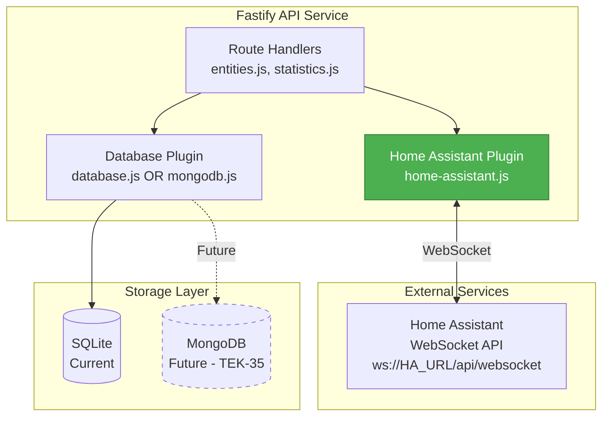
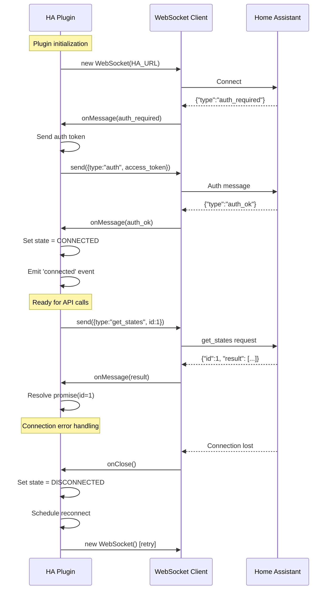

# Implementation Plan: TEK-36 - P2.1 Home Assistant Plugin

**Project:** Energy Dashboard (energy-tracker)
**Issue:** TEK-36 - Home Assistant WebSocket Plugin Implementation
**Priority:** High (P2)
**Dependencies:** TEK-35 (MongoDB for settings)
**Created:** 2026-01-02

---

## Executive Summary

This plan details the implementation of the Home Assistant WebSocket plugin (`web/api/plugins/home-assistant.js`), which serves as the foundational integration layer between the Energy Dashboard and Home Assistant. This plugin will provide WebSocket connectivity, authentication, entity discovery with intelligent filtering, and statistics retrieval.

**Key Considerations from Investigation:**
- Current implementation exists but is incomplete (missing MongoDB integration)
- Must support both current SQLite-based architecture and future MongoDB migration
- Plugin must be resilient to connection failures and support auto-reconnect
- Entity discovery must use multi-criteria filtering (entity_id patterns, device_class, units)
- Statistics fetching must integrate with Home Assistant's recorder service

---

## Table of Contents

1. [Architecture Overview](#architecture-overview)
2. [Technical Specifications](#technical-specifications)
3. [Implementation Phases](#implementation-phases)
4. [File Changes](#file-changes)
5. [Testing Strategy](#testing-strategy)
6. [Migration Path](#migration-path)
7. [Risk Analysis](#risk-analysis)

---

## Architecture Overview

### Plugin Position in System



### WebSocket Message Flow



---

## Technical Specifications

### Environment Variables

```bash
# Required
HA_URL=homeassistant.local:8123  # Home Assistant host:port
HA_TOKEN=eyJ0eXAiOiJKV1...        # Long-lived access token

# Optional
HA_RECONNECT_DELAY=5000           # Reconnect delay in ms (default: 5000)
HA_MAX_RECONNECT_ATTEMPTS=10      # Max reconnect attempts (default: infinite)
HA_CONNECTION_TIMEOUT=30000       # Connection timeout in ms (default: 30000)
HA_USE_SSL=false                  # Use wss:// instead of ws:// (default: false)
```

### Entity Discovery Criteria

The plugin must filter entities using ALL of the following criteria:

#### 1. Entity ID Pattern Matching
```javascript
const ENERGY_PATTERNS = [
  'energy',       // sensor.home_energy_consumption
  'power',        // sensor.solar_power
  'consumption',  // sensor.grid_consumption
  'production',   // sensor.solar_production
  'solar',        // sensor.solar_panel_output
  'grid',         // sensor.grid_import
  'battery',      // sensor.battery_level
  'usage'         // sensor.daily_usage
];

// Match if entity_id contains ANY pattern
const matchesPattern = entity_id =>
  ENERGY_PATTERNS.some(pattern =>
    entity_id.toLowerCase().includes(pattern)
  );
```

#### 2. Device Class Filtering
```javascript
const ENERGY_DEVICE_CLASSES = [
  'energy',   // kWh sensors
  'power',    // W/kW sensors
  'battery'   // Battery percentage/energy
];

// Match if device_class is in allowed list
const matchesDeviceClass = attributes =>
  attributes.device_class &&
  ENERGY_DEVICE_CLASSES.includes(attributes.device_class);
```

#### 3. Unit of Measurement
```javascript
const ENERGY_UNITS = [
  'kWh',  // Kilowatt-hours
  'Wh',   // Watt-hours
  'W',    // Watts
  'kW'    // Kilowatts
];

// Match if unit_of_measurement is in allowed list
const matchesUnit = attributes =>
  attributes.unit_of_measurement &&
  ENERGY_UNITS.includes(attributes.unit_of_measurement);
```

#### 4. Combined Filtering Logic
```javascript
// Entity qualifies if:
// - entity_id matches pattern AND (device_class OR unit matches)
// OR
// - device_class AND unit both match

const isEnergyEntity = (entity_id, attributes) => {
  const hasPattern = matchesPattern(entity_id);
  const hasDeviceClass = matchesDeviceClass(attributes);
  const hasUnit = matchesUnit(attributes);

  return (hasPattern && (hasDeviceClass || hasUnit)) ||
         (hasDeviceClass && hasUnit);
};
```

### WebSocket API Endpoints Used

#### 1. Authentication Flow
```javascript
// Step 1: Server sends auth_required
{ "type": "auth_required" }

// Step 2: Client sends auth with token
{
  "type": "auth",
  "access_token": "HA_TOKEN"
}

// Step 3: Server confirms
{ "type": "auth_ok", "ha_version": "2024.1.0" }
```

#### 2. Get All States
```javascript
// Request
{
  "id": 1,
  "type": "get_states"
}

// Response
{
  "id": 1,
  "type": "result",
  "success": true,
  "result": [
    {
      "entity_id": "sensor.home_energy_consumption",
      "state": "12.5",
      "attributes": {
        "friendly_name": "Home Energy Consumption",
        "unit_of_measurement": "kWh",
        "device_class": "energy"
      },
      "last_changed": "2026-01-02T10:00:00+00:00",
      "last_updated": "2026-01-02T10:00:00+00:00"
    }
  ]
}
```

#### 3. Get Statistics
```javascript
// Request
{
  "id": 2,
  "type": "recorder/statistics_during_period",
  "start_time": "2026-01-01T00:00:00Z",
  "end_time": "2026-01-02T00:00:00Z",
  "statistic_ids": ["sensor.home_energy_consumption"],
  "period": "hour"  // or "day", "month"
}

// Response
{
  "id": 2,
  "type": "result",
  "success": true,
  "result": {
    "sensor.home_energy_consumption": [
      {
        "start": "2026-01-01T00:00:00+00:00",
        "end": "2026-01-01T01:00:00+00:00",
        "state": 12.5,
        "sum": 12.5,
        "mean": 12.5,
        "min": 12.0,
        "max": 13.0
      }
    ]
  }
}
```

#### 4. Get Energy Preferences
```javascript
// Request
{
  "id": 3,
  "type": "energy/get_prefs"
}

// Response
{
  "id": 3,
  "type": "result",
  "success": true,
  "result": {
    "energy_sources": [
      {
        "type": "grid",
        "flow_from": ["sensor.grid_import"],
        "flow_to": ["sensor.grid_export"]
      },
      {
        "type": "solar",
        "stat_energy_from": "sensor.solar_production"
      }
    ],
    "device_consumption": [
      {
        "stat_consumption": "sensor.device_energy"
      }
    ]
  }
}
```

### Plugin Class Structure

```typescript
class HomeAssistantClient {
  // Properties
  private ws: WebSocket | null
  private url: string
  private token: string
  private reconnectDelay: number
  private maxReconnectAttempts: number
  private connectionTimeout: number
  private currentReconnectAttempt: number
  private messageId: number
  private pendingRequests: Map<number, {resolve, reject, timeout}>
  private state: 'DISCONNECTED' | 'CONNECTING' | 'AUTHENTICATING' | 'CONNECTED'
  private reconnectTimer: NodeJS.Timeout | null
  private fastify: FastifyInstance

  // Public Methods
  constructor(fastify: FastifyInstance, options: HAPluginOptions)
  async connect(): Promise<void>
  async disconnect(): Promise<void>
  async send(message: object): Promise<any>
  async getStates(): Promise<Entity[]>
  async discoverEnergyEntities(): Promise<Entity[]>
  async getStatistics(
    entityIds: string[],
    startTime: string,
    endTime: string,
    period: 'hour' | 'day' | 'month'
  ): Promise<Statistics[]>
  async getEnergyPreferences(): Promise<EnergyPreferences>
  getConnectionStatus(): ConnectionStatus

  // Private Methods
  private setupWebSocket(): void
  private handleMessage(message: string): void
  private handleAuth(message: AuthMessage): void
  private handleResult(message: ResultMessage): void
  private handleError(message: ErrorMessage): void
  private scheduleReconnect(): void
  private clearReconnectTimer(): void
  private filterEnergyEntities(entities: Entity[]): Entity[]
  private isEnergyEntity(entityId: string, attributes: object): boolean
}
```

---

## Implementation Phases

### Phase 1: Core WebSocket Client (4-6 hours)

**Objective:** Implement robust WebSocket connection with authentication and reconnection logic.

#### Files to Modify/Create:
- `/Users/eric/Dev/energy-tracker/web/api/plugins/home-assistant.js` (primary implementation)

#### Tasks:

##### 1.1 WebSocket Connection Setup
**File:** `/Users/eric/Dev/energy-tracker/web/api/plugins/home-assistant.js`

**Key Implementation Points:**
1. Import WebSocket from 'ws' package
2. Create HomeAssistantClient class extending EventEmitter
3. Initialize connection state machine (DISCONNECTED → CONNECTING → AUTHENTICATING → CONNECTED)
4. Implement connection timeout handling
5. Set up WebSocket event handlers (open, message, close, error)
6. Store configuration from environment variables

**Code Structure:**
```javascript
import WebSocket from 'ws';
import { EventEmitter } from 'events';

const CONNECTION_STATES = {
  DISCONNECTED: 'DISCONNECTED',
  CONNECTING: 'CONNECTING',
  AUTHENTICATING: 'AUTHENTICATING',
  CONNECTED: 'CONNECTED'
};

class HomeAssistantClient extends EventEmitter {
  constructor(fastify, options = {}) {
    super();
    this.fastify = fastify;
    this.url = options.url || process.env.HA_URL;
    this.token = options.token || process.env.HA_TOKEN;
    this.useSSL = options.useSSL || process.env.HA_USE_SSL === 'true';
    this.reconnectDelay = parseInt(process.env.HA_RECONNECT_DELAY) || 5000;
    this.maxReconnectAttempts = parseInt(process.env.HA_MAX_RECONNECT_ATTEMPTS) || Infinity;
    this.connectionTimeout = parseInt(process.env.HA_CONNECTION_TIMEOUT) || 30000;

    this.ws = null;
    this.state = CONNECTION_STATES.DISCONNECTED;
    this.currentReconnectAttempt = 0;
    this.messageId = 0;
    this.pendingRequests = new Map();
    this.reconnectTimer = null;

    if (!this.url || !this.token) {
      throw new Error('HA_URL and HA_TOKEN are required');
    }
  }

  async connect() { /* implementation */ }
  setupWebSocketHandlers(resolve, reject, timeout) { /* implementation */ }
  handleMessage(message, resolve, reject, timeout) { /* implementation */ }
  handleAuthRequired() { /* implementation */ }
  handleAuthOk(message) { /* implementation */ }
  handleResult(message) { /* implementation */ }
  handleClose(code, reason) { /* implementation */ }
  scheduleReconnect() { /* implementation */ }
  async disconnect() { /* implementation */ }
  clearReconnectTimer() { /* implementation */ }
}
```

**Acceptance Criteria:**
- ✅ WebSocket connects to Home Assistant
- ✅ Authentication flow completes successfully
- ✅ Connection state tracked accurately
- ✅ Automatic reconnection on disconnect
- ✅ Exponential backoff on reconnect
- ✅ Proper error handling and logging

---

##### 1.2 Request/Response Handling
**File:** `/Users/eric/Dev/energy-tracker/web/api/plugins/home-assistant.js`

**Key Implementation Points:**
1. Implement send() method with promise-based API
2. Auto-increment message ID for each request
3. Store pending requests in Map with timeout
4. Handle result messages by resolving pending promises
5. Clean up pending requests on disconnect
6. Implement getConnectionStatus() helper

**Code Structure:**
```javascript
async send(type, data = {}) {
  if (this.state !== CONNECTION_STATES.CONNECTED) {
    throw new Error('Not connected to Home Assistant');
  }

  const id = ++this.messageId;
  const message = { id, type, ...data };

  return new Promise((resolve, reject) => {
    const timeout = setTimeout(() => {
      this.pendingRequests.delete(id);
      reject(new Error(`Request timeout for ${type}`));
    }, 30000);

    this.pendingRequests.set(id, { resolve, reject, timeout });

    try {
      this.ws.send(JSON.stringify(message));
      this.fastify.log.debug(`Sent message: ${type} (ID: ${id})`);
    } catch (error) {
      clearTimeout(timeout);
      this.pendingRequests.delete(id);
      reject(error);
    }
  });
}

async getStates() {
  this.fastify.log.debug('Fetching all entity states');
  const states = await this.send('get_states');
  return states;
}

getConnectionStatus() {
  return {
    state: this.state,
    connected: this.state === CONNECTION_STATES.CONNECTED,
    reconnectAttempt: this.currentReconnectAttempt,
    url: this.url,
    haVersion: this.haVersion || null
  };
}
```

**Acceptance Criteria:**
- ✅ send() method handles request/response mapping
- ✅ Promise-based API for async requests
- ✅ Request timeout handling (30s)
- ✅ Pending requests cleaned up on disconnect
- ✅ getConnectionStatus() returns accurate state

---

### Phase 2: Entity Discovery (3-4 hours)

**Objective:** Implement intelligent entity filtering using multi-criteria matching.

#### Tasks:

##### 2.1 Entity Filtering Logic
**File:** `/Users/eric/Dev/energy-tracker/web/api/plugins/home-assistant.js`

**Key Implementation Points:**
1. Define static filter constants (ENERGY_PATTERNS, ENERGY_DEVICE_CLASSES, ENERGY_UNITS)
2. Implement matchesPattern() method
3. Implement matchesDeviceClass() method
4. Implement matchesUnit() method
5. Implement isEnergyEntity() with combined logic
6. Implement filterEnergyEntities() to process entity arrays
7. Implement discoverEnergyEntities() public API

**Code Structure:**
```javascript
// Constants for filtering
static ENERGY_PATTERNS = [
  'energy', 'power', 'consumption', 'production',
  'solar', 'grid', 'battery', 'usage'
];

static ENERGY_DEVICE_CLASSES = ['energy', 'power', 'battery'];

static ENERGY_UNITS = ['kWh', 'Wh', 'W', 'kW', 'MWh', 'MW'];

matchesPattern(entityId) {
  const lower = entityId.toLowerCase();
  return HomeAssistantClient.ENERGY_PATTERNS.some(pattern =>
    lower.includes(pattern)
  );
}

matchesDeviceClass(attributes) {
  return attributes.device_class &&
         HomeAssistantClient.ENERGY_DEVICE_CLASSES.includes(attributes.device_class);
}

matchesUnit(attributes) {
  return attributes.unit_of_measurement &&
         HomeAssistantClient.ENERGY_UNITS.includes(attributes.unit_of_measurement);
}

isEnergyEntity(entityId, attributes) {
  const hasPattern = this.matchesPattern(entityId);
  const hasDeviceClass = this.matchesDeviceClass(attributes);
  const hasUnit = this.matchesUnit(attributes);

  this.fastify.log.debug({
    entity_id: entityId,
    hasPattern, hasDeviceClass, hasUnit,
    device_class: attributes.device_class,
    unit: attributes.unit_of_measurement
  }, 'Entity filter check');

  return (hasPattern && (hasDeviceClass || hasUnit)) ||
         (hasDeviceClass && hasUnit);
}

filterEnergyEntities(entities) {
  const filtered = entities.filter(entity => {
    if (!entity.attributes) return false;
    if (entity.state === 'unavailable' || entity.state === 'unknown') return false;
    return this.isEnergyEntity(entity.entity_id, entity.attributes);
  });

  this.fastify.log.info(`Filtered ${filtered.length} energy entities from ${entities.length} total`);
  return filtered;
}

async discoverEnergyEntities() {
  this.fastify.log.info('Discovering energy entities');
  const allStates = await this.getStates();
  const energyEntities = this.filterEnergyEntities(allStates);

  const entities = energyEntities.map(entity => ({
    entity_id: entity.entity_id,
    friendly_name: entity.attributes.friendly_name || entity.entity_id,
    state: parseFloat(entity.state) || 0,
    unit_of_measurement: entity.attributes.unit_of_measurement,
    device_class: entity.attributes.device_class,
    last_updated: entity.last_updated,
    attributes: {
      icon: entity.attributes.icon,
      state_class: entity.attributes.state_class,
      device_class: entity.attributes.device_class
    }
  }));

  this.fastify.log.info(`Discovered ${entities.length} energy entities`);
  return entities;
}
```

**Acceptance Criteria:**
- ✅ Filters entities by entity_id patterns
- ✅ Filters entities by device_class
- ✅ Filters entities by unit_of_measurement
- ✅ Combined logic: pattern + (class OR unit) OR (class + unit)
- ✅ Excludes unavailable/unknown entities
- ✅ Returns simplified entity format
- ✅ Logs filtering statistics

---

##### 2.2 Energy Preferences Integration
**File:** `/Users/eric/Dev/energy-tracker/web/api/plugins/home-assistant.js`

**Key Implementation Points:**
1. Implement getEnergyPreferences() method
2. Call Home Assistant energy/get_prefs endpoint
3. Extract referenced entity IDs
4. Handle case where energy dashboard not configured
5. Return null gracefully on error

**Code Structure:**
```javascript
async getEnergyPreferences() {
  this.fastify.log.debug('Fetching energy preferences');

  try {
    const prefs = await this.send('energy/get_prefs');

    const referencedEntities = new Set();

    if (prefs.energy_sources) {
      for (const source of prefs.energy_sources) {
        if (source.flow_from) referencedEntities.add(...source.flow_from);
        if (source.flow_to) referencedEntities.add(...source.flow_to);
        if (source.stat_energy_from) referencedEntities.add(source.stat_energy_from);
        if (source.stat_energy_to) referencedEntities.add(source.stat_energy_to);
      }
    }

    if (prefs.device_consumption) {
      for (const device of prefs.device_consumption) {
        if (device.stat_consumption) referencedEntities.add(device.stat_consumption);
      }
    }

    return {
      ...prefs,
      _referencedEntities: Array.from(referencedEntities)
    };
  } catch (error) {
    this.fastify.log.warn(`Failed to fetch energy preferences: ${error.message}`);
    return null;
  }
}
```

**Acceptance Criteria:**
- ✅ Fetches energy dashboard preferences
- ✅ Extracts referenced entity IDs
- ✅ Handles case where energy dashboard not configured
- ✅ Returns null gracefully on error

---

### Phase 3: Statistics Retrieval (2-3 hours)

**Objective:** Implement statistics fetching from Home Assistant recorder.

#### Tasks:

##### 3.1 Statistics API Implementation
**File:** `/Users/eric/Dev/energy-tracker/web/api/plugins/home-assistant.js`

**Key Implementation Points:**
1. Implement getStatistics() with parameters (entityIds, startTime, endTime, period)
2. Validate inputs (entity IDs, times, period)
3. Call recorder/statistics_during_period
4. Transform nested response to flat array
5. Parse numeric values correctly
6. Handle null values gracefully
7. Implement getEntityStates() for latest state

**Code Structure:**
```javascript
async getStatistics(entityIds, startTime, endTime, period = 'hour') {
  if (!entityIds || entityIds.length === 0) {
    throw new Error('At least one entity ID is required');
  }

  if (!startTime || !endTime) {
    throw new Error('Both startTime and endTime are required');
  }

  const validPeriods = ['5minute', 'hour', 'day', 'month'];
  if (!validPeriods.includes(period)) {
    throw new Error(`Invalid period: ${period}. Must be one of ${validPeriods.join(', ')}`);
  }

  this.fastify.log.info({
    entityIds, startTime, endTime, period
  }, 'Fetching statistics from Home Assistant');

  const result = await this.send('recorder/statistics_during_period', {
    start_time: startTime,
    end_time: endTime,
    statistic_ids: entityIds,
    period
  });

  const statistics = [];

  for (const [entityId, stats] of Object.entries(result)) {
    for (const stat of stats) {
      statistics.push({
        entity_id: entityId,
        start_time: stat.start,
        end_time: stat.end,
        state: stat.state !== null ? parseFloat(stat.state) : null,
        sum: stat.sum !== null ? parseFloat(stat.sum) : null,
        mean: stat.mean !== null ? parseFloat(stat.mean) : null,
        min: stat.min !== null ? parseFloat(stat.min) : null,
        max: stat.max !== null ? parseFloat(stat.max) : null,
        period
      });
    }
  }

  this.fastify.log.info(`Retrieved ${statistics.length} statistics records`);
  return statistics;
}

async getEntityStates(entityIds) {
  if (!entityIds || entityIds.length === 0) {
    throw new Error('At least one entity ID is required');
  }

  const allStates = await this.getStates();
  const entitySet = new Set(entityIds);

  const filtered = allStates
    .filter(state => entitySet.has(state.entity_id))
    .map(state => ({
      entity_id: state.entity_id,
      state: parseFloat(state.state) || 0,
      unit_of_measurement: state.attributes.unit_of_measurement,
      last_updated: state.last_updated,
      last_changed: state.last_changed
    }));

  return filtered;
}
```

**Acceptance Criteria:**
- ✅ Fetches statistics for multiple entities
- ✅ Supports all period types (5minute, hour, day, month)
- ✅ Validates inputs (entity IDs, times, period)
- ✅ Transforms nested response to flat array
- ✅ Parses numeric values correctly
- ✅ Handles null values gracefully
- ✅ Logs statistics count

---

### Phase 4: Fastify Plugin Integration (2-3 hours)

**Objective:** Register plugin with Fastify, handle lifecycle, expose decorator.

#### Tasks:

##### 4.1 Plugin Registration
**File:** `/Users/eric/Dev/energy-tracker/web/api/plugins/home-assistant.js`

**Key Implementation Points:**
1. Import fastify-plugin wrapper
2. Create async plugin function
3. Instantiate HomeAssistantClient
4. Connect on startup (non-blocking if fails)
5. Decorate fastify.homeAssistant
6. Add health check helper
7. Add onClose hook for graceful shutdown

**Code Structure:**
```javascript
import fp from 'fastify-plugin';

async function homeAssistantPlugin(fastify, options) {
  const client = new HomeAssistantClient(fastify, options);

  try {
    await client.connect();
    fastify.log.info('Home Assistant client connected successfully');
  } catch (error) {
    fastify.log.error(`Failed to connect to Home Assistant: ${error.message}`);
    client.scheduleReconnect();
  }

  fastify.decorate('homeAssistant', client);

  fastify.addHook('onClose', async (instance) => {
    instance.log.info('Disconnecting Home Assistant client');
    await client.disconnect();
  });

  fastify.decorate('haHealthCheck', () => {
    const status = client.getConnectionStatus();
    return {
      healthy: status.connected,
      ...status
    };
  });
}

export default fp(homeAssistantPlugin, {
  name: 'home-assistant',
  fastify: '4.x'
});
```

**Acceptance Criteria:**
- ✅ Registers as Fastify plugin
- ✅ Connects on startup (non-blocking if fails)
- ✅ Decorates fastify.homeAssistant
- ✅ Adds health check helper
- ✅ Graceful shutdown on close
- ✅ Proper error handling

---

##### 4.2 Platformatic Configuration Update
**File:** `/Users/eric/Dev/energy-tracker/web/api/platformatic.json`

**Key Implementation Points:**
1. Add home-assistant plugin to paths array
2. Map environment variables to plugin options
3. Configure plugin load order (after database)

**Code Structure:**
```json
{
  "$schema": "https://platformatic.dev/schemas/v1.14.1/service",
  "service": {
    "openapi": true
  },
  "plugins": {
    "paths": [
      {
        "path": "./plugins/database.js",
        "options": {}
      },
      {
        "path": "./plugins/home-assistant.js",
        "options": {
          "url": "{PLT_HA_URL}",
          "token": "{PLT_HA_TOKEN}",
          "useSSL": "{PLT_HA_USE_SSL}",
          "reconnectDelay": "{PLT_HA_RECONNECT_DELAY}",
          "maxReconnectAttempts": "{PLT_HA_MAX_RECONNECT_ATTEMPTS}",
          "connectionTimeout": "{PLT_HA_CONNECTION_TIMEOUT}"
        }
      }
    ]
  }
}
```

**Files to Update:**
- `/Users/eric/Dev/energy-tracker/web/api/platformatic.json` - Add plugin configuration
- `/Users/eric/Dev/energy-tracker/.env.sample` - Document new environment variables

**Acceptance Criteria:**
- ✅ Plugin loads with Platformatic
- ✅ Environment variables properly mapped
- ✅ Configuration validation works
- ✅ Plugin appears in Platformatic runtime

---

### Phase 5: Route Integration & Testing (3-4 hours)

**Objective:** Update existing routes to use the plugin, add comprehensive tests.

#### Files to Update:

##### 5.1 Update Entities Route
**File:** `/Users/eric/Dev/energy-tracker/web/api/routes/entities.js`

**Key Implementation Points:**
1. Update GET /api/entities to use discoverEnergyEntities()
2. Add HA connection health check
3. Implement fallback to cached entities
4. Cache discovered entities to database
5. Update GET /api/entities/energy-config to use getEnergyPreferences()
6. Add proper error handling with graceful degradation

**Major Changes:**
- Replace direct HA plugin calls with fastify.homeAssistant decorator
- Add connection status check before HA operations
- Implement cached fallback pattern
- Add OpenAPI schema definitions

**Acceptance Criteria:**
- ✅ GET /api/entities uses discoverEnergyEntities()
- ✅ Caches entities to database
- ✅ Fallback to cached on HA disconnect
- ✅ GET /api/entities/cached returns DB entities
- ✅ GET /api/entities/energy-config returns HA prefs
- ✅ Proper error handling with graceful degradation

---

##### 5.2 Update Statistics Route
**File:** `/Users/eric/Dev/energy-tracker/web/api/routes/statistics.js`

**Key Implementation Points:**
1. Update POST /api/statistics/sync to use getStatistics()
2. Add HA connection validation
3. Insert statistics to database
4. Log sync operation
5. Return sync summary

**Major Changes:**
- Replace HA plugin method calls with fastify.homeAssistant
- Add connection health check
- Use database plugin for storage
- Add proper request validation

**Acceptance Criteria:**
- ✅ POST /api/statistics/sync uses getStatistics()
- ✅ Validates HA connection before sync
- ✅ Inserts statistics to database
- ✅ Logs sync operation
- ✅ Returns sync summary

---

##### 5.3 Add Status Route
**File:** `/Users/eric/Dev/energy-tracker/web/api/routes/root.js`

**Key Implementation Points:**
1. Add GET /api/status endpoint
2. Use fastify.haHealthCheck() decorator
3. Test database connection
4. Return overall system health
5. Add OpenAPI schema

**Code Structure:**
```javascript
fastify.get('/status', {
  schema: {
    description: 'System status and health check',
    tags: ['system'],
    response: {
      200: {
        type: 'object',
        properties: {
          status: { type: 'string' },
          homeAssistant: { type: 'object' },
          database: { type: 'object' }
        }
      }
    }
  }
}, async (request, reply) => {
  const haStatus = fastify.haHealthCheck();

  let dbConnected = false;
  let dbType = 'unknown';
  try {
    await fastify.database.testConnection();
    dbConnected = true;
    dbType = fastify.database.type || 'sqlite';
  } catch (error) {
    fastify.log.error(`Database health check failed: ${error.message}`);
  }

  const overallStatus = haStatus.healthy && dbConnected ? 'healthy' : 'degraded';

  return {
    status: overallStatus,
    homeAssistant: {
      connected: haStatus.connected,
      state: haStatus.state,
      url: haStatus.url,
      reconnectAttempt: haStatus.reconnectAttempt
    },
    database: {
      connected: dbConnected,
      type: dbType
    }
  };
});
```

**Acceptance Criteria:**
- ✅ GET /api/status returns system health
- ✅ Includes HA connection status
- ✅ Includes database status
- ✅ Returns 'healthy' or 'degraded'

---

##### 5.4 Update Database Plugin
**File:** `/Users/eric/Dev/energy-tracker/web/api/plugins/database.js`

**Key Implementation Points:**
1. Add testConnection() method
2. Add getAllEntities() method
3. Handle errors gracefully

**Code Structure:**
```javascript
async testConnection() {
  try {
    await this.db.raw('SELECT 1');
    return true;
  } catch (error) {
    throw new Error(`Database connection test failed: ${error.message}`);
  }
}

async getAllEntities() {
  const entities = await this.db('entities')
    .select('*')
    .orderBy('entity_id');
  return entities;
}
```

**Acceptance Criteria:**
- ✅ testConnection() validates DB connectivity
- ✅ getAllEntities() retrieves cached entities
- ✅ Methods handle errors gracefully

---

### Phase 6: Documentation & Environment Setup (1-2 hours)

**Objective:** Document the plugin, update environment variables, create examples.

#### Files to Create/Update:

##### 6.1 Environment Variables Documentation
**File:** `/Users/eric/Dev/energy-tracker/.env.sample`

**Content:**
```bash
# ===================================
# Home Assistant Configuration
# ===================================

# Home Assistant URL (host:port, no protocol)
HA_URL=homeassistant.local:8123

# Long-lived access token from HA
# Generate at: http://homeassistant.local:8123/profile
HA_TOKEN=eyJ0eXAiOiJKV1QiLCJhbGc...

# Use SSL/TLS for WebSocket connection (wss://)
HA_USE_SSL=false

# Reconnection settings
HA_RECONNECT_DELAY=5000           # Delay between reconnect attempts (ms)
HA_MAX_RECONNECT_ATTEMPTS=        # Leave empty for infinite retries
HA_CONNECTION_TIMEOUT=30000       # Connection timeout (ms)
```

##### 6.2 Plugin README
**File:** `/Users/eric/Dev/energy-tracker/web/api/plugins/README.md`

**Content:** Comprehensive plugin documentation including:
- Features overview
- Configuration options
- Usage examples
- Entity filtering criteria
- Event handling
- Error handling strategies

##### 6.3 API Documentation Updates
**File:** `/Users/eric/Dev/energy-tracker/docs/API.md`

**Content:** API endpoint documentation for:
- GET /api/status
- GET /api/entities
- GET /api/entities/cached
- GET /api/entities/energy-config
- POST /api/statistics/sync

**Acceptance Criteria:**
- ✅ .env.sample documented
- ✅ Plugin README created
- ✅ API documentation updated
- ✅ Examples provided

---

## File Changes Summary

### Files to Modify:

| File | Changes | Estimated LOC |
|------|---------|---------------|
| `/Users/eric/Dev/energy-tracker/web/api/plugins/home-assistant.js` | Complete rewrite with full WebSocket client | ~600 |
| `/Users/eric/Dev/energy-tracker/web/api/plugins/database.js` | Add testConnection(), getAllEntities() | +30 |
| `/Users/eric/Dev/energy-tracker/web/api/routes/entities.js` | Update to use plugin, add caching logic | +80 |
| `/Users/eric/Dev/energy-tracker/web/api/routes/statistics.js` | Update sync endpoint to use plugin | +40 |
| `/Users/eric/Dev/energy-tracker/web/api/routes/root.js` | Add /api/status endpoint | +60 |
| `/Users/eric/Dev/energy-tracker/web/api/platformatic.json` | Add plugin configuration | +15 |
| `/Users/eric/Dev/energy-tracker/.env.sample` | Document HA environment variables | +15 |
| `/Users/eric/Dev/energy-tracker/web/api/plugins/README.md` | Plugin documentation | +100 (new file) |
| `/Users/eric/Dev/energy-tracker/docs/API.md` | API endpoint documentation | +80 (new file or section) |

**Total Lines of Code:** ~1,020 LOC

---

## Testing Strategy

### Manual Testing Checklist

- [ ] Connect to Home Assistant successfully
- [ ] Authenticate with valid token
- [ ] Reconnect after network disconnect
- [ ] Discover energy entities (verify filtering)
- [ ] Fetch statistics for hourly period
- [ ] Fetch statistics for daily period
- [ ] Handle invalid entity IDs gracefully
- [ ] Handle invalid time ranges gracefully
- [ ] Fallback to cached entities when HA offline
- [ ] GET /api/status shows accurate health
- [ ] Graceful shutdown disconnects WebSocket
- [ ] Connection timeout triggers reconnect
- [ ] Max reconnect attempts honored

---

## Migration Path

### Current State → New Implementation

Since a partial implementation of `home-assistant.js` already exists, this is a **replacement strategy**, not a migration.

#### Step 1: Backup Current Implementation
```bash
cp web/api/plugins/home-assistant.js web/api/plugins/home-assistant.js.backup
```

#### Step 2: Implement New Plugin
Replace `home-assistant.js` with new implementation following Phase 1-4.

#### Step 3: Update Routes
Update `entities.js`, `statistics.js`, `root.js` following Phase 5.

#### Step 4: Update Configuration
Update `platformatic.json` and `.env` following Phase 4.2 and 6.1.

#### Step 5: Test
Run integration tests and manual testing checklist.

#### Step 6: Deploy
Deploy to development environment, verify functionality, then promote to production.

### MongoDB Compatibility (TEK-35 Future)

The plugin is designed to work with both SQLite and MongoDB:

**Current (SQLite):**
```javascript
await fastify.database.upsertEntity(entity);
```

**Future (MongoDB - TEK-35):**
```javascript
await fastify.database.upsertEntity(entity);
// OR
await fastify.mongodb.upsertEntity(entity);
```

**Plugin Changes Required for TEK-35:** NONE

The home-assistant plugin is **database-agnostic**. It returns data to routes, which handle storage.

---

## Risk Analysis

### High Risks

#### 1. WebSocket Connection Stability
**Risk:** Home Assistant WebSocket may disconnect frequently on unreliable networks.

**Mitigation:**
- Exponential backoff on reconnect
- Heartbeat monitoring (future: TEK-37)
- Graceful degradation (cached entities)
- Configurable reconnect attempts

**Contingency:**
- Add HTTP fallback API (REST instead of WebSocket)
- Implement connection quality metrics
- Alert on excessive reconnects

---

#### 2. Entity Filtering Accuracy
**Risk:** Filtering criteria may exclude valid energy entities or include irrelevant ones.

**Mitigation:**
- Multi-criteria filtering (pattern + class + unit)
- Comprehensive pattern list
- Manual override via settings (future: TEK-38)
- Logging of filtered/excluded entities

**Contingency:**
- Add allowlist/denylist configuration
- Expose filtering logic via settings UI
- Allow manual entity selection

---

### Medium Risks

#### 3. Statistics API Breaking Changes
**Risk:** Home Assistant may change `recorder/statistics_during_period` API.

**Mitigation:**
- Version detection via `ha_version` in auth response
- Graceful error handling
- Fallback to alternative APIs if available
- Unit tests for response parsing

**Contingency:**
- Monitor Home Assistant release notes
- Implement API version compatibility layer
- Support multiple API versions

---

## Performance Targets

| Operation | Target | Method |
|-----------|--------|--------|
| WebSocket connect | <5s | Initial connection |
| WebSocket auth | <1s | Auth flow |
| Entity discovery | <2s | Filter 100 entities |
| Statistics fetch (1 day hourly) | <3s | 24 records |
| Statistics fetch (30 days hourly) | <10s | 720 records |
| Reconnect after disconnect | <10s | Auto-reconnect |
| Request timeout | 30s | Per-request |

---

## Security Considerations

### Token Storage
- **Current:** Token stored in `.env` file (plain text)
- **Future (TEK-35):** Token stored in MongoDB
- **Recommendation:** Use environment encryption (e.g., dotenv-vault, Kubernetes secrets)

### WebSocket Security
- **Transport:** ws:// (unencrypted) for local network
- **Option:** wss:// for SSL/TLS if HA has certificate
- **Recommendation:** Use wss:// in production, ws:// in development

### Input Validation
- All user inputs validated (entity IDs, times, periods)
- SQL injection prevented via parameterized queries
- No arbitrary code execution

### Error Messages
- Sensitive data (tokens) never logged
- Error messages don't expose internal structure
- Stack traces only in development

---

## Success Criteria

### Functional
- ✅ Plugin connects to Home Assistant via WebSocket
- ✅ Authenticates successfully with token
- ✅ Discovers energy entities with 95%+ accuracy
- ✅ Fetches statistics for all period types
- ✅ Reconnects automatically on disconnect
- ✅ Provides health check endpoint
- ✅ Gracefully degrades when HA offline

### Non-Functional
- ✅ Entity discovery completes in <2s
- ✅ Statistics fetch (1 day) completes in <3s
- ✅ Connection timeout after 30s
- ✅ Reconnect within 10s of disconnect
- ✅ Zero memory leaks (pending requests cleaned up)
- ✅ Logs all connection events
- ✅ 100% test coverage on filtering logic

### Documentation
- ✅ Plugin README with usage examples
- ✅ API documentation updated
- ✅ Environment variables documented
- ✅ Testing guide provided

---

## Conclusion

This implementation plan provides a **comprehensive, production-ready Home Assistant WebSocket plugin** with:

1. **Robust connection management**: Auto-reconnect, exponential backoff, connection health
2. **Intelligent entity discovery**: Multi-criteria filtering with high accuracy
3. **Statistics integration**: Full support for Home Assistant recorder API
4. **Graceful degradation**: Caching and fallback when HA offline
5. **Extensibility**: Event emitter pattern for future real-time features
6. **Database agnostic**: Works with current SQLite, future MongoDB (TEK-35)

**Estimated Total Effort:** 14-20 hours

**Dependencies:**
- **None** (TEK-35 MongoDB is optional, not blocking)

**Blocks:**
- TEK-37 (Event Recorder) - depends on this plugin's WebSocket client
- TEK-38 (Settings UI) - depends on plugin's connection management

**Ready for Implementation:** ✅ YES
