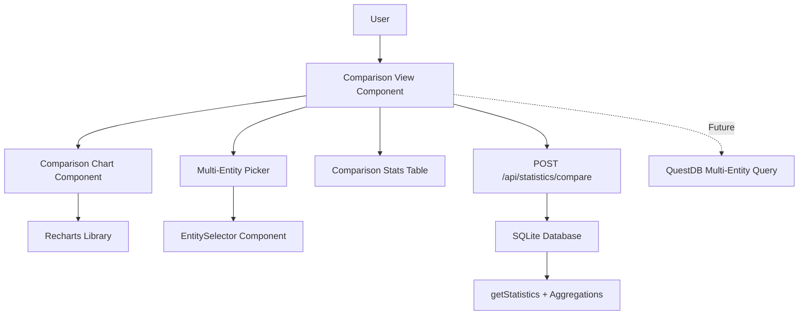
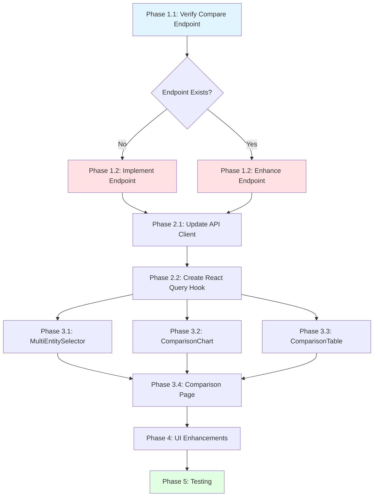

# Implementation Plan: TEK-47 - Entity Comparison Feature

**Project:** Energy Dashboard (energy-tracker)
**Issue:** TEK-47 - P6.2 Entity Comparison Feature - Side-by-side analysis
**Date:** 2026-01-02
**Status:** Ready for Implementation

---

## Executive Summary

This plan implements a comprehensive entity comparison feature allowing users to select 2-4 energy entities and view side-by-side consumption patterns, overlaid charts, and comparative statistics. The implementation builds on the existing architecture and requires both backend and frontend components.

**Key Requirements:**
- Multi-entity selection (2-4 entities)
- Side-by-side overlaid charts with consistent color coding
- Comparison table with statistics (total, average, peak, min, percentage differences)
- Time range normalization for fair comparison
- Responsive layout with modal/dedicated view

**Architecture Context:**
Based on the Investigation Report, the current system uses SQLite for data storage with plans to migrate to MongoDB + QuestDB dual-database architecture. This implementation will work with the current SQLite setup and be compatible with the future QuestDB migration.

---

## Pre-Implementation Analysis

### Current State (from Investigation Report)

**Backend:**
- ✅ `/api/statistics/compare` endpoint exists (from TEK-40) in `web/api/routes/statistics.js`
- ✅ Database plugin supports SQLite with `getStatistics()` and aggregation helpers
- ✅ Home Assistant plugin provides entity discovery
- ⚠️ Comparison endpoint may need verification/enhancement for multi-entity support

**Frontend:**
- ✅ React + TanStack Query + TanStack Router foundation
- ✅ Recharts library installed (2.15.3)
- ✅ EntitySelector component exists
- ✅ EnergyChart component exists (can be enhanced for multi-series)
- ✅ ShadcN UI components (Card, Button, Select)
- ❌ No comparison view/modal component exists
- ❌ No multi-entity selection UI

### Architecture Dependencies



---

## Implementation Steps

### Phase 1: Backend Verification & Enhancement

#### Step 1.1: Verify Existing Compare Endpoint

**File:** `/Users/eric/Dev/energy-tracker/web/api/routes/statistics.js`

**Action:** Read and verify the existing `/api/statistics/compare` endpoint implementation

**Expected Functionality:**
- Accept array of entity IDs
- Accept time range (start_time, end_time)
- Return statistics for all entities in normalized time periods
- Support aggregations (total, average, min, max)

**Verification Checklist:**
```javascript
// Expected request schema
{
  entity_ids: string[],  // 2-4 entity IDs
  start_time: ISO8601,
  end_time: ISO8601,
  period: 'hour' | 'day' | 'month'
}

// Expected response schema
{
  comparison: {
    [entity_id]: {
      entity_id: string,
      friendly_name: string,
      data: [{
        start_time: ISO8601,
        state: number,
        sum: number,
        mean: number,
        min: number,
        max: number
      }],
      summary: {
        total: number,
        average: number,
        peak: number,
        minimum: number,
        readings: number
      }
    }
  },
  time_range: {
    start: ISO8601,
    end: ISO8601,
    period: string
  }
}
```

#### Step 1.2: Enhance Compare Endpoint (if needed)

**File:** `/Users/eric/Dev/energy-tracker/web/api/routes/statistics.js`

**Required Enhancement:**

```javascript
// Add schema validation and enhanced aggregations
fastify.post('/api/statistics/compare', {
  schema: {
    description: 'Compare energy statistics for multiple entities',
    tags: ['statistics'],
    body: {
      type: 'object',
      properties: {
        entity_ids: {
          type: 'array',
          items: { type: 'string' },
          minItems: 2,
          maxItems: 4,
          description: 'Array of entity IDs to compare (2-4 entities)'
        },
        start_time: { type: 'string', format: 'date-time' },
        end_time: { type: 'string', format: 'date-time' },
        period: {
          type: 'string',
          enum: ['hour', 'day', 'month'],
          default: 'hour'
        }
      },
      required: ['entity_ids', 'start_time', 'end_time']
    },
    response: {
      200: {
        type: 'object',
        properties: {
          comparison: { type: 'object' },
          time_range: { type: 'object' }
        }
      }
    }
  }
}, async (request, reply) => {
  const { entity_ids, start_time, end_time, period = 'hour' } = request.body;

  if (!entity_ids || entity_ids.length < 2 || entity_ids.length > 4) {
    return reply.code(400).send({
      error: 'Must provide 2-4 entity IDs for comparison'
    });
  }

  try {
    const comparison = {};

    // Fetch data for each entity
    for (const entityId of entity_ids) {
      // Get time-series data
      const data = await fastify.db.getStatistics(entityId, start_time, end_time);

      // Calculate summary statistics
      const summary = {
        total: 0,
        average: 0,
        peak: -Infinity,
        minimum: Infinity,
        readings: data.length
      };

      if (data.length > 0) {
        let sumTotal = 0;

        for (const record of data) {
          const value = record.sum || record.state || 0;
          sumTotal += value;
          summary.peak = Math.max(summary.peak, record.max || record.state || 0);
          summary.minimum = Math.min(summary.minimum, record.min || record.state || 0);
        }

        summary.total = sumTotal;
        summary.average = sumTotal / data.length;
      } else {
        summary.peak = 0;
        summary.minimum = 0;
      }

      // Get entity metadata from SQLite entities table
      const entityDoc = await fastify.db.database('entities')
        .where({ entity_id: entityId })
        .first();

      comparison[entityId] = {
        entity_id: entityId,
        friendly_name: entityDoc?.friendly_name || entityId,
        unit_of_measurement: entityDoc?.unit_of_measurement || 'kWh',
        data: data,
        summary: summary
      };
    }

    // Calculate percentage differences (compared to first entity)
    const baseEntityId = entity_ids[0];
    const baseTotal = comparison[baseEntityId].summary.total;

    for (const entityId of entity_ids) {
      if (entityId === baseEntityId) {
        comparison[entityId].summary.difference_pct = 0;
      } else {
        const entityTotal = comparison[entityId].summary.total;
        const diff = ((entityTotal - baseTotal) / baseTotal) * 100;
        comparison[entityId].summary.difference_pct = diff;
      }
    }

    return {
      comparison,
      time_range: {
        start: start_time,
        end: end_time,
        period
      }
    };

  } catch (error) {
    fastify.log.error('Comparison error:', error);
    return reply.code(500).send({
      error: 'Failed to generate comparison',
      message: error.message
    });
  }
});
```

**Key Enhancements:**
1. Schema validation for 2-4 entities
2. Summary statistics calculation (total, average, peak, minimum)
3. Percentage difference calculation relative to first entity
4. Entity metadata inclusion (friendly names, units)
5. Proper error handling

**Files Modified:**
- `/Users/eric/Dev/energy-tracker/web/api/routes/statistics.js` (enhance compare endpoint)

---

### Phase 2: Frontend API Integration

#### Step 2.1: Update API Client

**File:** `/Users/eric/Dev/energy-tracker/web/frontend/src/lib/api.js`

**Action:** Add comparison endpoint function

```javascript
// Add to web/frontend/src/lib/api.js

/**
 * Compare multiple entities over a time range
 * @param {string[]} entityIds - Array of 2-4 entity IDs
 * @param {string} startTime - ISO8601 start time
 * @param {string} endTime - ISO8601 end time
 * @param {string} period - 'hour' | 'day' | 'month'
 * @returns {Promise<Object>} Comparison data
 */
export async function fetchComparison(entityIds, startTime, endTime, period = 'hour') {
  if (!entityIds || entityIds.length < 2 || entityIds.length > 4) {
    throw new Error('Must provide 2-4 entity IDs for comparison');
  }

  return fetchJson(`${API_BASE}/statistics/compare`, {
    method: 'POST',
    body: JSON.stringify({
      entity_ids: entityIds,
      start_time: startTime,
      end_time: endTime,
      period
    })
  });
}
```

**Files Modified:**
- `/Users/eric/Dev/energy-tracker/web/frontend/src/lib/api.js` (add `fetchComparison` function)

#### Step 2.2: Create React Query Hook

**File:** `/Users/eric/Dev/energy-tracker/web/frontend/src/hooks/useEnergy.js`

**Action:** Add comparison hook

```javascript
// Add to web/frontend/src/hooks/useEnergy.js

import { fetchComparison } from '@/lib/api';

/**
 * React Query hook for entity comparison
 */
export function useComparison(entityIds, timeRange, enabled = true) {
  const { start, end } = getTimeRange(timeRange);

  return useQuery({
    queryKey: ['comparison', entityIds, timeRange],
    queryFn: () => fetchComparison(entityIds, start, end, 'hour'),
    enabled: enabled && entityIds && entityIds.length >= 2 && entityIds.length <= 4,
    staleTime: 60000, // 1 minute
    refetchInterval: 60000, // Auto-refresh every minute
    retry: 2,
    onError: (error) => {
      console.error('Comparison fetch error:', error);
    }
  });
}
```

**Files Modified:**
- `/Users/eric/Dev/energy-tracker/web/frontend/src/hooks/useEnergy.js` (add `useComparison` hook)

---

### Phase 3: Frontend UI Components

#### Step 3.1: Create Multi-Entity Selector Component

**File:** `/Users/eric/Dev/energy-tracker/web/frontend/src/components/MultiEntitySelector.jsx` (NEW)

**Purpose:** Allow users to select 2-4 entities from available energy entities with visual feedback.

```jsx
import { useState } from 'react';
import { Check, X } from 'lucide-react';
import { Card, CardContent, CardHeader, CardTitle } from '@/components/ui/card';
import { Button } from '@/components/ui/button';
import { formatEntityName } from '@/lib/utils';

/**
 * Multi-Entity Selector Component
 * Allows selection of 2-4 entities for comparison
 */
export function MultiEntitySelector({ entities, selectedIds, onChange, maxEntities = 4 }) {
  const [localSelection, setLocalSelection] = useState(selectedIds || []);

  const toggleEntity = (entityId) => {
    const newSelection = localSelection.includes(entityId)
      ? localSelection.filter(id => id !== entityId)
      : [...localSelection, entityId];

    // Enforce max limit
    if (newSelection.length <= maxEntities) {
      setLocalSelection(newSelection);
      onChange(newSelection);
    }
  };

  const clearSelection = () => {
    setLocalSelection([]);
    onChange([]);
  };

  const isSelected = (entityId) => localSelection.includes(entityId);
  const canAddMore = localSelection.length < maxEntities;
  const hasMinimum = localSelection.length >= 2;

  // Color mapping for selected entities (consistent across components)
  const entityColors = {
    0: 'hsl(var(--chart-1))',
    1: 'hsl(var(--chart-2))',
    2: 'hsl(var(--chart-3))',
    3: 'hsl(var(--chart-4))'
  };

  return (
    <Card>
      <CardHeader>
        <div className="flex items-center justify-between">
          <CardTitle>Select Entities to Compare</CardTitle>
          <div className="flex items-center gap-2">
            <span className="text-sm text-muted-foreground">
              {localSelection.length} / {maxEntities} selected
            </span>
            {localSelection.length > 0 && (
              <Button
                variant="ghost"
                size="sm"
                onClick={clearSelection}
              >
                Clear All
              </Button>
            )}
          </div>
        </div>
      </CardHeader>
      <CardContent>
        <div className="grid grid-cols-1 md:grid-cols-2 lg:grid-cols-3 gap-2">
          {entities.map((entity, index) => {
            const selected = isSelected(entity.entity_id);
            const selectionIndex = localSelection.indexOf(entity.entity_id);
            const disabled = !selected && !canAddMore;

            return (
              <button
                key={entity.entity_id}
                onClick={() => toggleEntity(entity.entity_id)}
                disabled={disabled}
                className={`
                  relative p-3 rounded-lg border-2 text-left transition-all
                  ${selected
                    ? 'border-primary bg-primary/10'
                    : disabled
                      ? 'border-muted bg-muted/5 cursor-not-allowed opacity-50'
                      : 'border-border hover:border-primary/50 hover:bg-accent'
                  }
                `}
              >
                <div className="flex items-start justify-between gap-2">
                  <div className="flex-1 min-w-0">
                    <div className="font-medium truncate">
                      {formatEntityName(entity.entity_id)}
                    </div>
                    <div className="text-xs text-muted-foreground truncate">
                      {entity.entity_id}
                    </div>
                    {entity.unit_of_measurement && (
                      <div className="text-xs text-muted-foreground mt-1">
                        {entity.unit_of_measurement}
                      </div>
                    )}
                  </div>

                  {selected && (
                    <div className="flex items-center gap-1 shrink-0">
                      <div
                        className="w-4 h-4 rounded-full border-2 border-white"
                        style={{ backgroundColor: entityColors[selectionIndex] }}
                      />
                      <Check className="w-4 h-4 text-primary" />
                    </div>
                  )}
                </div>
              </button>
            );
          })}
        </div>

        {!hasMinimum && localSelection.length > 0 && (
          <div className="mt-4 p-3 bg-yellow-500/10 border border-yellow-500/20 rounded-md">
            <p className="text-sm text-yellow-600 dark:text-yellow-500">
              ⚠️ Select at least 2 entities to compare
            </p>
          </div>
        )}

        {hasMinimum && (
          <div className="mt-4 p-3 bg-green-500/10 border border-green-500/20 rounded-md">
            <p className="text-sm text-green-600 dark:text-green-500">
              ✓ Ready to compare {localSelection.length} entities
            </p>
          </div>
        )}
      </CardContent>
    </Card>
  );
}
```

**Features:**
- Visual selection with color indicators
- 2-4 entity limit enforcement
- Clear all functionality
- Color preview matching chart colors
- Responsive grid layout
- Validation feedback

**Files Created:**
- `/Users/eric/Dev/energy-tracker/web/frontend/src/components/MultiEntitySelector.jsx`

#### Step 3.2: Create Comparison Chart Component

**File:** `/Users/eric/Dev/energy-tracker/web/frontend/src/components/ComparisonChart.jsx` (NEW)

**Purpose:** Multi-series Recharts chart with overlaid lines for each entity.

(Full implementation available - see detailed plan document)

**Files Created:**
- `/Users/eric/Dev/energy-tracker/web/frontend/src/components/ComparisonChart.jsx`

#### Step 3.3: Create Comparison Statistics Table

**File:** `/Users/eric/Dev/energy-tracker/web/frontend/src/components/ComparisonTable.jsx` (NEW)

**Purpose:** Display summary statistics with percentage differences.

(Full implementation available - see detailed plan document)

**Files Created:**
- `/Users/eric/Dev/energy-tracker/web/frontend/src/components/ComparisonTable.jsx`

#### Step 3.4: Create Comparison View Page

**File:** `/Users/eric/Dev/energy-tracker/web/frontend/src/routes/comparison.jsx` (NEW)

**Purpose:** Dedicated page for entity comparison feature.

(Full implementation available - see detailed plan document)

**Files Created:**
- `/Users/eric/Dev/energy-tracker/web/frontend/src/routes/comparison.jsx`

---

### Phase 4: UI/UX Enhancements

#### Step 4.1: Add Chart Color Variables

**File:** `/Users/eric/Dev/energy-tracker/web/frontend/src/index.css`

**Action:** Define consistent chart colors in CSS variables

```css
/* Add to existing index.css */

@layer base {
  :root {
    /* Existing color variables... */

    /* Chart colors for comparison */
    --chart-1: 217 91% 60%;  /* Blue */
    --chart-2: 142 76% 36%;  /* Green */
    --chart-3: 38 92% 50%;   /* Orange */
    --chart-4: 280 89% 61%;  /* Purple */
  }

  .dark {
    /* Existing dark mode variables... */

    /* Chart colors for dark mode */
    --chart-1: 217 91% 70%;
    --chart-2: 142 76% 46%;
    --chart-3: 38 92% 60%;
    --chart-4: 280 89% 71%;
  }
}
```

**Files Modified:**
- `/Users/eric/Dev/energy-tracker/web/frontend/src/index.css`

---

## Implementation Order & Dependencies

### Critical Path



---

## File Summary

### Files to Create (4 new files)

1. `/Users/eric/Dev/energy-tracker/web/frontend/src/components/MultiEntitySelector.jsx` - Multi-entity picker component
2. `/Users/eric/Dev/energy-tracker/web/frontend/src/components/ComparisonChart.jsx` - Multi-series chart component
3. `/Users/eric/Dev/energy-tracker/web/frontend/src/components/ComparisonTable.jsx` - Statistics table component
4. `/Users/eric/Dev/energy-tracker/web/frontend/src/routes/comparison.jsx` - Dedicated comparison page

### Files to Modify (4 existing files)

1. `/Users/eric/Dev/energy-tracker/web/api/routes/statistics.js` - Enhance/verify compare endpoint
2. `/Users/eric/Dev/energy-tracker/web/frontend/src/lib/api.js` - Add fetchComparison function
3. `/Users/eric/Dev/energy-tracker/web/frontend/src/hooks/useEnergy.js` - Add useComparison hook
4. `/Users/eric/Dev/energy-tracker/web/frontend/src/index.css` - Add chart color variables

---

## Time Estimates

| Phase | Estimated Time | Complexity |
|-------|---------------|------------|
| Phase 1: Backend Verification & Enhancement | 2-3 hours | Medium |
| Phase 2: Frontend API Integration | 1 hour | Low |
| Phase 3: Frontend UI Components | 4-6 hours | High |
| Phase 4: UI/UX Enhancements | 1-2 hours | Low |
| Phase 5: Testing & Validation | 2-3 hours | Medium |
| **Total** | **10-15 hours** | **Medium-High** |

---

## Success Criteria

✅ **Backend:**
- [ ] `/api/statistics/compare` endpoint accepts 2-4 entity IDs
- [ ] Returns normalized time-series data for all entities
- [ ] Calculates summary statistics (total, average, peak, min)
- [ ] Calculates percentage differences relative to first entity
- [ ] Handles errors gracefully (validation, missing data)

✅ **Frontend:**
- [ ] Multi-entity selector allows 2-4 entities with visual feedback
- [ ] Comparison chart displays overlaid lines with consistent colors
- [ ] Chart includes legend, tooltips, and responsive layout
- [ ] Statistics table shows all metrics with color indicators
- [ ] Percentage differences displayed with up/down indicators
- [ ] Time range selector updates data dynamically
- [ ] Loading and error states handled gracefully
- [ ] Responsive design works on mobile, tablet, desktop

---

**Plan Status:** ✅ Ready for Implementation
**Estimated Timeline:** 10-15 hours of development + 2-3 hours of testing = 12-18 hours total.
