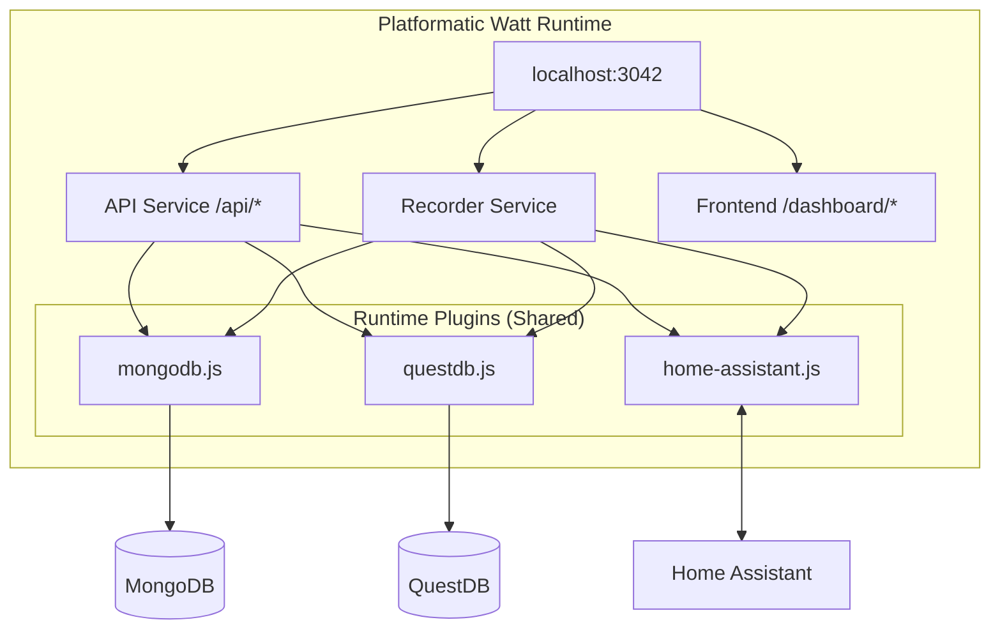

# Runtime Plugins

This directory contains runtime-level shared plugins that are accessible by all services in the Platformatic Watt application.

## Overview

Runtime plugins are registered in the root `watt.json` with `encapsulate: false`, making them available to all services (API, Recorder, Frontend) via the Fastify decorator pattern.

## Plugins

### home-assistant.js

WebSocket client for Home Assistant integration.

**Access:** `fastify.ha`

**Features:**
- WebSocket connection with token authentication
- Automatic reconnection with exponential backoff (1s → 30s)
- Entity discovery (filters energy-related entities)
- Statistics fetching via `recorder/statistics_during_period`
- Event subscription for `state_changed` events
- Graceful degradation when `HA_TOKEN` is not set

**Key Methods:**
- `connect()` - Establish WebSocket connection
- `isConnected()` - Check connection status
- `reconnect()` - Force reconnection
- `discoverEntities()` - Get all energy-related entities
- `isEnergyEntity(state)` - Check if entity is energy-related
- `getStatistics(ids, start, end, period)` - Fetch statistics
- `subscribeToStateChanges(callback, entityId?)` - Subscribe to events
- `unsubscribeFromStateChanges(entityId?)` - Unsubscribe from events

**Example Usage:**
```javascript
// In any service
export default async function myRoute(fastify, options) {
  fastify.get('/entities', async (request, reply) => {
    if (!fastify.ha?.isConnected()) {
      return reply.code(503).send({ error: 'Home Assistant not connected' });
    }

    const entities = await fastify.ha.discoverEntities();
    return { entities };
  });
}
```

### mongodb.js

MongoDB client for application state storage.

**Access:** `fastify.mongo`

**Collections:**
- `settings` - Application settings
- `entities` - Cached entity metadata
- `subscriptionState` - Event subscription tracking
- `syncLog` - Manual sync history

**Key Methods:**
- `healthCheck()` - Connection health check
- `getSetting(key)`, `setSetting(key, value)` - Settings CRUD
- `getEntities(filter)`, `upsertEntity(entity)` - Entity management
- `getSubscriptionState()`, `updateSubscriptionState()` - Subscription tracking
- `logSync(data)`, `getRecentSyncs()` - Sync logging

### questdb.js

QuestDB client for time-series data storage.

**Access:** `fastify.questdb`

**Tables:**
- `energy_readings` - Real-time state_changed events
- `energy_statistics` - Hourly/daily aggregated statistics

**Key Methods:**
- `writeReadings(readings)` - Batch write readings
- `writeStats(stats)` - Batch write statistics
- `getReadings(entityId, start, end, limit)` - Query readings
- `getStatistics(entityId, start, end, period)` - Query statistics
- `getDailySummary(entityId, start, end)` - Daily aggregations
- `getMonthlySummary(entityId, start, end)` - Monthly aggregations
- `isConnected()` - Connection health check

## Environment Variables

### Home Assistant
- `HA_URL` - Home Assistant host:port (default: `homeassistant.local:8123`)
- `HA_TOKEN` - Long-lived access token (required for HA integration)

### MongoDB
- `MONGODB_URI` - MongoDB connection string (default: `mongodb://localhost:27017/energy_dashboard`)

### QuestDB
- `QUESTDB_HOST` - QuestDB hostname (default: `localhost`)
- `QUESTDB_ILP_PORT` - ILP ingestion port (default: `9009`)
- `QUESTDB_HTTP_PORT` - HTTP API port (default: `9000`)

## Architecture



## Testing

Runtime plugins are automatically available in all services. Test via:

```bash
# Check health endpoint
curl http://localhost:3042/api/health

# Expected response
{
  "status": "ok",
  "homeAssistant": true,
  "mongodb": true,
  "questdb": true,
  "timestamp": "2026-01-02T20:00:00.000Z"
}
```

## Troubleshooting

### Home Assistant not connecting
- Verify `HA_TOKEN` is set and valid
- Check `HA_URL` is reachable
- Review logs for authentication errors
- Use `fastify.ha.reconnect()` to force reconnection

### MongoDB connection issues
- Verify `MONGODB_URI` is correct
- Check MongoDB is running
- Review connection pool settings in `mongodb.js`

### QuestDB connection issues
- Verify `QUESTDB_HOST` and ports are correct
- Check QuestDB is running
- Review ILP connection logs
- Automatic reconnection attempts every 5 seconds
